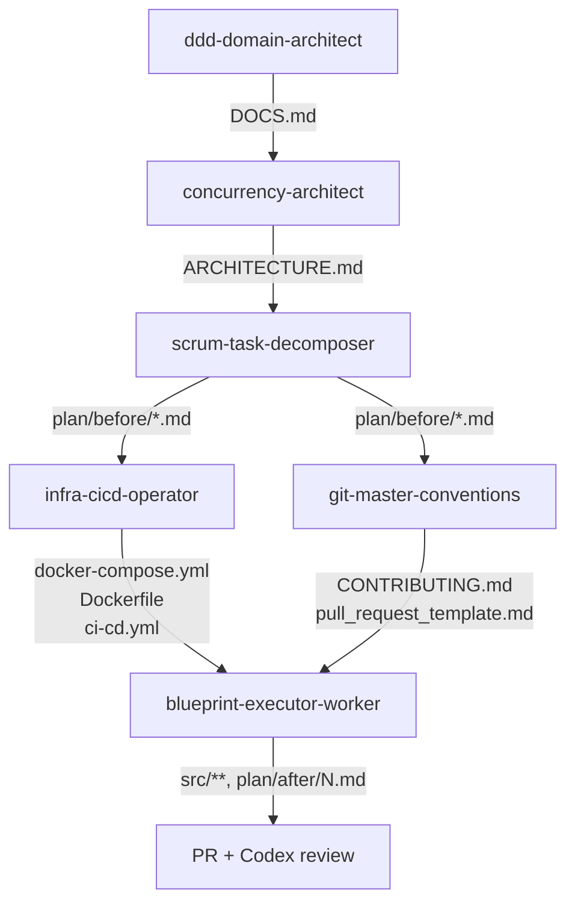

<!-- 에이전트·스킬·하네스 세 기둥의 1페이지 허브. 세부는 docs/agents, docs/harness 시리즈로 분리 -->
# AGENTS · SKILLS · HARNESS

이 워크스페이스는 라이브 강의 수강신청 시스템(`live-class/`)을 **6개의 서브에이전트가 순차/병렬로 만들어내는** 멀티 에이전트 파이프라인이다. 메인 Claude Code 세션은 `src/`에 직접 코드를 쓰지 않고, 세 기둥을 통해 작업을 시킨다.

- **에이전트 (`.claude/agents/`)** — 각자 단일 산출물만 만드는 6개 서브에이전트 + 외부 위임용 Codex.
- **스킬 (`.claude/skills/`)** — 사용자가 `/`로 호출하는 단축 명령. 각 스킬이 정확히 1개 에이전트를 래핑.
- **하네스 (`.claude/settings.json` + `.claude/hooks/*.sh`)** — 퍼미션·훅으로 안전망과 자동화를 거는 레일.

본 문서는 세 기둥의 인덱스다. 세부 카탈로그·구조·이식 가이드는 아래 다섯 세분 문서로 분리되어 있다.

## 파이프라인 흐름

같은 레벨끼리는 병렬 가능하다. 다음 레벨로 넘어가려면 앞 산출물이 디스크에 존재해야 한다. 그렇지 않으면 해당 단계 스킬이 사전 검증에서 STOP하고 빠진 파일을 알려 준다.

## 세분 문서 인덱스

| 문서 | 다루는 범위 |
|---|---|
| [`docs/agents/agents.md`](docs/agents/agents.md) | 6개 내부 서브에이전트의 역할·출력·halt 조건·페르소나 + 외부 위임(Codex) |
| [`docs/agents/skills.md`](docs/agents/skills.md) | 6개 슬래시 스킬의 인자·전제·호출 패턴·다음 단계 + 유틸 스킬 일람 |
| [`docs/harness/01-reference.md`](docs/harness/01-reference.md) | 12개 hook 카탈로그 + 5개 라이프사이클 이벤트 + permissions allow/deny |
| [`docs/harness/02-architecture.md`](docs/harness/02-architecture.md) | 시스템 구조 · 라이프사이클 다이어그램 · hook 입출력 계약 · 구현 패턴 · 설계 동기 · 회귀 테스트 |
| [`docs/harness/03-migration.md`](docs/harness/03-migration.md) | 환경 가정 · 이식 체크리스트 · 알려진 함정 · troubleshooting |

## 다음 단계 안내

새 도메인 설계를 시작하려면 `/design-domain "<도메인 한 줄 요약>"`을 호출한다. 이후 파이프라인 안내대로 `/design-concurrency` → `/decompose-tasks` → `/setup-infra` · `/setup-git-rules` 병렬 → 태스크별 `/exec-blueprint` 순으로 진행한다. 각 스킬은 전제 파일을 사전 검증하고 다음 단계를 자동으로 알려 준다.

## 관련 메타 문서

- `CLAUDE.md` — 일반 행동 규칙 + 프로젝트 보조 문서 인덱스.
- `ORCHESTRATION.md` — 파이프라인 정책 (단계·산출물·차단 규칙).
- `context.yaml` — 위 문서들을 LLM이 빠르게 스캔하기 위한 구조화 컨텍스트.
