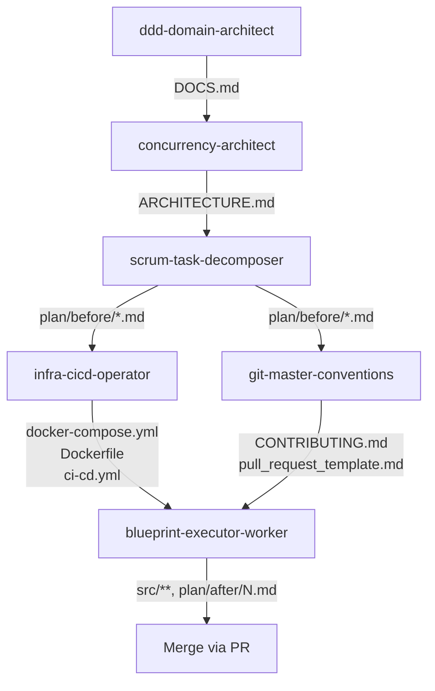

<!-- 이 워크스페이스의 3가지 기둥(에이전트·스킬·하네스)을 한 곳에서 설명하는 안내 문서 -->
# AGENTS · SKILLS · HARNESS

이 워크스페이스는 라이브 강의 수강신청 시스템(`live-class/`)을 **6개의 서브에이전트가 순차/병렬로 만들어내는** 멀티 에이전트 파이프라인입니다. 메인 Claude Code 세션은 직접 코드를 쓰지 않고, 다음 세 가지 기둥을 통해 일을 시킵니다.

- **에이전트 (`.claude/agents/`)** — 각자 한 가지 산출물만 만드는 6개의 서브에이전트.
- **스킬 (`.claude/skills/`)** — 사용자가 `/`로 호출하는 단축 명령. 각 스킬이 정확히 1개 에이전트를 래핑합니다.
- **하네스 (`.claude/settings.json` + `.claude/hooks/*.sh`)** — 퍼미션·훅으로 안전망과 자동화를 거는 레일.

`CLAUDE.md`는 일반 행동 규칙, `ORCHESTRATION.md`는 파이프라인 정책이고, 이 문서는 그 두 문서를 보조하는 빠른 참조 카드입니다.

---

## 파이프라인 흐름

산출물은 다음 의존성 순서로 만들어집니다. 같은 레벨끼리는 병렬 가능, 다음 레벨로 가려면 앞 산출물이 반드시 존재해야 합니다.

### ASCII

```
                ddd-domain-architect ──► DOCS.md
                          │
                          ▼
                concurrency-architect ──► ARCHITECTURE.md
                          │
                          ▼
              scrum-task-decomposer ──► plan/before/NN_*.md  (작업 명세 N개)
                          │
              ┌───────────┴────────────┐
              ▼                        ▼
       infra-cicd-operator    git-master-conventions
              │                        │
       docker-compose.yml       CONTRIBUTING.md
       Dockerfile               .github/pull_request_template.md
       .github/workflows/
              │                        │
              └───────────┬────────────┘
                          ▼
              blueprint-executor-worker × N   (각자 ../worktrees/feature-*/)
                          │
                  src/main/java/**
                  src/test/java/**
                  + plan/before/N.md → plan/after/N.md
```

### Mermaid



---

## 에이전트

| 이름 | 역할 (1줄) | 입력 | 산출물 |
|---|---|---|---|
| `ddd-domain-architect` | DDD 기반 도메인 모델·바운디드 컨텍스트·상태 전이를 설계 | 비즈니스 요구사항 (사용자 입력) | `DOCS.md` |
| `concurrency-architect` | Redis 락·캐싱 레이어·동시성 시나리오를 설계 | `DOCS.md` | `ARCHITECTURE.md` |
| `scrum-task-decomposer` | 설계를 마이크로 태스크 N개로 분해, 의존성 그래프 부여 | `DOCS.md` + `ARCHITECTURE.md` | `plan/before/NN_<role>_<slug>.md` |
| `infra-cicd-operator` | 컨테이너·CI/CD 파이프라인 산출 | `ARCHITECTURE.md` | `docker-compose.yml`, `Dockerfile`, `.github/workflows/ci-cd.yml`, `.env` |
| `git-master-conventions` | 브랜치·커밋·PR 규약 산출, 태스크 추적성 강제 | `plan/before/*.md` (최소 1개) | `CONTRIBUTING.md`, `.github/pull_request_template.md` |
| `blueprint-executor-worker` | 단일 태스크 파일 1개를 Java/Spring 코드로 변환 (0 일탈) | `plan/before/<task>.md` + `DOCS.md` + `ARCHITECTURE.md` + worktree 경로 | 워크트리 내부 `src/**`, 작업 완료 시 `plan/before/<task>.md` → `plan/after/<task>.md` 이동 |

각 에이전트의 상세 동작은 `.claude/agents/<name>.md` 본문 참조. 모든 에이전트는 상류 산출물이 누락되면 **즉시 halt**합니다. blueprint-executor-worker 만 worktree 격리(`isolation: "worktree"`)가 강제됩니다.

---

## 스킬

사용자는 `/`를 입력해 다음 6개 슬래시 커맨드 중 하나를 호출합니다. 각 스킬은 인자 1개(자유 텍스트)를 받아 대응 에이전트를 Task tool로 호출하고, 완료 후 다음 단계 안내를 출력합니다.

| 슬래시 | 래핑 에이전트 | 인자 포맷 | 예시 |
|---|---|---|---|
| `/design-domain` | `ddd-domain-architect` | 도메인 한 줄 요약 | `/design-domain "라이브 강의 수강신청, 정원 + 결제 후 7일 취소"` |
| `/design-concurrency` | `concurrency-architect` | 동시성 관심사 | `/design-concurrency "마지막 자리 race condition + 대기열 자동 승격"` |
| `/decompose-tasks` | `scrum-task-decomposer` | 분해 트리거 | `/decompose-tasks "이제 태스크로 쪼개줘"` |
| `/setup-infra` | `infra-cicd-operator` | 인프라 요청 | `/setup-infra "Postgres 16 + Redis 7 + GitHub Actions"` |
| `/setup-git-rules` | `git-master-conventions` | Git 정책 요청 | `/setup-git-rules "GitHub Flow + Conventional Commits"` |
| `/exec-blueprint` | `blueprint-executor-worker` | 태스크 파일 경로 | `/exec-blueprint "plan/before/01_Logic_Implementer_Class_Entity.md"` |

`/exec-blueprint`는 인자 파일명을 기준으로 자동으로 `../worktrees/feature-<slug>` 경로를 생성하고 `isolation: "worktree"`로 디스패치합니다. 스킬은 호출 전 상류 산출물(`DOCS.md` 등) 존재 여부를 검증하고, 없으면 어떤 스킬을 먼저 실행해야 하는지 안내한 뒤 중단합니다.

---

## 하네스

### 퍼미션 (`.claude/settings.json`)

자동 허용되는 안전한 Bash 명령(읽기·빌드 위주).

- `ls`, `git status`, `git diff`, `git log`, `cat`
- `./gradlew test`, `./gradlew build`, `./gradlew bootRun`, `./gradlew clean`
- `docker compose up`, `docker compose down`, `docker compose ps`, `docker compose logs`

자동 차단되는 Read 패턴(시크릿 방어).

- `.env`, `.env.*`, `*.key`, `*.pem`, `credentials*`, `secrets*`

위 외 명령은 매번 사용자 프롬프트로 확인합니다. `.claudeignore`와 함께 이중 방어선을 형성합니다.

### 훅 (`.claude/hooks/*.sh`)

모든 훅은 Bash 스크립트(Git for Windows 기본 설치) 1행짜리 한국어 헤더 주석 + `set -euo pipefail`로 시작합니다.

| 트리거 | 스크립트 | 동작 |
|---|---|---|
| `SessionStart` | `session-start.sh` | 현재 파이프라인 상태(`DOCS:✓/✗ · ARCH:✓/✗ · before:N · after:M`)를 컨텍스트로 주입 |
| `UserPromptSubmit` | `user-prompt-submit.sh` | 매 사용자 메시지 앞에 동일한 파이프라인 배지 prepend |
| `Stop` | `stop-warn-design-changes.sh` | 세션 중 `DOCS.md` 또는 `ARCHITECTURE.md` 변경이 있었으면 종료 전에 경고 |
| `PreToolUse(Bash)` | `pre-bash-block-destructive.sh` | `rm -rf`, `git push --force`, `git reset --hard` 차단(`permissionDecision: deny`) |
| `PreToolUse(Write\|Edit)` | `pre-write-worktree-guard.sh` | `$CLAUDE_WORKTREE_PATH`가 설정된 경우 그 경로 밖 쓰기 시도에 경고 |
| `PostToolUse(Write\|Edit)` | `post-write-md-lint.sh` | `.md` 파일을 만진 경우 `npx markdownlint-cli` 실행(npx 없으면 no-op) |
| (공유 헬퍼) | `_lib-pipeline-state.sh` | `pipeline_state_badge` 함수 — 다른 훅에서 source |

---

## 다음 단계 안내

새 도메인 설계를 시작하려면 `/design-domain "<도메인 한 줄 요약>"`을 호출하세요. 이후 파이프라인이 안내하는 대로 `/design-concurrency` → `/decompose-tasks` → `/setup-infra` / `/setup-git-rules`(병렬) → 태스크별 `/exec-blueprint` 순으로 진행합니다.
