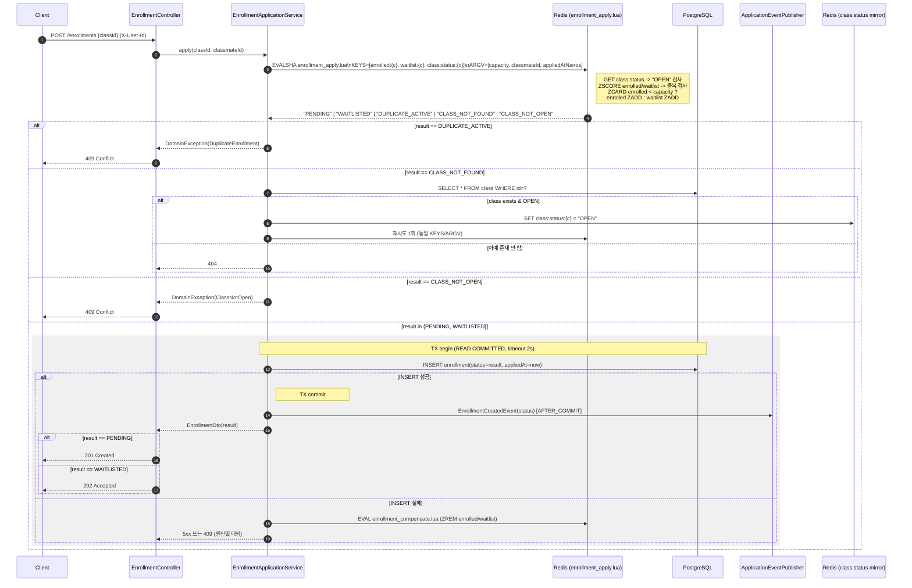
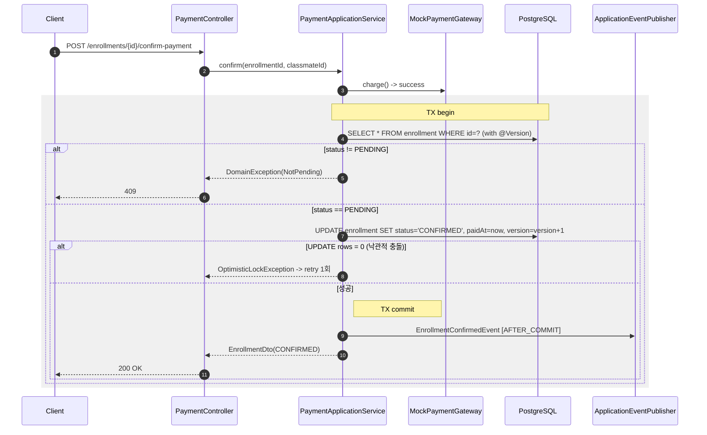
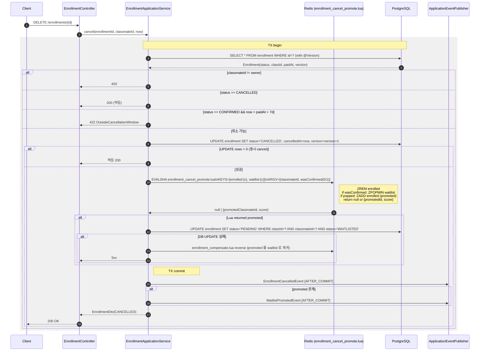

<!-- 라이브 강의 수강신청 시스템의 동시성 제어·캐싱·스케줄링·실패 복구 아키텍처 문서 -->
---
status: draft
owner: live-class team
created: 2026-05-11
updated: 2026-05-12
companion: DOCS.md
---

# ARCHITECTURE.md — Concurrency, Caching & Scheduling Architecture

## Table of Contents

1. [Overview](#1-overview)
2. [Concurrency Scenarios](#2-concurrency-scenarios)
3. [Strategy Comparison](#3-strategy-comparison)
4. [Chosen Approach](#4-chosen-approach)
5. [Redis Mirror Layer](#5-redis-mirror-layer-cache-계층-미사용--pre-flight-5-결정)
6. [End-to-End Request Flows](#6-end-to-end-request-flows)
7. [Failure Modes & Recovery](#7-failure-modes--recovery)
8. [Scheduled Jobs (Quartz)](#8-scheduled-jobs-quartz)

> **본 문서는 2026-05-12 갱신본이다.** 초안(2026-05-11) 은 PostgreSQL `SELECT FOR UPDATE` 를 1차 동시성 제어로 채택했으나 본 갱신본부터는 **Redis ZSET + Lua atomic script 를 1차 동시성 제어로, PostgreSQL 을 영속화 + 마지막 정합성 방어선**으로 전환한다. 또한 `Class.period.endDate` 도래 시 OPEN→CLOSED 를 자동 전이시키는 Quartz 스케줄링이 §8 에 추가됐다. 결정 사유와 트레이드오프는 §3·§4·§8 에 명시한다. 도메인 불변식(DOCS.md §6) 은 endDate 자동 close 행 1건이 추가된 것 외에는 변하지 않는다.

---

## 1. Overview

라이브 강의 수강신청 시스템은 **고경합 자원(`Class.capacity`) 에 대한 동시 쓰기** 와 **다중 Aggregate 에 걸친 상태 전이(취소 → 대기열 승격)** 라는 두 축의 동시성 문제를 안고 있다. DOCS.md §6 Invariants 가 요구하는 다음 규칙들은 모두 동시성 제어가 무너지면 즉시 깨진다.

- Enrollment §2 — `CONFIRMED + PENDING` 합산이 `capacity` 를 초과해서는 안 된다.
- Enrollment §3 — 동일 `(classId, classmateId)` 활성 신청 중복 금지.
- Enrollment §8 — 대기열 승격은 `appliedAt` 오름차순으로 정확히 1건만 일어난다.
- Class §3 — `DRAFT → OPEN → CLOSED` 일방향 전이.
- Class §6 (신규) — `endDate` 경과 후 `OPEN` 상태로 남을 수 없다. Quartz 가 자동 close 시도, Creator 수동 close 와 `@Version` 으로 충돌 해소.

본 시스템은 **모듈러 모놀리스 + 단일 PostgreSQL + 단일 Redis + Quartz in-memory scheduler** 구성이며 단일 JVM 안에서 Spring `ApplicationEventPublisher` 로 컨텍스트가 협력한다. 분산 트랜잭션(2PC)이나 Saga 는 사용하지 않는다.

설계 원칙은 다음과 같다.

1. **Source of Truth 는 PostgreSQL 이지만, race-critical 결정은 Redis ZSET 미러가 1차 게이트** 다. Redis ZSET (`enrolled:{classId}`, `waitlist:{classId}`) 는 Enrollment Aggregate 의 *index* 로 취급한다(DOCS.md §3.4 의 한-트랜잭션-한-Aggregate 원칙 예외 조항). DB 는 영속 + 마지막 방어선(partial unique index)이다.
2. **race-safe 결정은 Lua atomic script 한 번의 호출 안에서 끝낸다**. read-modify-write 가 Redis 서버 단일 스레드 안에서 직렬화되므로 분산 락이 필요 없다.
3. **DB 쓰기는 Lua 결정 직후에 같은 application 트랜잭션 안에서 수행** 한다. Lua 성공 후 DB 실패 시 보상 Lua (`enrollment_compensate.lua`) 로 ZSET 갱신을 되돌린다.
4. **락 보유 시간은 0 이다**. Redis 는 lock 매니저가 아닌 atomic executor 이며, JVM lock / Redisson `RLock` 모두 critical path 에 두지 않는다.
5. **실패 모드는 fail-closed**. Redis 연결 실패는 즉시 503 으로 사용자에게 회신한다. 정합성 우선 정책.
6. **부팅 시 ZSET reconcile 을 의무화** 한다. 어떤 경로로든 ZSET 이 비어 있거나 어긋나 있을 가능성을 가정하고 DB → Redis 재구성 절차를 항상 통과시킨다.
7. **시간 기반 자동 전이는 Quartz 가 담당** 한다(§8). 단일 EC2 + in-memory JobStore 가정. 멀티 인스턴스 확장 시 JDBC JobStore 로 전환하며 본 설계의 다른 부분은 그대로 유효하다.

---

## 2. Concurrency Scenarios

DOCS.md 가 정의한 도메인 규칙에 비춰 본 시스템이 반드시 정답을 내야 하는 동시성 시나리오 네 가지다.

### 2.1 마지막 자리 race condition

- **상황** — `Class.capacity = N`, 현재 `PENDING + CONFIRMED` 합산 = `N - 1`. 동일한 순간에 `M` 명(M >= 2)이 `POST /enrollments` 를 호출한다.
- **요구** — Invariant Enrollment §2. 1명만 `PENDING` 으로 진입하고 나머지 `M - 1` 명은 `WAITLISTED` 로 진입한다(DOCS §4.2 — 거부가 아니라 대기열 진입).
- **실패 모드** — naive `SELECT count(*); INSERT` 구현은 lost update + phantom read 로 `N + k` 명이 PENDING 에 들어간다.
- **기대 동작** — `(classId)` 단위로 직렬화된 critical section 안에서 잔여 정원을 읽고, 0 이면 WAITLISTED, 1 이상이면 PENDING 으로 분기한다.

### 2.2 대기열 자동 승격 (double-promotion 방지)

- **상황** — `Class C` 에 CONFIRMED 인 Enrollment 두 건이 거의 동시에 취소된다. WAITLISTED 의 선두는 한 명이다.
- **요구** — Invariant Enrollment §8. 두 번의 취소는 각각 서로 다른 WAITLISTED 1건을 PENDING 으로 승격시켜야 한다. double promotion 도, lost promotion 도 없어야 한다.
- **실패 모드** — 두 cancel 핸들러가 `SELECT ... WHERE status='WAITLISTED' ORDER BY appliedAt LIMIT 1` 를 동시에 읽으면 둘 다 같은 row 를 PENDING 으로 UPDATE 시도, lost update 발생.
- **기대 동작** — cancel 트랜잭션 안에서 `(classId)` 두 ZSET 을 **단일 Lua 호출** 로 swap 한다. `ZREM enrolled` + `ZPOPMIN waitlist` + `ZADD enrolled` 가 한 원자 단위에서 끝난다.

### 2.3 7일 취소 창 enforce

- **상황** — `paidAt = 2026-05-04T10:00:00Z`. 사용자가 `2026-05-11T09:59:59Z` 와 `2026-05-11T10:00:01Z` 에 각각 취소를 시도한다.
- **요구** — Invariant Enrollment §5. `paidAt + 168h` 까지가 허용 경계.
- **경계 정책** — `now <= paidAt + Duration.ofDays(7)` 을 허용으로 정의한다. 정확히 `+7일 0시 0분 0초` 시점은 **허용**, `+7일 0시 0분 1초` 부터 거부.
- **실패 모드** — 동일 Enrollment 에 대해 두 cancel 요청이 동시에 도착하면 한 건은 `CONFIRMED → CANCELLED` 성공, 다른 건은 이미 CANCELLED 인 row 를 다시 취소하려고 시도(Invariant §6 위반).
- **기대 동작** — Enrollment row 의 `@Version` optimistic lock 으로 상태 전이를 단 한 번만 허용한다. 7일 비교는 application service 의 비즈니스 로직 (Lua 안에서 다루지 않는다).

### 2.4 상태 전이 무결성 (수동 + 자동)

- **상황** — Creator 가 `PATCH /classes/{id}/status close` 를 더블 클릭하거나, Quartz `ClassAutoCloseJob` 이 동일 강의의 close 를 거의 동시에 트리거한다.
- **요구** — Class Invariant §3 + §6. 단 한 번만 성공.
- **기대 동작** — `Class` row 에 `@Version` optimistic lock. 충돌 시 도메인 예외, 멱등 응답으로 매핑. 상태 전이 성공 시 Redis mirror (`class:status:{classId}`) 도 함께 갱신해 Lua 가 신선한 상태를 읽도록 한다.

---

## 3. Strategy Comparison

세 가지 후보 전략을 **본 도메인의 시나리오**(§2) 에 매핑해 비교한다. 일반론적 장단점이 아니라 "우리가 풀어야 할 문제에 무엇이 부합하는가" 가 기준이다.

### 3.1 비교표

| 항목 | A. DB Pessimistic Lock (`SELECT FOR UPDATE`) | B. Redisson `RLock` | C. **Redis ZSET + Lua Atomic Script** |
|------|--------------------------------------------|---------------------|----------------------------|
| **작동 원리** | Postgres row 에 행 단위 X-lock 을 걸고 트랜잭션 종료 시 해제. | Redis 키에 SETNX + TTL + pub/sub 으로 분산 mutex 구현. Watchdog 이 TTL 자동 연장. | 단일 Lua 스크립트가 Redis 서버 안에서 read-modify-write 를 원자적으로 실행. `enrolled:{classId}` 와 `waitlist:{classId}` 두 ZSET 을 Aggregate 의 index 로 운영. |
| **§2.1 마지막 자리** | `Class` row 에 FOR UPDATE 걸고 잔여 정원 계산. 같은 `classId` 의 모든 신청이 row lock 큐에 직렬화. p99 가 큐 길이에 비례해 증가. | Redis 락 획득 → DB 트랜잭션 시작 → 카운트 → INSERT → 커밋 → 락 해제. 락과 DB 가 분리되어 락 해제 직전 DB 커밋 실패 시 윈도우 발생. | **단일 Lua 호출이 ZCARD → 분기 → ZADD 를 원자 실행.** Redis 단일 스레드 직렬화로 race 자체가 정의 불가능. DB INSERT 는 결정 이후의 영속화 단계로 분리. |
| **§2.2 대기열 승격** | `FOR UPDATE SKIP LOCKED` 로 다음 후보 1건만 잠그면 double-promotion 방지. PG 락 큐에 의존, 다중 cancel 동시 발생 시 한 cancel 이 다른 cancel 의 row lock 을 기다린다. | 락 잡고 DB 쿼리 한 번 더 함. SKIP LOCKED 보다 라운드트립 1회 더. | **단일 Lua 호출이 `ZREM enrolled` + `ZPOPMIN waitlist` + `ZADD enrolled` 를 원자 swap.** 두 ZSET 사이 정합성 윈도우가 0. double promotion 도, lost promotion 도 정의 불가. |
| **§2.3 7일 창** | `FOR UPDATE` 또는 `@Version` + `paidAt + 7d` 비교. | 동시성 보호용 락 도입은 과잉. | 7일 비교는 비즈니스 로직 — Lua 안에 두지 않고 application service 가 처리. **§2.3 한정으로 `@Version` optimistic lock 이 여전히 표준 해법.** |
| **§2.4 상태 전이** | `@Version` optimistic lock 으로 충분. | 과잉. | `@Version` 유지. 추가로 상태 전이 성공 후 `class:status:{classId}` mirror 갱신 (다음 신청 Lua 가 신선한 상태를 읽도록). 수동 close 와 Quartz 자동 close 충돌도 동일 메커니즘으로 해소. |
| **장애 모델** | DB 가 죽으면 시스템이 죽는다. 추가 장애점 없음. | Redis 가 죽으면 락 자체 불가 → fallback 정책 필요. 장애점 +1. | **Redis 가 죽으면 신청·취소 API 자체 불가 (fail-closed).** 장애점 +1. 그러나 Redis 는 단일 노드 in-memory 라 운영상 가용성이 높고, 본 시스템 규모에서는 EC2 위에 백엔드와 같은 컨테이너 네트워크로 묶여 사실상 함께 다운된다. 별도 SPOF 등급은 사실상 추가되지 않는다. |
| **공정성(FIFO)** | DB 락 큐는 FIFO 가 명시 보장되지 않는다. | `RLock` 비공정, `RFairLock` 사용 시 성능 손해. | **Redis 단일 스레드 직렬 실행 → 도착 순서 그대로 처리.** ZSET score 는 `appliedAtNanos` 이며 FIFO 가 자료구조 차원에서 강제된다. |
| **성능 (단일 노드)** | row lock + INSERT 1 트랜잭션. 동시 신청자 수에 비례해 락 큐 길어지며 p99 선형 증가. | Redis 라운드트립 2회(lock, unlock) + DB 트랜잭션. **네트워크 hop 추가**. | **Redis 라운드트립 1회(Lua) + DB 라운드트립 1회(INSERT).** Lua 단계 sub-ms, DB INSERT ms 수준. 가장 빠르고 부하 증가에 따른 p99 둔화가 가장 완만. |
| **운영 복잡도** | 익숙한 SQL. `pg_locks`, `pg_stat_activity` 모니터링. | Redisson + Redis 모니터링 + watchdog 동작 이해 필요. | Lua 디버깅 어려움. `EVALSHA` 캐시 미스 시 `EVAL` fallback. ZSET vs DB 정합성 모니터링 추가. |
| **테스트 용이성** | `@Transactional` + Testcontainers PG. | Testcontainers Redis + RLock watchdog 통제 까다로움. | Testcontainers Redis + Lua 단위 테스트(스크립트 분리 verify). 보상 시나리오는 통합 테스트로 검증. |
| **모듈러 모놀리스 적합성** | 매우 높음. | 중간. 수평 확장 보험. | **높음.** Redis 와 DB 가 같은 EC2 docker network 안에서 헬스 의존성이 합쳐져 있어 본 도메인의 정합성 모델을 손상시키지 않는다. 이중 표현은 reconcile 절차로 봉합. |

### 3.2 비교의 요지

본 도메인의 본질은 **(a) `(classId)` 라는 좁은 키 단위 직렬화** 와 **(b) `appliedAt` FIFO 보장** 이다. (a) 는 Redis 단일 스레드가 직접적인 해답이고, (b) 는 Redis ZSET 의 score 가 자료구조 차원에서 보장한다.

대안 A (PG row lock) 는 두 요구를 모두 충족하지만 **락 큐가 사용자 부하에 비례해 선형 비용** 을 내고 **FIFO 가 락 매니저 구현에 의존하는 약점** 이 있다. 대안 C (ZSET + Lua) 는 (a) 와 (b) 를 자료구조와 단일 스레드 실행 모델 자체로 강제하며, race-critical path 의 라운드트립을 1회로 압축한다. 트레이드오프는 **이중 SoT (DB + Redis ZSET) 의 정합성 관리** 이고, 이를 **보상 Lua + 부팅 reconcile + partial unique index** 라는 3중 방어로 닫는다.

---

## 4. Chosen Approach

### 4.1 결론

**기본 전략은 Redis ZSET + Lua Atomic Script (C) 이다.** PostgreSQL 은 영속화와 마지막 정합성 방어선(partial unique index, `@Version`) 으로 사용한다. DB Pessimistic Lock (A) 은 본 시스템의 critical path 에서 채택하지 않는다. **Redisson `RLock` (B) 은 본 시스템에서 사용하지 않는다 — Pre-flight 4 결정으로 의존성 자체를 제거** (이전 §5.5 의 cache stampede single-flight 용도가 단일 EC2 환경에서 ROI 낮음). cache stampede 방어는 §5.5 에서 JVM-내 single-flight 로 다룬다.

### 4.2 채택 근거

1. **race-critical path 의 라운드트립을 1회로 압축**. §2.1 의 결정은 Lua 한 번에서 끝난다. PG row lock 은 락 획득 자체에 RTT 가 들고 락 큐가 사용자 부하에 비례해 선형 비용을 낸다. Lua 는 동시 신청자가 늘어나도 Redis 단일 스레드 처리 큐에 들어가는 동일한 sub-ms 비용을 낸다.

2. **FIFO 가 자료구조 차원에서 강제됨**. WAITLISTED 의 `appliedAt` 순서는 ZSET 의 score 가 그대로 보장한다. PG 의 락 큐에 FIFO 를 의존하는 것보다 명시적이고 가시적이다.

3. **§2.2 promotion 의 원자성이 단일 Lua 호출 안에서 끝남**. `ZREM enrolled` + `ZPOPMIN waitlist` + `ZADD enrolled` 가 한 원자 단위. 두 ZSET 사이 정합성 윈도우가 0 이며 double promotion / lost promotion 이 정의 불가. PG `SKIP LOCKED` 는 여전히 row lock 대기와 deadlock 회피 동작이 필요하다.

4. **이중 SoT 는 3중 방어로 봉합**.
   - (a) **보상 Lua** — Lua 성공 후 DB INSERT/UPDATE 실패 시 즉시 `enrollment_compensate.lua` 로 ZSET 갱신을 되돌린다.
   - (b) **부팅 reconcile + admin endpoint** — 어떤 경로로든 ZSET 이 어긋날 가능성을 가정하고, 부팅 시점에 항상 DB → ZSET 재구성 절차를 통과한다. 운영 중 의심 시 `POST /api/admin/reconcile/{classId}` 로 강제 재구성 가능.
   - (c) **DB partial unique index** — `(class_id, classmate_id) WHERE status IN ('PENDING','CONFIRMED','WAITLISTED')` 가 DB 차원에서 활성 신청 중복을 거부.

5. **단일 EC2 + docker network 환경에서 Redis 와 DB 의 가용성 등급이 사실상 동일**. Redis SPOF 추가는 본 배포 모델에서 운영 위험이 미미하다.

### 4.3 시나리오별 적용 매핑

| 시나리오 | 메커니즘 | 비고 |
|---------|---------|------|
| §2.1 마지막 자리 | `enrollment_apply.lua` 호출. KEYS=[`enrolled:{classId}`, `waitlist:{classId}`, `class:status:{classId}`], ARGV=[`capacity`, `classmateId`, `appliedAtNanos`]. 반환값 `PENDING` / `WAITLISTED` / `DUPLICATE_ACTIVE` / `CLASS_NOT_FOUND_IN_MIRROR` / `CLASS_NOT_OPEN`. application service 가 반환값에 따라 DB `INSERT` 실행. | Lua 안에서 `GET class:status` 검사 + `ZSCORE enrolled/waitlist` 중복 검사 + `ZCARD enrolled < capacity` 분기. score 는 `appliedAtNanos` (uint64). |
| §2.2 대기열 승격 | `enrollment_cancel_promote.lua` 호출. KEYS=[`enrolled:{classId}`, `waitlist:{classId}`], ARGV=[`classmateId`, `wasConfirmed(0/1)`]. 반환값 `null` 또는 `{promotedClassmateId, promotedScoreNanos}`. application service 가 반환값에 따라 promoted Enrollment 의 DB 상태를 `WAITLISTED → PENDING` 으로 UPDATE. | `wasConfirmed == 0` 이면 `ZREM enrolled` 만 한다. `wasConfirmed == 1` 이면 `ZREM` + `ZPOPMIN waitlist` 시도 후 결과를 `ZADD enrolled`. 단일 원자. |
| §2.3 7일 창 | application service 가 비즈니스 로직으로 처리. `Enrollment.cancel(now)` 안에서 `CONFIRMED` 인 경우 `paidAt + Duration.ofDays(7) >= now` 검증. `@Version` optimistic lock 으로 동시 cancel 두 건 중 한 건만 성공. | Lua 는 7일 정책을 모르며 관여하지 않는다. ZSET 갱신은 DB UPDATE 성공 후 `enrollment_cancel_promote.lua` 에서 발생. |
| §2.4 상태 전이 (수동 + 자동) | `Class` 에 `@Version`. 상태 전이 application service 가 성공 후 `RedisTemplate.opsForValue().set("class:status:{id}", newStatus, TTL)` 로 mirror 갱신. Quartz `ClassAutoCloseJob` 도 같은 application service 의 `close()` 메서드를 호출하므로 동일 경로로 처리된다. | `enrollment_apply.lua` 가 mirror 를 `GET` 으로 검증. mirror 미존재 시 application service 가 DB 조회 후 mirror 채우고 Lua 재시도. |

### 4.4 Lua 스크립트·키 컨벤션과 보유 시간

- **Lua 스크립트 캐싱** — Spring Data Redis `RedisScript<List>` 로 classpath 로딩(`src/main/resources/lua/*.lua`). `EVALSHA` 로 실행하며 `NOSCRIPT` 오류 시 `EVAL` fallback (Lettuce 자동 처리).
- **키 네이밍** —
  - `enrolled:{classId}` — Sorted Set. score=`appliedAtNanos`, member=`classmateId(UUID 문자열)`. PENDING + CONFIRMED 미러.
  - `waitlist:{classId}` — Sorted Set. score=`appliedAtNanos`, member=`classmateId`. WAITLISTED 미러.
  - `class:status:{classId}` — String. value=`DRAFT|OPEN|CLOSED`, TTL=300s. Lua 가 status 검사용으로 GET.
  - `class:detail:{classId}` — String (JSON). Spring `@Cacheable` 로 관리되는 cache-aside 데이터.
  - `class:enrolledCount:{classId}` — String (int). 표시용 카운터. TTL 60s. 결정에 사용하지 않는다.
  - (out-of-scope) `lock:cache:class:{classId}:detail` — 본 시스템에서는 사용 안 함. 다중 인스턴스 확장 시 Redis SETNX 기반 분산 single-flight 도입 검토 — Pre-flight 4 에서 Redisson 의존성 제거 결정 (§5.5 참조).
- **EVALSHA 캐시** — Redis 재시작 시 스크립트 캐시가 사라지므로 부팅 직후 첫 호출에서 한 번 `EVAL` 이 발생할 수 있다. Lettuce 가 투명 처리.
- **Lua 보유 시간** — Lua 는 락 매니저가 아니며 락 보유 개념이 없다. 한 호출의 wall-clock 은 sub-ms (대부분 100µs 미만). 한 스크립트의 명령 수는 10 이하로 유지한다.
- **DB 트랜잭션 상한** — Lua 결정 직후 application 트랜잭션은 100ms 이내에 종료. 외부 호출(mock 결제, 알림) 은 트랜잭션 밖에서 처리.

---

## 5. Redis Mirror Layer (Cache 계층 미사용 — Pre-flight 5 결정)

Redis 는 본 시스템에서 **Mirror (Aggregate Index)** 한 가지 역할만 한다. Spring Cache (`@Cacheable` + `RedisCacheManager`) 는 사용하지 않는다 (Pre-flight 5 결정 — ZSET mirror 가 결정 경로 캐시 역할을 이미 하므로 별도 metadata cache 의 ROI 가 단일 EC2 채용 과제 트래픽에서 무시 가능).

| 역할 | 정의 | 예 |
|------|------|----|
| **Mirror (Aggregate Index)** | DB 의 Enrollment 활성 신청 집합을 ZSET 으로 미러링 + `Class.status` 를 Lua 입력용 String 으로 미러링. **결정의 1차 게이트**. 데이터 유실 시 부팅 reconcile 로 복구. | `enrolled:{classId}` (ZSET), `waitlist:{classId}` (ZSET), `class:status:{classId}` (String) |
| ~~Cache (Read-aside Snapshot)~~ | **out-of-scope, Pre-flight 5**. Spring `@Cacheable` / `RedisCacheManager` / `@EnableCaching` 미사용. metadata 조회는 매 호출 DB 직접. | — |

### 5.1 데이터 분류

| 데이터 | 분류 | 이유 |
|--------|------|------|
| 활성 Enrollment 집합 (`PENDING + CONFIRMED + WAITLISTED`) | **Mirror** | §2.1·§2.2 결정의 입력. Lua 가 직접 read-modify-write. |
| `Class.status` 단독 미러 (`class:status:{id}`) | **Mirror (Lua 입력)** | `enrollment_apply.lua` 가 status 검사용으로 GET. application service 가 DB 상태 전이 성공 후 SET 으로 갱신. **`@Cacheable` 이 아닌 직접 `redisTemplate.opsForValue().set(...)`**. |
| `Class` 메타데이터(title, description, price, period) | **DB 직접** (out-of-scope, Pre-flight 5) | 매 조회 DB. 단일 인스턴스 채용 과제 트래픽에서 perf 무시 가능. production 에서는 RPS·hit-rate·TTL 측정 후 cache 도입. |
| 현재 enrolled count 표시용 | **(out-of-scope, Pre-flight 5)** | 표시 자체를 구현 안 함. 필요 시 `ZCARD enrolled:{id}` 또는 DB COUNT 매번. |
| `Enrollment` 개별 row | **사용하지 않음** | 사용자 본인 데이터, 캐시 적중률 낮음. |
| 대기열 순위 | **Mirror 의 부산물** | `ZRANK waitlist:{classId} {classmateId}` 로 조회 가능. |

### 5.2 Key 네이밍 컨벤션

| Key | Type | TTL | 역할 | 갱신 트리거 |
|-----|------|-----|------|------------|
| `enrolled:{classId}` | ZSET | 영구 (재구성으로 보정) | Mirror | `enrollment_apply.lua`, `enrollment_cancel_promote.lua`, reconcile |
| `waitlist:{classId}` | ZSET | 영구 | Mirror | 위와 동일 |
| `class:status:{classId}` | String | 300s | Mirror (Lua 입력) | Class 상태 전이 application service (수동 + Quartz 자동) — `redisTemplate.opsForValue().set` 직접 호출 |
| ~~`class:detail:{classId}`~~ | (사용 안 함) | — | — | Pre-flight 5 결정으로 Spring Cache 제거. metadata 는 DB 직접. |
| ~~`class:enrolledCount:{classId}`~~ | (사용 안 함) | — | — | Pre-flight 5 결정. 표시용 카운터 자체 out-of-scope. |
| ~~`lock:cache:class:{classId}:detail`~~ | (사용 안 함) | — | — | Pre-flight 4 결정으로 Redisson 의존성 제거. |

키는 모두 소문자, `:` 구분자, `{변수}` 는 UUID 문자열 형태로 통일한다.

### 5.3 무효화 / 갱신 전략

**Mirror** — Lua 가 직접 갱신한다. 별도 무효화 이벤트가 없다(Lua 가 곧 갱신 자체).

**`class:status:{classId}` 미러** — Class 상태 전이 application service 가 DB 커밋 성공 후 `AFTER_COMMIT` 단계에서 `redisTemplate.opsForValue().set(...)` 로 갱신. miss 시 `enrollment_apply.lua` 가 `CLASS_NOT_FOUND` 를 반환 → application service 가 DB fallback + mirror 채우고 Lua 재시도.

**Spring Cache 이벤트 핸들러** — 사용하지 않음 (Pre-flight 5 결정으로 `EnrollmentCacheInvalidator` / `ClassCacheInvalidator` 등 모든 cache evict 리스너 미구현).

### 5.4 Stale Read 정책

- **강의 상세 조회** — 매 호출 DB 직접. stale 자체가 정의 불가 (캐시 없음).
- **enrolledCount 표시** — out-of-scope (필요 시 `ZCARD` 또는 DB COUNT 매번).
- **신청 가능 여부 판정** — UI 표시가 어떻든 실제 결정은 `enrollment_apply.lua` 가 한다.

### 5.5 Cache Stampede 방어

본 시스템에서는 Spring Cache 를 사용하지 않으므로 cache stampede 가 정의 불가. 다중 인스턴스 / 고트래픽 환경으로 확장 시점에 cache 계층 도입 + JVM-내 single-flight (`synchronized` / `ConcurrentHashMap.computeIfAbsent`) 또는 분산 single-flight (Redis SETNX / Redisson RLock) 를 같이 검토 — **본 채용 과제 범위 외 (Pre-flight 4·5 결정)**.

---

## 6. End-to-End Request Flows

### 6.1 `POST /enrollments` — race-safe last-seat allocation (Lua-first)



핵심 포인트.

- (3) Lua 한 번의 호출에 §2.1 의 race 결정과 §2.4 의 status 검사가 모두 들어 있다. application service 는 Lua 결정을 받아 DB 영속화만 담당.
- (10–11) `CLASS_NOT_FOUND` 는 `class:status` mirror 미존재 케이스. application service 가 DB 로 fallback 후 mirror 채움 (`opsForValue().set`) + Lua 재시도. mirror TTL 300s 만료 직후에만 발생.
- (15) Lua 성공 후 DB INSERT 실패 시 즉시 보상 Lua 호출. 보상 Lua 자체가 또 실패하면 부팅 시 reconcile 로 정정.
- (16–17) AFTER_COMMIT 단계에서 도메인 이벤트만 발행. **Spring Cache 미사용 (Pre-flight 5) 이므로 cache evict 핸들러 없음**. ZSET 미러는 Lua 가 이미 갱신해두었으므로 별도 처리 불요.

### 6.2 `POST /enrollments/{id}/confirm-payment` — mock 결제



핵심 포인트.

- **ZSET 갱신 없음**. `enrolled` ZSET 은 PENDING 과 CONFIRMED 를 한 집합으로 다루므로 PENDING → CONFIRMED 전이는 ZSET 멤버십에 영향이 없다. DB UPDATE 만.
- mock 결제는 트랜잭션 밖.

### 6.3 `DELETE /enrollments/{id}` — cancel + waitlist promotion (Lua-atomic ZSET swap)



핵심 포인트.

- (4) DB SELECT 는 `FOR UPDATE` 없이 `@Version` 만 본다. 동시 cancel 두 건은 한 건만 UPDATE rows=1, 다른 한 건은 rows=0 → 멱등 200.
- (10) 단일 Lua 호출이 `ZREM enrolled` + (`ZPOPMIN waitlist` + `ZADD enrolled`) 를 원자 swap. 두 ZSET 사이 정합성 윈도우 0.
- (12) 승격된 enrollment 의 DB UPDATE 실패 시 보상 Lua 가 ZSET 을 반대로 되돌린다.
- (16–17) 이벤트 발행은 모두 AFTER_COMMIT.

---

## 7. Failure Modes & Recovery

### 7.1 Redis 다운

- **영향** — 모든 신청·취소 API 가 즉시 실패한다. 강의 상세 조회는 캐시 미스로 DB 직행.
- **정책 — Fail-closed**. Lua 호출 실패 시 application service 는 **즉시 503** 을 반환한다. DB 만으로 결정하는 fallback 경로를 두지 않는다.
- **복구** — Redis 가 다시 살아나면 §7.7 의 reconcile 절차가 부팅 시점에 ZSET 을 재구성한다.

### 7.2 PostgreSQL 연결 끊김

- **영향** — 모든 쓰기 API 실패. SoT 다운은 시스템 다운.
- **대응** — HikariCP `connectionTimeout` 2s, 헬스체크 활성화. 끊김 시 503.
- **데이터 손실 방지** — Lua 가 ZSET 갱신을 마쳤는데 DB INSERT/UPDATE 가 실패한 경우 보상 Lua 가 즉시 ZSET 을 되돌린다. 보상마저 실패하면 부팅 reconcile.

### 7.3 장기 트랜잭션

- **위험** — application service 안에서 외부 I/O 로 인한 트랜잭션 지연.
- **대응** — 외부 호출 금지 코드 레벨 강제. `SET LOCAL statement_timeout = '500ms'`. 트랜잭션 평균 + 3σ 모니터링.
- **모니터링** — `pg_stat_activity` long-running TX, Lua 실행 시간 (`SLOWLOG`), 보상 Lua 호출 빈도.

### 7.4 Lua 스크립트 실행 실패

- **위험** — `@noscript`, 문법 오류, 잘못된 KEYS/ARGV. 또는 cluster slot 분산.
- **대응** — CI 단계에서 Testcontainers Redis 로 모든 Lua `EVAL` 검증. `@noscript` 는 Lettuce 가 `EVAL` fallback. 단일 노드 Redis 만 사용하므로 cross-slot 문제는 발생 안 함. cluster 전환 시 keys 에 `{classId}` hash tag 적용.

### 7.5 멱등성과 재시도

- **client 재시도** — Lua 가 `DUPLICATE_ACTIVE` 거부 + partial unique index 가 DB 차원의 마지막 방어선.
- **cancel 동시 도착** — `@Version` 으로 한 건만 성공, 다른 건은 멱등 200.
- **이벤트 핸들러 재시도** — `@TransactionalEventListener` 핸들러 안의 예외는 트랜잭션 커밋에 영향을 주지 않는다.

### 7.6 정합성 검증 (Continuous)

- **항목**
  1. `Class.capacity >= ZCARD enrolled:{classId}` — Lua 결정 게이트의 일관성.
  2. `ZCARD enrolled:{classId} == COUNT(enrollment WHERE classId=? AND status IN ('PENDING','CONFIRMED'))` — ZSET ↔ DB 미러 정합성.
  3. `ZCARD waitlist:{classId} == COUNT(enrollment WHERE classId=? AND status='WAITLISTED')` — 동일.
  4. `(classId, classmateId)` 별 활성 신청 1건 이하.
  5. `CONFIRMED` Enrollment 의 `paidAt` non-null.
  6. (신규) `Class.status == OPEN` 이고 `period.endDate < today(KST)` 인 row 가 존재하지 않는다 — Quartz 자동 close 게이트의 일관성.
- **주기** — application metric 으로 분 1회 샘플링. 발견 시 알림. 자동 수정은 reconcile endpoint 호출을 사람이 트리거.

### 7.7 Redis ↔ DB Reconcile

이중 SoT 의 정합성을 닫는 핵심 절차다.

- **부팅 시** — `ReconcileRunner extends ApplicationRunner` 가 `OPEN` 상태인 모든 Class 에 대해 `DEL enrolled:{c}` + `DEL waitlist:{c}` 후 DB 활성 enrollment 를 ZSET 으로 재구성한다. 멱등.
- **운영 중** — `POST /api/admin/reconcile/{classId}` 엔드포인트. mock 환경이므로 인증 없음. 호출자(`X-User-Id`) 와 시각을 로그로 남긴다.
- **알림 기반 자동 트리거 X** — §7.6 의 검증이 위반을 발견하면 알림만 발송하고 자동 reconcile 하지 않는다.

---

## 8. Scheduled Jobs (Quartz)

본 시스템은 시간 기반 자동 전이가 한 가지 있다 — **`Class.period.endDate` 도래 시 `OPEN → CLOSED` 자동 전이**. Quartz Scheduler 가 담당한다.

### 8.1 채택 모델

- **JobStore**: in-memory (`RAMJobStore`). 단일 EC2 가정. 멀티 인스턴스로 확장 시 `JobStoreTX` (JDBC JobStore) 로 전환 — 본 갱신 범위 밖.
- **Timezone**: `Asia/Seoul` 고정. KST 자정 기준 endDate 판정.
- **Job**: `ClassAutoCloseJob extends QuartzJobBean`. Singleton.
- **Trigger**: `CronTrigger`, 표현식 `0 5 0 * * ?` (매일 00:05 KST). 자정 직후 5분 버퍼는 다른 자정 처리(예: DB 통계, 백업)와 시간대 충돌을 피하기 위한 안전 마진.
- **Misfire**: `MISFIRE_INSTRUCTION_FIRE_AND_PROCEED`. EC2 가 00:05 시점에 다운된 경우 다음 부팅에서 한 번 실행. 멱등.

### 8.2 작업 흐름

```
ClassAutoCloseJob.execute()
  → classRepository.findByStatusAndPeriodEndDateBefore(OPEN, LocalDate.now(ZoneId.of("Asia/Seoul")))
  → for each c in result:
      try {
        classApplicationService.close(c.id, SYSTEM_USER_ID, Instant.now())
      } catch (IllegalStateTransitionException e) {
        // Creator 가 1분 사이에 수동 close 한 경우 — 정상. INFO 로깅 후 continue.
      }
```

- `classApplicationService.close(...)` 는 Creator 수동 호출과 동일 경로. `@Version` optimistic lock 으로 race 한 건만 성공.
- 시스템 호출용 가상 사용자 ID(`SYSTEM_USER_ID`) 는 application config 에 상수로 정의 — Creator ID 일치 검증을 우회하기 위해 `Class.close()` 메서드 자체가 시스템 호출 케이스를 인지해야 한다. 또는 별도 `Class.autoClose(now)` 메서드를 추가해 Creator 검증을 생략하는 게 더 깔끔하다(구현 선택은 task 16 work-order 에서 확정).

### 8.3 실패 모드

- **Job 실행 중 일부 Class close 실패** — 한 Class 의 close 가 예외를 던져도 try-catch 로 격리, 다음 Class 로 진행. 실패 카운터를 Micrometer 메트릭으로 노출.
- **Scheduler 자체 실패** — Spring Quartz Auto-configuration 이 부팅 시 healthcheck. 실패 시 actuator `/health` 가 DOWN.
- **Clock drift** — EC2 의 시스템 시계가 KST 와 어긋난 경우 자동 close 시점이 어긋난다. 운영 시 NTP 동기화 필수.

### 8.4 향후 확장 (out-of-scope)

- `PENDING auto-cancellation timeout` (대기열 승격 후 N시간 결제 deadline) — README §10 에 한계로 명시.
- `DRAFT → OPEN auto-trigger by startDate` — 본 도메인 채택 안 함 (`period` 는 강의 진행 기간이지 모집 기간이 아님).

---

(end of ARCHITECTURE.md)
