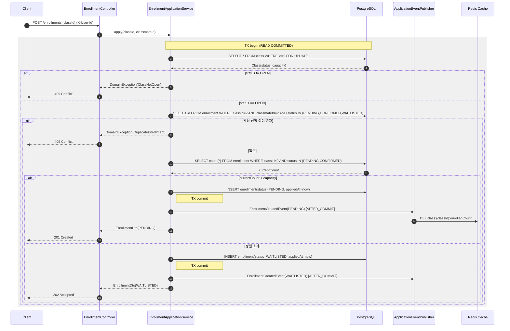
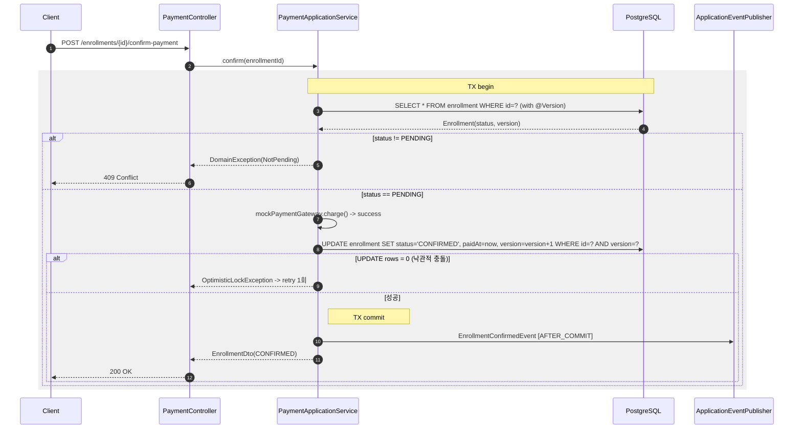
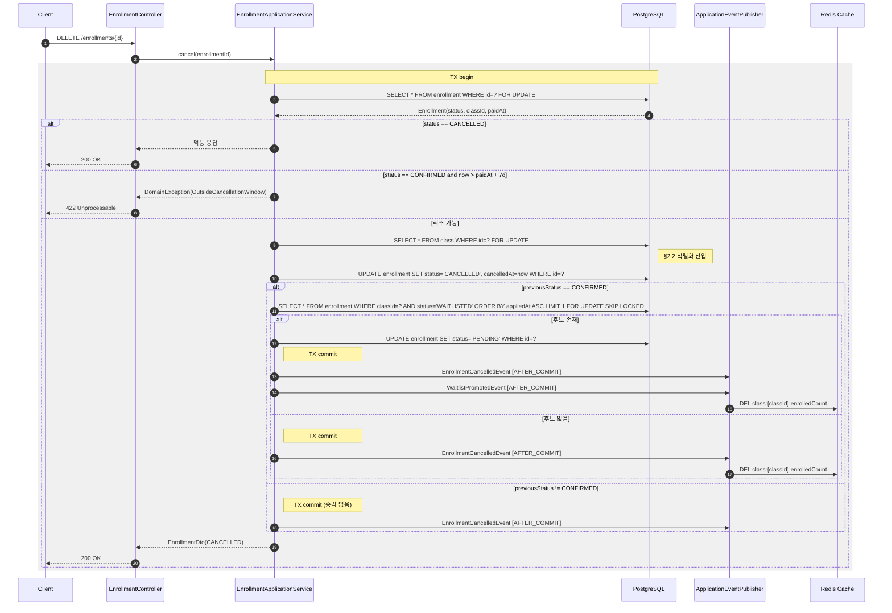

<!-- 라이브 강의 수강신청 시스템의 동시성 제어·캐싱·실패 복구 아키텍처 문서 -->
---
status: draft
owner: live-class team
created: 2026-05-11
updated: 2026-05-11
companion: DOCS.md
---

# ARCHITECTURE.md — Concurrency & Caching Architecture

## Table of Contents

1. [Overview](#1-overview)
2. [Concurrency Scenarios](#2-concurrency-scenarios)
3. [Strategy Comparison](#3-strategy-comparison)
4. [Chosen Approach](#4-chosen-approach)
5. [Redis Caching Layer](#5-redis-caching-layer)
6. [End-to-End Request Flows](#6-end-to-end-request-flows)
7. [Failure Modes & Recovery](#7-failure-modes--recovery)

---

## 1. Overview

라이브 강의 수강신청 시스템은 **고경합 자원(`Class.capacity`)에 대한 동시 쓰기** 와 **다중 Aggregate에 걸친 상태 전이(취소 → 대기열 승격)** 라는 두 축의 동시성 문제를 안고 있다. DOCS.md §6 Invariants 가 요구하는 다음 규칙들은 모두 동시성 제어가 무너지면 즉시 깨진다.

- Enrollment §2 — `CONFIRMED + PENDING` 합산이 `capacity` 를 초과해서는 안 된다(정원 초과 금지).
- Enrollment §3 — 동일 `(classId, classmateId)` 활성 신청 중복 금지.
- Enrollment §8 — 대기열 승격은 `appliedAt` 오름차순으로 정확히 1건만 일어난다.
- Class §3 — `DRAFT → OPEN → CLOSED` 일방향 전이.

본 시스템은 **모듈러 모놀리스 + 단일 PostgreSQL + 단일 Redis** 구성이며 단일 JVM 안에서 Spring `ApplicationEventPublisher` 로 컨텍스트가 협력한다. 분산 트랜잭션(2PC)이나 Saga 는 불필요하다. 다만 **다중 인스턴스로 수평 확장하는 순간 JVM 내부 락(`synchronized`, `ReentrantLock`)은 무용지물이 되므로**, 인프라 레벨의 동시성 제어가 필수다.

설계 원칙은 다음과 같다.

1. **Source of Truth 는 PostgreSQL** 이다. Redis 는 캐시·락 매니저·원자 카운터로만 사용하고 영속 상태의 단독 권위가 되지 않는다.
2. **한 트랜잭션은 한 Aggregate 만 변경** 한다(DOCS.md §3.4). 다중 Aggregate 가 관여하는 흐름은 도메인 이벤트로 분리한다.
3. **락 보유 시간은 짧게**. 락 안에서 외부 I/O(결제, 알림) 를 호출하지 않는다.
4. **실패 모드 명시**. 락 획득 실패, 타임아웃, 만료를 도메인 예외로 명시적으로 매핑한다.

---

## 2. Concurrency Scenarios

DOCS.md 가 정의한 도메인 규칙에 비춰 본 시스템이 반드시 정답을 내야 하는 동시성 시나리오 네 가지다.

### 2.1 마지막 자리 race condition

- **상황** — `Class.capacity = N`, 현재 `PENDING + CONFIRMED` 합산 = `N - 1`. 정확히 동일한 순간에 `M` 명(M >= 2)이 `POST /enrollments` 를 호출한다.
- **요구** — Invariant Enrollment §2. 1명만 `PENDING` 으로 진입하고 나머지 `M - 1` 명은 `WAITLISTED` 로 진입한다(거부가 아니라 대기열 진입, DOCS §4.2).
- **실패 모드** — naive `SELECT count(*) ... ; INSERT` 구현은 **lost update + phantom read** 로 `N + k` 명이 `PENDING` 에 들어간다(`k = 동시 요청 수 - 1`).
- **기대 동작** — `(classId)` 단위로 직렬화된 critical section 안에서 잔여 정원을 읽고, 0 이면 `WAITLISTED`, 1 이상이면 `PENDING` 으로 INSERT 한다.

### 2.2 대기열 자동 승격 (double-promotion 방지)

- **상황** — `Class C` 에 `CONFIRMED` 인 Enrollment 두 건이 거의 동시에 취소된다. `WAITLISTED` 의 선두는 한 명(`appliedAt` 가장 오래된)이다.
- **요구** — Invariant Enrollment §8. 두 번의 취소는 각각 **서로 다른** WAITLISTED 1건을 PENDING 으로 승격시켜야 한다. 같은 한 사람이 2번 승격되는(double promotion) 일도, 자리가 비었는데 아무도 승격되지 않는(lost promotion) 일도 없어야 한다.
- **실패 모드** — 두 cancel 핸들러가 `SELECT ... WHERE status='WAITLISTED' ORDER BY appliedAt LIMIT 1` 를 동시에 읽으면 둘 다 같은 row 를 PENDING 으로 UPDATE 하려고 시도. 격리수준이 READ COMMITTED 면 lost update 발생.
- **기대 동작** — cancel 트랜잭션 안에서 `(classId)` 단위 락을 잡고, 그 안에서 다음 승격 후보를 행 단위로 잠근다(`FOR UPDATE SKIP LOCKED`). cancel 이벤트당 정확히 1건이 `WAITLISTED → PENDING` 으로 전이한다.

### 2.3 7일 취소 창 enforce

- **상황** — `paidAt = 2026-05-04T10:00:00Z`. 사용자가 `2026-05-11T09:59:59Z` 와 `2026-05-11T10:00:01Z` 에 각각 취소를 시도한다.
- **요구** — Invariant Enrollment §5. `paidAt + 168h` 까지가 허용 경계.
- **경계 정책** — `now <= paidAt + Duration.ofDays(7)` 을 허용으로 정의한다. 즉 정확히 `+7일 0시 0분 0초` 시점은 **허용**, `+7일 0시 0분 1초` 부터 거부. DOCS §4.2 의 "이내" 라는 표현을 폐구간으로 해석한다.
- **실패 모드** — 동일 Enrollment 에 대해 두 cancel 요청이 동시에 도착하면 한 건은 `CONFIRMED → CANCELLED` 성공, 다른 건은 이미 `CANCELLED` 인 row 를 다시 취소하려고 시도(DOCS Invariant Enrollment §6 위반).
- **기대 동작** — Enrollment row 자체에 `SELECT ... FOR UPDATE` 또는 `version` 컬럼 기반 optimistic lock 을 걸어 상태 전이를 단 한 번만 허용한다.

### 2.4 상태 전이 무결성

- **상황** — Creator 가 `POST /classes/{id}/close` 를 더블 클릭하거나, 두 관리자 세션에서 동시에 `DRAFT → OPEN` 과 `DRAFT → CLOSED`(실제로는 DOCS §3 위반이지만 방어 필요) 를 시도한다.
- **요구** — Class Invariant §3. 단 한 번만 성공하고 나머지는 도메인 예외(`IllegalStateTransitionException`).
- **실패 모드** — `Class` row 의 `status` 컬럼을 두 트랜잭션이 동시에 읽으면 둘 다 `DRAFT` 로 보고 둘 다 UPDATE 시도.
- **기대 동작** — `Class` row 에 optimistic lock(`@Version`) 을 부여하고, 충돌 시 `OptimisticLockException` 을 catch 해 도메인 예외로 변환. 사용자 측에는 멱등 응답으로 매핑(이미 OPEN 이면 OK, 이미 CLOSED 면 OK).

---

## 3. Strategy Comparison

세 가지 후보 전략을 **본 도메인의 시나리오**(§2) 에 매핑해 비교한다. 일반론적 장단점이 아니라 "우리가 풀어야 할 문제에 무엇이 부합하는가" 가 기준이다.

### 3.1 비교표

| 항목 | A. DB Pessimistic Lock (`SELECT FOR UPDATE`) | B. Redisson `RLock` | C. Redis Lua Atomic Script |
|------|--------------------------------------------|---------------------|----------------------------|
| **작동 원리** | Postgres row 에 행 단위 X-lock 을 걸고 트랜잭션 종료 시 해제. | Redis 키에 SETNX + TTL + pub/sub 으로 분산 mutex 구현. Watchdog 이 TTL 자동 연장. | 단일 Lua 스크립트가 Redis 서버 안에서 read-modify-write 를 원자적으로 실행. |
| **§2.1 마지막 자리** | `Class` row 에 FOR UPDATE 걸고 잔여 정원 계산. DB 라운드트립 1회 + INSERT. **트랜잭션 일관성 보장**. | Redis 락 획득 → DB 트랜잭션 시작 → 카운트 → INSERT → 커밋 → 락 해제. 락과 DB 가 분리되어 **락 해제 직전 DB 커밋 실패 시 윈도우 발생**. | Redis 에 `remaining_seats` 카운터 두고 `DECR` 을 Lua 로 원자 검사. 그러나 **WAITLISTED 진입 시 `appliedAt` FIFO 보장을 위해 결국 DB 가 필요**. |
| **§2.2 대기열 승격** | `FOR UPDATE SKIP LOCKED` 로 다음 후보 1건만 잠그면 double-promotion 자연스럽게 방지. **PostgreSQL 의 SKIP LOCKED 가 이 시나리오에 정확히 맞는 도구**. | 가능하지만 락 잡고 DB 쿼리 한 번 더 함. SKIP LOCKED 보다 라운드트립 1회 더. | Lua 만으로 표현하기 어렵다. WAITLISTED 후보 목록을 Redis ZSET 으로 미러링해야 하며 **DB 와 정합성 동기화 부담**이 폭발. |
| **§2.3 7일 창** | Enrollment row 에 FOR UPDATE 또는 `@Version`. 트랜잭션 안에서 `paidAt + 7일` 비교. **단순**. | Enrollment 키별 락 필요. TTL 만료가 7일 정책과 무관함에도 동시성 문제만을 위해 락 도입은 과잉. | 7일 비교는 비즈니스 로직이라 Lua 안에 넣기 부적합. |
| **§2.4 상태 전이** | `@Version` optimistic lock 으로 충분. 충돌률이 낮은 시나리오. | 과잉. | 과잉. |
| **장애 모델** | DB 가 죽으면 어차피 시스템이 죽는다(단일 SoT). **추가 장애점 없음**. | Redis 가 죽으면 락 자체 불가 → fallback 정책 필요. **장애점 +1**. | Redis 가 죽으면 정원 카운터가 사라짐 → DB 에서 rebuild 필요. **장애점 +1 + 재구성 비용**. |
| **데드락** | 락 순서 위반 시 발생 가능. PostgreSQL 이 감지해 한쪽 트랜잭션 abort. | Watchdog TTL 연장이 정상 동작하면 데드락 자체는 거의 없으나, **lease 만료로 인한 silent unlock** 위험. | 단일 Lua 호출 안에서 끝나므로 데드락 없음. |
| **Fairness** | DB 의 락 큐는 FIFO 가 보장되지 않는다(PostgreSQL 은 FIFO 에 가깝지만 명시 보장 X). | `RLock` 자체는 비공정. `RFairLock` 사용 시 가능하나 성능 손해. | Lua 는 단일 스레드 직렬 실행 → 도착 순서대로 처리. |
| **성능 (단일 노드)** | row lock + INSERT 1 트랜잭션. p99 수 ms 수준. | Redis 라운드트립 2회(lock, unlock) + DB 트랜잭션. **네트워크 hop 추가**. | Redis 라운드트립 1회. **가장 빠름**. 단, 비즈니스 로직 일부만 처리 가능. |
| **운영 복잡도** | 익숙한 SQL. 모니터링은 `pg_locks`, `pg_stat_activity`. | Redisson client + Redis 모니터링 + watchdog 동작 이해 필요. | Lua 디버깅 어렵다. 스크립트 캐시(`EVALSHA`) 관리. |
| **테스트 용이성** | `@Transactional` + Testcontainers PostgreSQL 로 단순. | 임베디드 Redis 또는 Testcontainers 필요. RLock 의 watchdog 시간을 통제하기 까다로움. | 동일하게 Redis 필요. Lua 단위 테스트는 별도 framework 필요. |
| **모듈러 모놀리스 적합성** | 매우 높음. 단일 JVM + 단일 DB 의 트랜잭션 경계와 자연스럽게 일치. | 중간. 수평 확장에 대비한 보험이지만 현재 단일 JVM 에서는 과잉. | 낮음. Redis 를 SoT 로 끌어올리는 효과가 발생해 모놀리스의 단순함을 훼손. |

### 3.2 비교의 요지

본 도메인의 본질은 **(a) `(classId)` 라는 좁은 키 단위 직렬화** 와 **(b) `appliedAt` FIFO 보장** 이다. (b) 를 충족시키려면 어떤 전략을 택하든 결국 PostgreSQL 의 row 와 인덱스를 만지게 되어 있다. 즉 Redis 를 동시성 제어의 1차 도구로 끌어와도 DB 트랜잭션을 피할 수 없고, **두 장치(Redis 락 + DB 트랜잭션)의 경계에서 새로운 정합성 문제** 가 생긴다.

PostgreSQL 은 `SELECT FOR UPDATE` 와 `FOR UPDATE SKIP LOCKED` 라는, **본 시나리오(§2.1, §2.2) 에 정확히 들어맞는** 두 가지 도구를 이미 제공한다.

---

## 4. Chosen Approach

### 4.1 결론

**기본 전략은 PostgreSQL Pessimistic Lock (A) 이다. Redisson 분산 락 (B) 은 단일 JVM 외부에서 트리거되는 작업(스케줄러, 운영 도구) 의 mutual exclusion 으로만 보조 사용한다. Lua Script (C) 는 본 도메인에서 채택하지 않는다.**

### 4.2 채택 근거

1. **본 도메인의 critical section 은 반드시 DB row 를 만진다.** §2.1 의 잔여 정원 계산, §2.2 의 다음 WAITLISTED 선정은 모두 PostgreSQL 의 인덱스 스캔 + row write 다. Redis 락이나 Lua 카운터를 끼워 넣으면 "락 보호 구간"과 "실제 변경 구간" 이 두 시스템에 걸쳐 분리되고, 두 시스템 사이 커밋 실패 시점에 lost update 가 재현된다. Postgres 안에서 끝내는 것이 정합성 윈도우를 0 으로 만든다.

2. **`FOR UPDATE SKIP LOCKED` 가 §2.2 의 교과서적 해답이다.** Redis 로 같은 동작을 구현하려면 ZSET 미러링 + Lua + DB 동기화 큐를 직접 만들어야 한다. 이는 표준 도구를 버리고 같은 동작을 다시 짜는 일이다.

3. **모듈러 모놀리스 + 단일 JVM 컨텍스트에서 Redis 분산 락은 과잉이다.** Redisson `RLock` 은 다중 인스턴스 간 mutex 가 필요할 때 가치를 갖는다. 현재 배포 단위가 단일 JVM 이라면 DB row lock 만으로 충분하며 장애점을 추가할 이유가 없다. 단, **다중 인스턴스로 수평 확장하는 미래** 에는 §2.4 같은 짧은 critical section 에 한해 `RLock` 도입을 검토한다.

4. **Lua Script 는 본 도메인에서 fit 하지 않는다.** 정원 카운터를 Redis 로 옮기면 (a) Redis 가 SoT 가 되어버려 DOCS §3.4 의 한 트랜잭션 한 Aggregate 원칙이 무너지고, (b) `appliedAt` FIFO 를 Redis ZSET 으로 이중관리해야 하며, (c) Redis 장애 시 정원 복구 절차가 필요해진다. 얻는 것은 ms 단위 성능, 잃는 것은 정합성 모델의 단순함. 트레이드오프가 맞지 않는다.

5. **성능 한계는 측정 후 결정.** 현 단계에서 p99 응답 시간 SLA(예: 200ms) 가 PostgreSQL row lock 으로 달성 불가하다는 측정 근거는 없다. 측정 없이 Redis 카운터로 도망가는 것은 premature optimization 이다.

### 4.3 시나리오별 적용 매핑

| 시나리오 | 메커니즘 | 비고 |
|---------|---------|------|
| §2.1 마지막 자리 | `Class` row 에 `SELECT ... FOR UPDATE` (`classId` PK 기준). 트랜잭션 안에서 `COUNT(*) FROM enrollment WHERE classId=? AND status IN ('PENDING','CONFIRMED')` 후 분기. | 락 보유 시간을 짧게 유지하기 위해 `Class` 의 `capacity` 만 읽고 unrelated 필드는 가져오지 않는다. |
| §2.2 대기열 승격 | (1) Cancel 트랜잭션 안에서 `Class` row FOR UPDATE 로 직렬화. (2) `SELECT ... FROM enrollment WHERE classId=? AND status='WAITLISTED' ORDER BY appliedAt LIMIT 1 FOR UPDATE SKIP LOCKED` 로 다음 후보 잠금. (3) UPDATE 후 `WaitlistPromotedEvent` 발행. | 동일 트랜잭션 안에서 처리하므로 `EnrollmentCancelledEvent → WaitlistPromotion` 은 in-process 이벤트로 같은 트랜잭션에서 실행한다(별도 메시지 큐 불필요). |
| §2.3 7일 창 | `Enrollment` row 에 `@Version` optimistic lock. `cancel()` 메서드 안에서 `paidAt + 7d` 비교. 충돌 시 한 번 재시도, 그래도 실패하면 사용자에게 5xx 가 아닌 idempotent 응답. | 같은 Enrollment 에 동시 cancel 요청은 사실상 더블 클릭 케이스이며 빈도가 낮으므로 optimistic 이 적합. |
| §2.4 상태 전이 | `Class` 에 `@Version`. Creator 가 같은 전이를 두 번 트리거해도 한 번만 성공. | 멱등 응답 매핑은 application service 책임. |

### 4.4 락 키 컨벤션과 보유 시간

- **PostgreSQL row lock** — Aggregate Root row 자체를 잠근다. 별도 advisory lock 은 사용하지 않는다(트랜잭션 종료와 함께 자동 해제되는 것이 운영상 안전).
- **Redisson RLock 보조 사용** — 향후 도입 시 키 컨벤션 `lock:class:{classId}` / `lock:enrollment:{enrollmentId}`. `tryLock(waitTime=200ms, leaseTime=3s)` 를 기본값으로 한다. leaseTime > 트랜잭션 평균 + 표준편차 * 3 을 만족해야 한다.
- **트랜잭션 시간 상한** — Class 락을 잡은 트랜잭션은 100ms 이내에 종료한다. 외부 호출(결제, 알림) 은 트랜잭션 밖에서 처리.

---

## 5. Redis Caching Layer

Redis 는 본 시스템에서 **(a) 강의 상세 조회 캐시** 와 **(b) 향후 분산 락** 두 목적으로만 사용한다. 영속 상태의 권위를 가지지 않는다.

### 5.1 캐시 대상과 비대상

| 데이터 | 캐시? | 이유 |
|--------|------|------|
| `Class` 메타데이터(title, description, price, period, status) | **예** | 읽기 비율이 압도적으로 높고 변경 빈도가 낮다. |
| `Class.capacity` (정수) | **예** | 메타데이터의 일부. |
| `현재 enrolled count` (PENDING + CONFIRMED 합) | **조건부 — 캐시는 하지만 결정에 사용하지 않음** | 표시 목적으로만 캐시하고 §2.1 의 정원 차감 결정에는 **절대 사용하지 않는다**. 결정은 DB row lock 안에서만 한다. |
| `Enrollment` 개별 row | **아니오** | 사용자 본인의 신청 상태이며 캐시 적중률이 낮다. |
| `대기열 순위` | **아니오** | DB 의 `ORDER BY appliedAt` 결과를 매번 계산. 캐시 무효화 복잡도가 이득을 초과. |

### 5.2 Key 네이밍 컨벤션

| Key | Type | TTL | 용도 |
|-----|------|-----|------|
| `class:{classId}:detail` | String (JSON) | 300s | 강의 상세 응답 본체. |
| `class:{classId}:enrolledCount` | String (int) | 60s | 표시용 카운터. 신뢰 경계 아님. |
| `lock:class:{classId}` | Redisson RLock | leaseTime | 향후 분산 락 도입 시 예약. |

키는 모두 소문자, `:` 구분자, `{변수}` 는 UUID 문자열 형태로 통일한다.

### 5.3 무효화 전략

**Write-through 가 아닌 Cache-aside + 도메인 이벤트 기반 invalidation** 을 사용한다.

| 트리거 이벤트 | 무효화 대상 |
|------------|------------|
| `ClassOpenedEvent`, `ClassClosedEvent` | `class:{classId}:detail` DEL |
| `Class.changeCapacity` (DRAFT only) | `class:{classId}:detail` DEL |
| `EnrollmentCreatedEvent` | `class:{classId}:enrolledCount` DEL (다음 조회 시 재계산) |
| `EnrollmentConfirmedEvent` | `class:{classId}:enrolledCount` DEL |
| `EnrollmentCancelledEvent` | `class:{classId}:enrolledCount` DEL |
| `WaitlistPromotedEvent` | `class:{classId}:enrolledCount` DEL |

무효화는 **트랜잭션 커밋 이후**(`@TransactionalEventListener(phase = AFTER_COMMIT)`) 에 실행한다. 커밋 전 무효화는 트랜잭션 롤백 시 캐시 incoherence 를 만든다.

### 5.4 Stale Read 정책

- **강의 상세 조회** — 최대 300초 stale 을 허용한다. UI 상의 가격·정원 표시가 5분 지연되어도 비즈니스 영향이 없다.
- **enrolledCount** — 최대 60초 stale 을 허용한다. "현재 X 명이 신청 중" 표시용이며, 사용자가 화면에서 본 숫자와 실제 잔여 정원이 다를 수 있다는 점을 UX 에서 수용한다.
- **신청 가능 여부 판정** — 캐시를 **신뢰하지 않는다**. UI 가 "신청 가능" 으로 보였더라도 실제 INSERT 는 §4.3 의 DB row lock 으로 결정된다. 화면 표시와 실제 결과 불일치는 "마감되었습니다" 응답으로 자연스럽게 해소.

### 5.5 Cache Stampede 방어

- 인기 강의 캐시가 동시에 만료되면 같은 키에 대해 다수 요청이 DB 로 몰린다.
- 방어책 — 캐시 미스 시 Redisson `RLock` 으로 **재계산 단일화** 를 적용(`lock:cache:class:{classId}:detail`, leaseTime 1s). 락 미획득 시 약간의 stale 값을 그대로 반환하거나 짧은 backoff 후 재조회.

---

## 6. End-to-End Request Flows

### 6.1 `POST /enrollments` — race-safe last-seat allocation

핵심 포인트.

- (3) `Class` row 의 FOR UPDATE 가 `(classId)` 단위 직렬화의 전부다. 다른 클래스 신청에는 영향이 없다.
- (4) 활성 신청 중복 검사는 같은 트랜잭션 안에서 한다. 별도 락 없이 row 가 잠겨있으므로 phantom insert 가능성은 해당 `(classId, classmateId)` 조합에 대해 unique index 로 추가 방어한다(`UNIQUE (classId, classmateId) WHERE status IN ('PENDING','CONFIRMED','WAITLISTED')` — partial index).
- (8) PENDING 또는 WAITLISTED INSERT 후 트랜잭션을 즉시 커밋. 이벤트 발행은 AFTER_COMMIT 단계.

### 6.2 `POST /enrollments/{id}/confirm-payment` — mock 결제

핵심 포인트.

- mock 결제는 실제 PG 호출이 아니지만 **외부 호출이라고 가정** 하고 트랜잭션 밖에 둔다(2). 실제 구현 시 트랜잭션을 시작하기 전에 결제 결과를 받아두고, 트랜잭션 안에서는 상태 전이만 한다.
- 본 흐름은 `Class` 락을 잡지 않는다. PENDING → CONFIRMED 는 잔여 정원에 영향을 주지 않기 때문이다(이미 PENDING 시점에 자리가 차감된 상태).

### 6.3 `DELETE /enrollments/{id}` — cancel + waitlist promotion

핵심 포인트.

- (3) Enrollment row 를 FOR UPDATE 로 잡아 §2.3 의 동시 cancel 중복을 방지.
- (8) Class row 를 FOR UPDATE 로 잡아 §2.2 의 다른 cancel 트랜잭션과 직렬화. 이로써 같은 강의의 두 cancel 이 동시에 실행되어도 정확히 자리 수만큼만 승격이 일어난다.
- (10) `FOR UPDATE SKIP LOCKED` 는 본 흐름에서는 사실상 단일 후보를 잠그는 정상 락처럼 동작한다. 다중 cancel 이 동시에 일어날 때 한 cancel 의 후보 락이 다른 cancel 에 의해 막혀 wait 하는 대신 다음 후보로 건너뛸 수 있도록 한 안전장치다.
- (11) 후보 UPDATE 까지 같은 트랜잭션 안에서 수행. cancel 과 promotion 이 하나의 원자 단위.
- 이벤트 발행은 모두 AFTER_COMMIT. 트랜잭션 롤백 시 외부에 잘못된 이벤트가 새지 않는다.

---

## 7. Failure Modes & Recovery

### 7.1 Redis 다운

- **영향** — 강의 상세 조회 캐시 미스. 캐시 stampede 방어 락(§5.5) 도 동작 불가.
- **대응** — Redis 클라이언트(Lettuce/Redisson)에 짧은 타임아웃(200ms) 과 circuit breaker 설정. Redis 호출 실패 시 캐시를 **bypass** 하고 직접 DB 조회로 fallback. 캐시 무효화 실패는 로그만 남기고 흘려보낸다(다음 만료 시점에 자연 정정).
- **금지** — Redis 가 죽었다고 신청 API 자체를 거부하지 않는다. 동시성 제어가 DB row lock 으로 닫혀 있기 때문에 Redis 부재는 정합성에 영향이 없다. 이것이 §4.2 (3) 의 핵심 가치.

### 7.2 PostgreSQL 연결 끊김

- **영향** — 모든 쓰기 API 실패. SoT 다운은 시스템 다운과 동의어.
- **대응** — Spring 의 connection pool(HikariCP) 의 `connectionTimeout` 을 짧게(2s), 헬스체크 활성화. 끊김이 감지되면 503 을 반환하고 client 가 재시도하도록 한다. 비동기 이벤트 컨슈머는 retry + DLQ.
- **데이터 손실 방지** — `EnrollmentConfirmedEvent` 등이 AFTER_COMMIT 단계에서 발행되는 구조이므로, 트랜잭션이 커밋되지 못한 신청은 외부에 노출되지 않는다. 트랜잭션 커밋 후 이벤트 발행 사이에 JVM 이 죽으면 이벤트 유실 위험이 있다. **본 모놀리스 단계에서는 in-process 이벤트만 사용** 하고 외부 시스템 연동 시점에 Transactional Outbox 패턴 도입을 검토한다(현재 범위 외).

### 7.3 락 leak / 장기 트랜잭션

- **위험** — `SELECT FOR UPDATE` 를 잡은 트랜잭션이 외부 I/O 로 늘어지면 같은 `(classId)` 의 모든 신청이 대기 큐에 쌓인다.
- **대응** — 트랜잭션 안에서 **외부 호출 금지** 를 코드 레벨로 강제(아키텍처 테스트로 검증). statement timeout 을 PostgreSQL 레벨에서 `SET LOCAL statement_timeout = '500ms'` 로 설정. 락 holding 시간이 임계치(예: 200ms) 를 넘으면 경보.
- **모니터링** — `pg_stat_activity.wait_event_type = 'Lock'` 행 수, `pg_locks` 의 granted=false 행 수를 메트릭으로 노출.

### 7.4 Redisson 분산 락 — clock skew 및 lease 만료

(보조 사용 시 한정.)

- **위험** — Redisson `RLock` 은 lease TTL 기반이다. 보유 노드가 GC pause 등으로 멈춘 사이 TTL 만료 → 다른 노드가 같은 락을 획득 → 동시에 두 노드가 critical section 진입.
- **대응** — `RLock` 만으로는 보호 못하므로 **DB row lock 을 마지막 방어선** 으로 항상 둔다(본 설계는 이미 그러함). 즉 Redisson 락이 lease 만료로 풀리더라도 DB 가 직렬화를 보장한다.
- **추가 방어** — JVM GC 튜닝(G1 / ZGC) 으로 stop-the-world 를 lease 보다 짧게 유지. lease 는 트랜잭션 평균 + 3σ + 안전마진으로 설정.

### 7.5 멱등성과 재시도

- **client 재시도** — 네트워크 단절로 client 가 같은 `POST /enrollments` 를 두 번 보낼 수 있다. partial unique index `(classId, classmateId) WHERE status IN ('PENDING','CONFIRMED','WAITLISTED')` 가 중복 INSERT 를 DB 레벨에서 거부 → application 에서 `DuplicateEnrollment` 도메인 예외로 변환 → client 에는 기존 신청 정보 반환(409).
- **이벤트 핸들러 재시도** — `@TransactionalEventListener` 핸들러 안에서 예외가 발생해도 트랜잭션 커밋은 영향받지 않는다. 캐시 무효화 같은 보조 작업은 실패해도 다음 TTL 만료로 자연 정정.

### 7.6 정합성 검증 배치

- **주기** — 일 1회 새벽.
- **검증 항목**
  1. `Class.capacity >= COUNT(enrollment WHERE classId=? AND status IN ('PENDING','CONFIRMED'))` — 정원 초과 감지.
  2. `(classId, classmateId)` 별 활성 신청 1건 이하.
  3. `CONFIRMED` Enrollment 의 `paidAt` non-null.
- **위반 발견 시** — 알림만 발송하고 자동 수정하지 않는다. 자동 수정은 도메인 의미를 모르는 수술이므로 운영자가 케이스를 판단한다.

---

(end of ARCHITECTURE.md)
