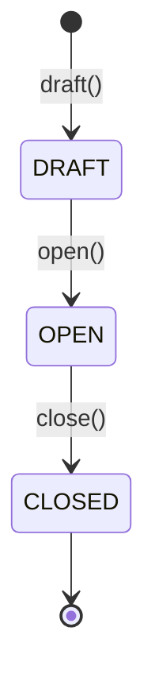
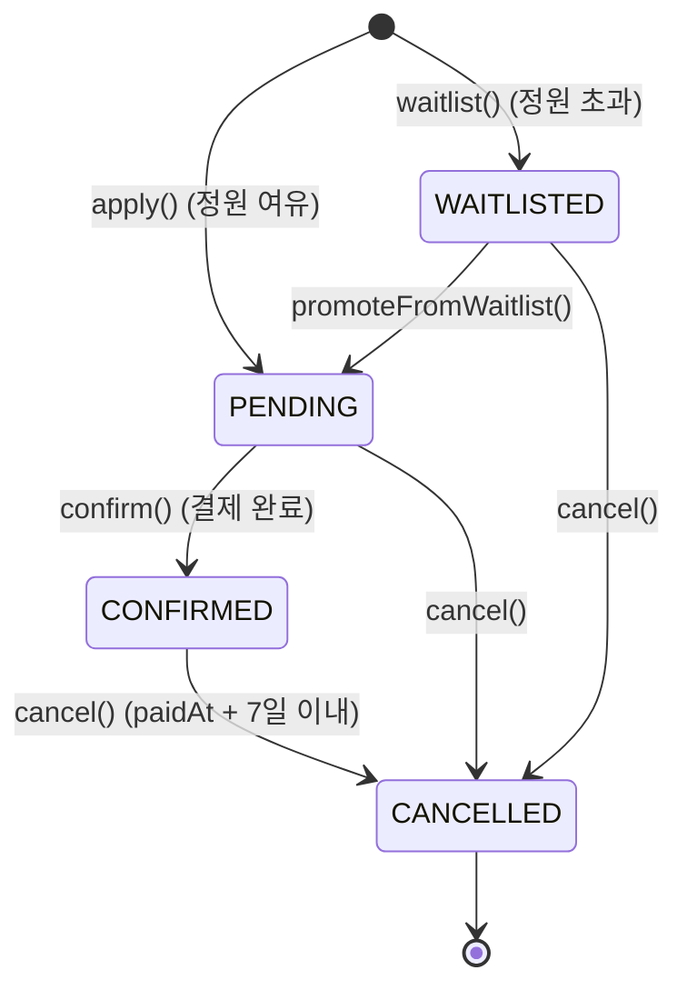

<!-- Live Class 도메인 설계 문서 — 바운디드 컨텍스트·애그리거트·상태 전이·불변식을 기술한다 -->
---
status: draft
owner: live-class team
created: 2026-05-11
updated: 2026-05-12
---

# DOCS.md — Live Class Domain Design

## Table of Contents

1. [Overview](#overview)
2. [Bounded Contexts](#bounded-contexts)
3. [Aggregates](#aggregates)
   - 3.1 [Class Aggregate](#class-aggregate)
   - 3.2 [Enrollment Aggregate](#enrollment-aggregate)
   - 3.3 [User Aggregate](#user-aggregate)
   - 3.4 [Aggregate 간 참조 전략](#aggregate-간-참조-전략)
4. [State Lifecycles](#state-lifecycles)
   - 4.1 [Class Lifecycle](#class-lifecycle)
   - 4.2 [Enrollment Lifecycle](#enrollment-lifecycle)
5. [Domain Events](#domain-events)
   - 5.1 [Event Catalog](#event-catalog)
   - 5.2 [Event Flow](#event-flow)
6. [Invariants](#invariants)
7. [Glossary](#glossary)

---

## Overview

라이브 강의 수강신청 시스템은 Creator가 강의를 개설하고 Classmate가 신청·결제·취소하는 도메인이며, 정원 제약·대기열 승격·취소 창(7일)을 핵심 비즈니스 규칙으로 한다.

---

## Bounded Contexts

세 개의 Bounded Context로 분리되며, 동일 배포 단위 안에서 in-process 호출(메서드 또는 Spring `ApplicationEvent`)로 협력한다.

| Context | 책임 경계 (한 줄 요약) | Aggregate Root |
|---------|----------------------|----------------|
| Class | 강의의 개설·기간·정원·가격·상태 전이(`DRAFT → OPEN → CLOSED`)를 관리한다. | `Class` |
| Enrollment | 수강 신청 생성, 결제 확정, 취소, 대기열 진입·승격을 관리한다. | `Enrollment` |
| User | 사용자(Creator / Classmate) 역할과 식별을 제공한다. 인증은 `X-User-Id` 헤더 기반 mock. | `User` |

컨텍스트 간 상호작용은 도메인 이벤트(섹션 5)로 느슨하게 연결한다. 직접 객체 참조는 금지하며 ID 참조만 사용한다.

---

## Aggregates

### Class Aggregate

Aggregate Root는 **`Class`** 이며 강의 메타데이터와 모집 상태를 캡슐화한다. Enrollment 집합은 Class 내부에 보관하지 않고 ID 참조로만 연계한다(트랜잭션 경계 분리).

**Class (Aggregate Root, Entity)**

| Field | Type | Description |
|-------|------|-------------|
| id | `ClassId` (VO) | 강의 식별자. UUID 래퍼. |
| title | `String` | 강의 제목. |
| description | `String` | 강의 설명. |
| price | `Money` (VO) | 수강료. `amount: BigDecimal`, `currency: Currency`. |
| capacity | `Capacity` (VO) | 최대 수강 인원. `value: int`, `value > 0` 불변. |
| period | `ClassPeriod` (VO) | 강의 **진행 기간** (수업 첫날 ~ 마지막날). 신청 모집 기간이 아니다. `startDate: LocalDate`, `endDate: LocalDate`, `startDate <= endDate` 불변. `endDate` 도래 시 Quartz 가 자동 close (ARCHITECTURE §8). |
| status | `ClassStatus` (Enum) | `DRAFT`, `OPEN`, `CLOSED`. |
| creatorId | `UserId` (VO) | 강의 개설자(Creator) 식별자. |
| createdAt | `Instant` | 생성 시각. |
| updatedAt | `Instant` | 마지막 수정 시각. |

**의도 표현 메서드 (Setter 금지)**

```
public static Class draft(UserId creatorId, String title, String description,
                          Money price, Capacity capacity, ClassPeriod period, Instant now)
public void open(Instant now)
public void close(Instant now)
public void changeCapacity(Capacity newCapacity, Instant now)   // DRAFT 상태에서만 허용
public boolean isOpenForEnrollment(Instant now)
```

**Value Objects**

- `ClassId(UUID value)` — 불변, `equals/hashCode`는 `value` 기준.
- `Money(BigDecimal amount, Currency currency)` — `amount >= 0`, 음수 거부.
- `Capacity(int value)` — `value >= 1`, 0 이하 거부.
- `ClassPeriod(LocalDate startDate, LocalDate endDate)` — `endDate >= startDate`.

---

### Enrollment Aggregate

Aggregate Root는 **`Enrollment`** 이며 한 명의 Classmate가 한 강의에 시도한 수강 신청 하나의 라이프사이클을 캡슐화한다. 대기열도 별도 Aggregate가 아닌 `Enrollment.status = WAITLISTED` 로 표현한다.

**Enrollment (Aggregate Root, Entity)**

| Field | Type | Description |
|-------|------|-------------|
| id | `EnrollmentId` (VO) | 신청 식별자. |
| classId | `ClassId` (VO) | 대상 강의 ID 참조. |
| classmateId | `UserId` (VO) | 수강생 ID 참조. |
| status | `EnrollmentStatus` (Enum) | `PENDING`, `CONFIRMED`, `CANCELLED`, `WAITLISTED`. |
| appliedAt | `Instant` | 최초 신청 시각. 대기열 순서 정렬 기준. |
| paidAt | `Instant` (nullable) | 결제 완료 시각. `CONFIRMED` 진입 시 세팅. |
| cancelledAt | `Instant` (nullable) | 취소 시각. `CANCELLED` 진입 시 세팅. |

**의도 표현 메서드 (Setter 금지)**

```
public static Enrollment apply(ClassId classId, UserId classmateId, Instant now)         // PENDING
public static Enrollment waitlist(ClassId classId, UserId classmateId, Instant now)      // WAITLISTED
public void confirm(Instant now)                       // PENDING → CONFIRMED, paidAt 기록
public void cancel(Instant now)                        // CONFIRMED/PENDING/WAITLISTED → CANCELLED
public void promoteFromWaitlist(Instant now)           // WAITLISTED → PENDING
public boolean isWithinCancellationWindow(Instant now) // paidAt + 7일 비교
```

**Value Objects**

- `EnrollmentId(UUID value)` — 불변.
- `EnrollmentStatus` — Enum.
- `CancellationWindow` — `paidAt` 기준 7일(168시간)을 캡슐화하는 정책 객체. `isWithin(Instant now): boolean`.

---

### User Aggregate

Aggregate Root는 **`User`** 이며 역할(Role)과 식별을 제공한다. 인증은 mock(`X-User-Id` 헤더)이므로 비밀번호·세션 필드는 없다.

**User (Aggregate Root, Entity)**

| Field | Type | Description |
|-------|------|-------------|
| id | `UserId` (VO) | 사용자 식별자. UUID 래퍼. |
| role | `UserRole` (Enum) | `CREATOR`, `CLASSMATE`. |
| name | `String` | 표시명. |
| createdAt | `Instant` | 가입 시각. |

**의도 표현 메서드**

```
public static User register(UserRole role, String name, Instant now)
public boolean isCreator()
public boolean isClassmate()
```

**Value Objects**

- `UserId(UUID value)` — 모든 Bounded Context에서 공유되는 식별자 VO.
- `UserRole` — Enum.

---

### Aggregate 간 참조 전략

- Aggregate 간 참조는 **항상 ID 참조**(`ClassId`, `UserId`, `EnrollmentId`)만 사용한다.
- 한 트랜잭션은 한 Aggregate 인스턴스만 변경하는 것을 원칙으로 한다(예: 신청 시 `Class`의 카운터는 직접 수정하지 않고 `EnrollmentCreatedEvent` 또는 별도 read model에서 처리).
- 대기열 승격처럼 다중 Aggregate가 관여하는 시나리오는 도메인 이벤트로 분리한다(섹션 5.2).
- **예외 조항 — Redis ZSET Mirror**. ARCHITECTURE.md §4·§5 에서 채택한 `enrolled:{classId}` / `waitlist:{classId}` Redis ZSET 은 Enrollment Aggregate 의 **index** 로 취급한다. 별개 Aggregate 가 아니며, ZSET 갱신은 동일 application 트랜잭션 안에서 Lua atomic script 로 수행하고 DB 쓰기와 Transactional Outbox 의미로 짝지운다. 위의 "한 트랜잭션 한 Aggregate" 원칙은 이 index 갱신을 포함하지 않는다(index 는 도메인 객체의 외부 표현).

---

## State Lifecycles

### Class Lifecycle

Creator만 상태 전이를 트리거하며 일방향이다. `CLOSED → OPEN` 역방향 전이는 거부된다.



| 전이 | 트리거 메서드 | 조건 |
|------|--------------|------|
| `→ DRAFT` | `Class.draft(...)` | 최초 생성 시. |
| `DRAFT → OPEN` | `Class.open(now)` | 호출자가 Creator(`creatorId` 일치)여야 한다. |
| `OPEN → CLOSED` | `Class.close(now)` (Creator 수동) **또는** `Class.autoClose(now)` (Quartz `ClassAutoCloseJob`) | Creator 수동 종료, 또는 `endDate` 도래 시 매일 00:05 KST Quartz 자동 close (Asia/Seoul, ARCHITECTURE §8). 동시 호출은 `@Version` optimistic lock 으로 한쪽만 성공. |

### Enrollment Lifecycle

`WAITLISTED`는 정원 초과 시 진입하며, `CONFIRMED` 취소가 발생하면 가장 오래된 `WAITLISTED` 하나가 `PENDING`으로 승격된다.



| 전이 | 트리거 메서드 | 조건 |
|------|--------------|------|
| `→ PENDING` | `Enrollment.apply(...)` | `Class.status == OPEN` 이고 잔여 정원 > 0. |
| `→ WAITLISTED` | `Enrollment.waitlist(...)` | `Class.status == OPEN` 이고 잔여 정원 == 0. |
| `WAITLISTED → PENDING` | `Enrollment.promoteFromWaitlist(now)` | 상위 `CONFIRMED` 취소로 자리 발생 시. |
| `PENDING → CONFIRMED` | `Enrollment.confirm(now)` | mock 결제 성공. `paidAt` 기록. |
| `PENDING → CANCELLED` | `Enrollment.cancel(now)` | 결제 전 자발 취소. |
| `WAITLISTED → CANCELLED` | `Enrollment.cancel(now)` | 대기열 이탈. |
| `CONFIRMED → CANCELLED` | `Enrollment.cancel(now)` | `paidAt + 7일` 이내. 초과 시 도메인 예외. |

---

## Domain Events

### Event Catalog

이벤트명은 과거형이며 페이로드는 record 형태로 정의한다. 발행은 Spring `ApplicationEventPublisher`를 전제한다.

| Event | Payload Fields | Trigger |
|-------|---------------|---------|
| `ClassOpenedEvent` | `classId: ClassId`, `creatorId: UserId`, `occurredAt: Instant` | `Class.open()` 성공 직후. |
| `ClassClosedEvent` | `classId: ClassId`, `creatorId: UserId`, `occurredAt: Instant` | `Class.close()` 성공 직후. |
| `EnrollmentCreatedEvent` | `enrollmentId`, `classId`, `classmateId`, `status (PENDING\|WAITLISTED)`, `occurredAt` | `Enrollment.apply()` 또는 `waitlist()` 성공 시. |
| `EnrollmentConfirmedEvent` | `enrollmentId`, `classId`, `classmateId`, `paidAt`, `occurredAt` | `Enrollment.confirm()` 성공 직후. |
| `EnrollmentCancelledEvent` | `enrollmentId`, `classId`, `classmateId`, `previousStatus`, `cancelledAt`, `occurredAt` | `Enrollment.cancel()` 성공 직후. |
| `WaitlistPromotedEvent` | `enrollmentId`, `classId`, `classmateId`, `occurredAt` | `Enrollment.promoteFromWaitlist()` 성공 직후. |

### Event Flow

| Event | Producer | Consumer | 후속 액션 |
|-------|----------|----------|-----------|
| `ClassClosedEvent` | Class | Enrollment | 해당 강의의 `WAITLISTED` 신청 일괄 정리. |
| `EnrollmentCreatedEvent` | Enrollment | (read model) | Creator 대시보드용 카운터 갱신. |
| `EnrollmentConfirmedEvent` | Enrollment | (read model) | 확정 인원 카운터 증가, Creator의 수강생 목록 반영. |
| `EnrollmentCancelledEvent` | Enrollment | Enrollment (Waitlist 정책) | `previousStatus == CONFIRMED` 인 경우 가장 오래된 `WAITLISTED` 1건을 `PENDING`으로 승격(`WaitlistPromotedEvent` 발행). |
| `WaitlistPromotedEvent` | Enrollment | (notification, read model) | 승격된 수강생에게 결제 안내 트리거. |

---

## Invariants

### Class

1. `capacity.value >= 1` — 정원은 1 이상이어야 한다.
2. `period.endDate >= period.startDate` — 종료일은 시작일 이후여야 한다.
3. 상태 전이는 `DRAFT → OPEN → CLOSED` 일방향만 허용한다. 역방향 호출은 도메인 예외로 거부한다.
4. 상태 전이 메서드는 호출자가 `creatorId` 와 일치할 때만 허용한다. 단 Quartz `ClassAutoCloseJob` 이 호출하는 `autoClose()` 는 시스템 호출로서 Creator 일치 검증을 우회한다(시스템 가상 사용자).
5. `capacity` 변경은 `DRAFT` 상태에서만 허용한다.
6. `endDate` 경과 후 `status` 는 `OPEN` 으로 남을 수 없다. Quartz `ClassAutoCloseJob` 이 매일 00:05 KST 에 OPEN 이면서 `endDate < today(KST)` 인 모든 Class 에 대해 자동 close 를 시도한다. Creator 수동 close 와 충돌할 경우 `@Version` optimistic lock 으로 한쪽만 성공하며, 패자는 `IllegalStateTransitionException` 을 catch 해 INFO 로깅 후 멱등 응답으로 처리한다.

### Enrollment

1. `Class.status == OPEN` 일 때만 새 `Enrollment` 생성을 허용한다. `DRAFT`/`CLOSED` 상태에서 생성 시도는 거부한다.
2. 정원 초과 신청은 `PENDING`으로 들어가지 않고 `WAITLISTED`로만 진입한다. `CONFIRMED + PENDING` 합산이 `capacity` 를 초과해서는 안 된다.
3. 동일 `(classId, classmateId)` 조합으로 활성(`PENDING|CONFIRMED|WAITLISTED`) 상태의 `Enrollment`가 둘 이상 존재할 수 없다.
4. Creator는 자신이 개설한 강의에 `Enrollment`를 생성할 수 없다(`creatorId != classmateId`).
5. `CONFIRMED → CANCELLED` 전이는 `paidAt + 7일` 이내에만 허용한다. 초과 시 도메인 예외.
6. `cancel()` 호출 시점에 이미 `CANCELLED` 인 경우 재취소는 거부한다(idempotent 처리는 application layer 책임).
7. `confirm()`은 `PENDING` 상태에서만 호출 가능. `WAITLISTED`는 먼저 `promoteFromWaitlist()`를 거쳐야 한다.
8. 대기열 승격은 `appliedAt` 오름차순(FIFO)으로 정확히 1건만 일어난다.

### User

1. `role` 은 생성 후 변경 불가(불변).
2. `name` 은 비어있을 수 없다.

### Cross-Aggregate

1. `Enrollment.classId` 는 존재하는 `Class` 를 가리켜야 한다. 참조 무결성은 application layer에서 보장한다.
2. 정원 초과 신청은 거부된다(동시성 제어 전략은 ARCHITECTURE.md에서 정의).

---

## Glossary

| Term (EN) | Term (KO) | Definition |
|-----------|-----------|------------|
| Class | 강의 | Creator가 개설한 라이브 강의 단위. Aggregate Root. |
| Creator | 강사 | 강의를 개설하고 상태를 전이시키는 사용자 역할. |
| Classmate | 수강생 | 강의에 신청·결제·취소하는 사용자 역할. |
| Enrollment | 수강 신청 | 한 Classmate가 한 Class에 시도한 수강 신청 1건. |
| Capacity | 정원 | 강의가 수용할 수 있는 최대 인원. `CONFIRMED + PENDING` 합산 상한. |
| Waitlist | 대기열 | 정원 초과 시 진입하는 `WAITLISTED` 상태 신청들의 FIFO 큐. |
| Waitlist Promotion | 대기열 승격 | `CONFIRMED` 취소로 자리가 났을 때 가장 오래된 `WAITLISTED` 하나가 `PENDING`이 되는 동작. |
| Cancellation Window | 취소 창 | `paidAt + 7일(168시간)` 이내의 `CONFIRMED → CANCELLED` 허용 기간. |
| DRAFT / OPEN / CLOSED | 초안 / 모집 중 / 마감 | `Class.status` 값. |
| PENDING / CONFIRMED / CANCELLED / WAITLISTED | 신청 / 확정 / 취소 / 대기 | `Enrollment.status` 값. |
| Mock Payment | 모의 결제 | 외부 PG 연동 없이 상태만 `CONFIRMED`로 전이시키는 결제 처리. |
