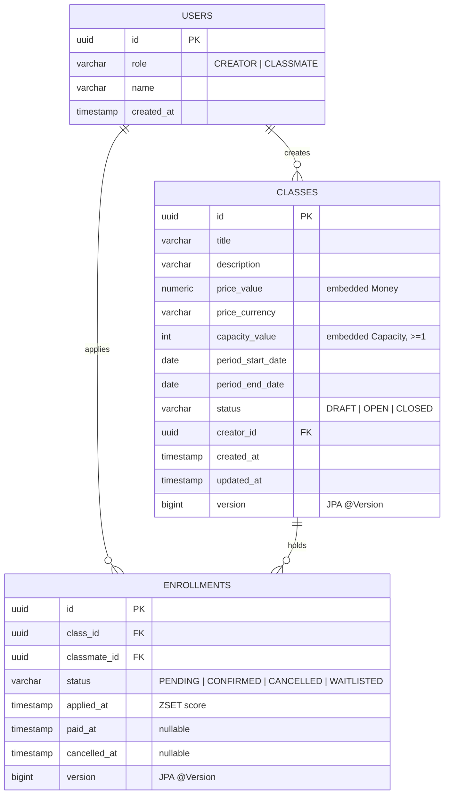
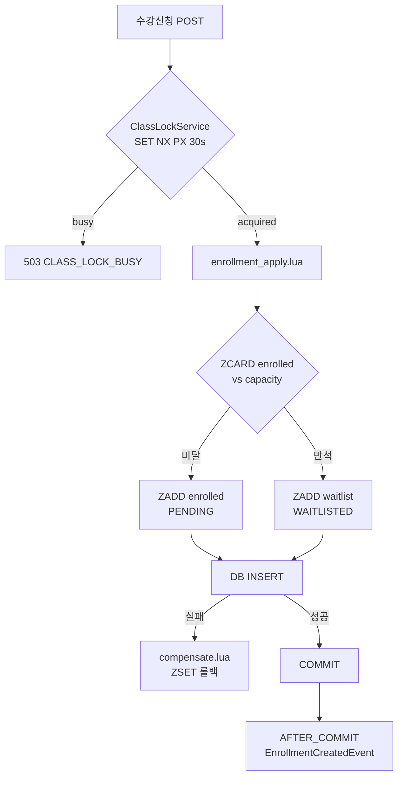
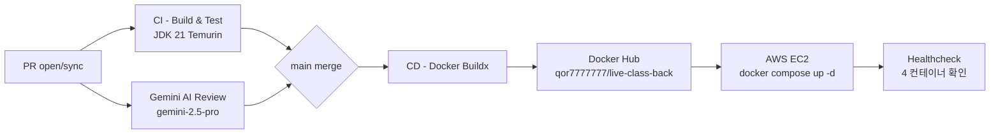

<!-- 면접관(시니어 백엔드) 평가용 README. 12 섹션 — 개요/스택/요구사항/설계 결정/데이터 모델/API/핵심 기술/CICD/트러블슈팅/테스트·AI/로컬 실행/미구현 -->
# Live Class — 라이브 강의 수강신청 백엔드

> Spring Boot 4.0.6 · Java 21 · PostgreSQL 16 · Redis 7 modular monolith.
> **정합성 우선** 의 동시성 제어 — Redis ZSET + Lua 원자 스크립트로 마지막 자리 race·대기열 승격을 직렬화. PostgreSQL 이 최종 진실의 원천.

---

## 목차

1. [프로젝트 개요](#1-프로젝트-개요)
2. [기술 스택](#2-기술-스택)
3. [요구사항 해석 및 가정](#3-요구사항-해석-및-가정)
4. [설계 결정과 이유](#4-설계-결정과-이유)
5. [데이터 모델](#5-데이터-모델)
6. [API 목록](#6-api-목록)
7. [핵심 기술 요소](#7-핵심-기술-요소)
8. [CI/CD 파이프라인](#8-cicd-파이프라인)
9. [트러블슈팅](#9-트러블슈팅)
10. [테스트 실행 방법 & AI 활용 범위](#10-테스트-실행-방법--ai-활용-범위)
11. [로컬 실행 (git clone 직후)](#11-로컬-실행-git-clone-직후)
12. [미구현 및 트레이드오프](#12-미구현-및-트레이드오프)
- [더 읽기](#더-읽기)

---

## 1. 프로젝트 개요

- 라이브 강의 한 회를 한 명의 Creator 가 열고, 다수의 Classmate 가 신청·결제·취소하는 백엔드.
- 핵심 비즈니스 규칙 3가지.
  - 정원 ceiling — 초과 신청은 PENDING 진입 불가, WAITLISTED 로만.
  - 7일 취소 창 — CONFIRMED 는 `paidAt + 7일` 내에만 cancel.
  - FIFO 대기열 승격 — CONFIRMED cancel 시 가장 오래된 WAITLISTED 가 PENDING 으로 자동 승격.
- 세 개 bounded context (`Class`·`Enrollment`·`User`) 가 단일 JVM 에서 ID 참조 + Spring `ApplicationEvent` 로 협력. 직접 객체 참조 금지.
- 본 저장소는 **modular monolith** — 패키지 경계만 MSA 가정으로 설계. 본 시점에 분리 배포 X.

---

## 2. 기술 스택

| 카테고리 | 선택 | 비고 |
|---|---|---|
| 언어 / 빌드 | Java 21 · Gradle Groovy DSL | LTS, virtual thread 미사용 (Quartz · Lettuce 호환성 최우선) |
| 프레임워크 | Spring Boot 4.0.6 (Web / Data JPA / Data Redis / Validation / Quartz / Actuator) | Spring Security 미도입 (mock 인증) |
| 데이터 | PostgreSQL 16 · Redis 7 (Lettuce + Lua) | Redisson `RLock` 제거 (Pre-flight 4 결정) |
| 스케줄러 | Quartz in-memory `RAMJobStore` | 단일 EC2 가정. scale-out 시 JDBC JobStore 전환 필요 |
| 컨테이너 | Docker Compose 4 profile (`db`·`redis`·`back`·`front`) | 격리 부하 테스트용 `t3.small / t3.nano` compose 별도 |
| 테스트 | JUnit 5 · Mockito · AssertJ · Testcontainers (Postgres + Redis) | `@IntegrationTest` 메타 + `*ConcurrencyTest` 명명 |
| API 문서 | springdoc-openapi 2.8.5 → Swagger UI | `@Schema` 11 DTO 적용 (PR #98) |
| CI / CD | GitHub Actions 12 workflow → Docker Hub → AWS EC2 (Ubuntu 22.04) | Gemini AI PR review 보조 채택 |

---

## 3. 요구사항 해석 및 가정

### 3.1 필수 요구사항 체크리스트

- [x] 라이브 강의 도메인 CRUD (`POST /api/classes`, `GET /api/classes/{id}`, `PATCH /api/classes/{id}/status`)
- [x] 수강신청 / 결제 확정 / 취소 라이프사이클 (`POST /api/enrollments`, `POST /api/enrollments/{id}/confirm-payment`, `DELETE /api/enrollments/{id}`)
- [x] 정원 race 동시성 제어 (Redis ZSET + Lua 원자 스크립트 — `enrollment_apply.lua`)
- [x] 7일 취소 창 (`Enrollment.cancel(now)` 도메인 메서드 + `CancellationWindow.SEVEN_DAYS`)
- [x] FIFO 대기열 승격 (`enrollment_cancel_promote.lua` — ZREM + ZPOPMIN + ZADD 원자 swap)
- [x] 역할 분리 — Creator / Classmate (mock 인증, `X-User-Id` 헤더)
- [x] 통합 + 동시성 테스트 (Testcontainers, 10회 연속 결정적 race 검증)

### 3.2 선택 요구사항 체크리스트

- [x] CI/CD 자동화 (GitHub Actions → Docker Hub → AWS EC2)
- [x] OpenAPI 문서화 (Swagger UI + `@Schema` DTO 11종)
- [x] 컨테이너화 (Docker Compose 4 profile + 격리 부하 테스트용 compose 2종)
- [x] 운영 안전장치 — Redis fail-closed 503 매핑, reconcile 부팅·수동 재구성, Quartz 자동 종료
- [x] 부하 테스트 (Python asyncio + aiohttp, 10k 사용자 / 100 정원 t3.small PASS)
- [ ] 실 결제 PG 연동 — out of scope (mock payment 로 상태 전이만)
- [ ] Spring Security / OAuth — out of scope (mock auth)
- [ ] 다중 인스턴스 scale-out — out of scope (단일 EC2 + RAMJobStore 가정)

### 3.3 합리적 가정

- 단일 EC2 배포가 본 사이클 범위. 분산 락 (Redisson `RLock`) 미도입. Redis Lua 원자 스크립트 + Redis SET NX PX outer-wrap 으로 충분 — race-critical 키는 `classId` 단위로만 직렬화.
- 결제는 외부 PG 없이 mock — `POST /confirm-payment` 호출로 상태만 `PENDING → CONFIRMED` 전이.
- 인증은 mock — Spring Security 미도입. `X-User-Id` 헤더의 UUID 만으로 사용자 식별. 헤더 없으면 401.
- 강의 상태 전이는 일방향 (`DRAFT → OPEN → CLOSED`). 역방향 X.
- 가격·정원은 `DRAFT` 에서만 변경 가능. `OPEN` 후 정원 증설은 본 사이클 미구현 — `§12.1`.

---

## 4. 설계 결정과 이유

본 저장소는 단일 JVM 의 modular monolith 지만, **MSA 가정 — 수강신청 마이크로서비스 담당자 시점** 으로 설계.

### 4.1 Redis ZSET + Lua 원자 스크립트를 1차 race gate 로 선택

대안 비교.

| 후보 | round-trip | 락 보유 시간 | FIFO 보장 | 채택 |
|---|---|---|---|---|
| PG `SELECT FOR UPDATE` | 1 DB | 트랜잭션 전체 | 미보장 (별도 정렬 필요) | X |
| Redisson `RLock` + DB | ≥2 Redis + 1 DB | 락 획득 ~ 해제 | 미보장 | X |
| **Redis Lua + DB** | 1 Redis + 1 DB | 0 (단일 명령 원자성) | ZSET score 자체로 보장 | O |

채택 근거.
- Redis single-threaded executor 가 Lua 콜 한 번 안에 ZCARD + ZADD 를 직렬화 — 락 자체가 필요 없음.
- FIFO 는 ZSET score (`appliedAtNanos`) 가 데이터 구조 레벨에서 보장.
- 대기열 승격은 단일 Lua 콜 (`ZREM + ZPOPMIN + ZADD`) — consistency window 0.

### 4.2 Fail-closed — Redis 다운 시 503 즉시

DB-only fallback 미도입. 정합성 > 가용성 명시 채택. 자세한 이유와 사건은 [트러블슈팅 1](docs/troubleshooting/01-redis-fail-closed.md).

### 4.3 outer-wrap classId 락 — `ClassLockService.executeWithLock`

Lua 만으로 last-seat race 는 막히지만, **Lua 콜 1번 + DB INSERT 1번 사이의 짧은 윈도우** 에서 동일 `classId` 다른 사용자의 cancel 이 끼어들면 ZSET ↔ DB 가 어긋날 수 있음. 본 윈도우를 닫기 위해 `apply` / `cancel` 진입점에 Redis `SET NX PX 30s` outer-wrap 도입 (token 기반 safe-unlock). 자세한 사건은 [트러블슈팅 2](docs/troubleshooting/02-outer-wrap-lock.md).

### 4.4 dual-SoT (DB + Redis ZSET) 3중 방어

| 방어층 | 역할 |
|---|---|
| Compensation Lua | DB INSERT/UPDATE 실패 시 ZSET 롤백 (`enrollment_compensate.lua`, `enrollment_reverse_cancel_promote.lua`) |
| Boot reconcile + admin endpoint | 부팅 시 + `POST /api/admin/reconcile/{classId}` 강제 재구성으로 ZSET 을 DB 기준 재구성 |
| DB partial unique index | `(classId, classmateId)` 활성 상태 한정 unique — Redis 가 잘못 보내도 DB 에서 reject |

### 4.5 `@Version` 낙관락 + 1회 retry — Class 상태 전이

Quartz 자동 종료 + Creator 수동 종료의 race 는 `@Version` 으로 해결. 비관락 (`SELECT FOR UPDATE`) 은 P1 리팩토링 (PR #112) 으로 제거 — ARCHITECTURE 와 정합.

---

## 5. 데이터 모델



핵심 제약.

- `ENROLLMENTS.(class_id, classmate_id)` 에 **활성 상태 한정 partial unique index** — `WHERE status IN ('PENDING', 'CONFIRMED', 'WAITLISTED')`. CANCELLED 만 재신청 허용.
- ZSET mirror — `enrolled:{classId}` (PENDING + CONFIRMED) / `waitlist:{classId}` (WAITLISTED), score = `appliedAtNanos`.
- 상태 핫 경로 캐시 — `class:status:{classId}` TTL 300s (Lua 가 OPEN 체크 시 사용).

상세 컬럼 정의·인덱스·제약·VO 매핑은 [docs/erd.md](docs/erd.md).

---

## 6. API 목록

13 엔드포인트 요약 (모든 요청에 `X-User-Id: <UUID>` 헤더 필수).

| Method | Path | Role | 설명 | 성공 HTTP |
|---|---|---|---|---|
| POST | `/api/users` | (none) | 회원 등록 | 201 |
| GET | `/api/users/me` | any | 내 정보 | 200 |
| POST | `/api/classes` | CREATOR | 강의 생성 (DRAFT) | 201 |
| PATCH | `/api/classes/{id}/status` | CREATOR | 상태 전이 (DRAFT→OPEN, OPEN→CLOSED) | 200 |
| GET | `/api/classes/{id}` | any | 단건 조회 | 200 |
| GET | `/api/classes` | any | OPEN 목록 (page) | 200 |
| GET | `/api/classes/{id}/students` | CREATOR (본인) | CONFIRMED 수강생 목록 | 200 |
| POST | `/api/enrollments` | CLASSMATE | 신청 (PENDING / WAITLISTED) | 201 / 202 |
| POST | `/api/enrollments/{id}/confirm-payment` | CLASSMATE (본인) | mock 결제 확정 | 200 |
| DELETE | `/api/enrollments/{id}` | CLASSMATE (본인) | 취소 (CONFIRMED 는 7일창) | 200 |
| GET | `/api/enrollments/me` | CLASSMATE | 본인 수강 목록 (page) | 200 |
| POST | `/api/admin/reconcile/{classId}` | ops | ZSET 강제 재구성 | 200 / 409 |
| GET | `/health` · `/api/ping` · `/api/pong` | any | 헬스 / 라우팅 검증 | 200 |

상세 스키마 · 요청 / 응답 예시 · 에러 코드는 [docs/api.md](docs/api.md). 런타임에는 Swagger UI (`/swagger-ui.html`).

---

## 7. 핵심 기술 요소

### 7.1 동시성 제어 결정 트리



### 7.2 멱등성 / 정합성 / 동시성 — 시나리오별

| 시나리오 | 메커니즘 | 검증 테스트 |
|---|---|---|
| Last-seat race | `executeWithLock` outer-wrap → Lua ZCARD vs capacity | `LastSeatRaceConcurrencyTest` |
| 대기열 승격 (FIFO) | `enrollment_cancel_promote.lua` 원자 ZREM + ZPOPMIN + ZADD | `WaitlistPromotionConcurrencyTest` |
| Cancel + 보상 | DB UPDATE 실패 시 `enrollment_reverse_cancel_promote.lua` | `EnrollmentCancelCompensationTest`, `LuaCompensationAtomicityTest` |
| 7일 취소 창 | `Enrollment.cancel(now)` 도메인 + `@Version` OL | `CancelDoubleClickConcurrencyTest` |
| Class 상태 전이 | `@Version` OL + 1회 retry | `ClassOptimisticLockTest` |
| Reconcile vs enrollment | 동일 lock key — apply 진행 중이면 reconcile skip | `ReconcileServiceIntegrationTest` |
| Redis 다운 | `GlobalExceptionHandler` 503 매핑 | `RedisDisconnectFailClosedTest` |

### 7.3 스케줄링 — Quartz

- `ClassAutoCloseJob` 매일 **00:05 KST** (`0 5 0 * * ?`, `Asia/Seoul`).
- `OPEN` 강의 중 `period.endDate < today(KST)` 인 강의를 자동 `CLOSED`.
- 미스파이어 정책 — `FIRE_AND_PROCEED` (재부팅 시 1회 실행).

자세한 락 / Lua / Quartz / Redis key convention 은 [docs/architecture.md](docs/architecture.md).

---

## 8. CI/CD 파이프라인



- GitHub Actions 12 workflow — CI / CD / Gemini Review / link-checker / context-drift cron / gatekeeper / auto-rebase / maintenance-cleanup / status-check-audit / wiki-pair-sync / wiki-sync / maestro-dispatch.
- 멀티 스테이지 Dockerfile — builder (`temurin:21-jdk-alpine`) → runtime (`temurin:21-jre-alpine`) + non-root user.
- EC2 배포 후 `docker compose ps --status running` 으로 4 컨테이너 (`db / redis / back / front`) 헬스체크.

상세 워크플로 정의 · 시크릿 · 트러블 사례는 [docs/cicd.md](docs/cicd.md).

---

## 9. 트러블슈팅

본 사이클에서 인상적이었던 4건. 각 문서는 [문제 → 원인 분석 → 의사결정 / 해결 → 결과] 4단계 흐름.

1. **[Redis 다운 503 매핑 갭과 t3.nano fail-closed 자체 방어막 — 정합성의 대가](docs/troubleshooting/01-redis-fail-closed.md)** — PR #104. `RedisDisconnectFailClosedTest` 가 `satisfiesAnyOf` 로 작성된 사실 자체가 갭의 증거였던 사건. t3.nano 11분 부하에서 자체 방어막으로 작동.
2. **[마지막 자리 race 의 두 번째 윈도우 — Lua + outer-wrap classId 락](docs/troubleshooting/02-outer-wrap-lock.md)** — PR #92. Lua 만으로 충분해 보였던 race 가 cancel-promotion 과의 race 에서 ZSET ↔ DB 미스매치를 만든 사건.
3. **[AI 하네스의 ARG_MAX — Gemini Review 가 죽이고 살아난 SIGPIPE 와 800KB diff](docs/troubleshooting/03-ai-harness-gemini.md)** — PR #65. 자율 코드리뷰 AI 가 워크플로 자체를 fail 시켰던 사건. Linux ARG_MAX · printf SIGPIPE · curl `--data-binary @file` 우회.
4. **[컨텍스트 매니지먼트 — context.yaml drift 와 surrogate-split 100KB 가드](docs/troubleshooting/04-context-management.md)** — PR #22 / #28 / #75 / #109. 멀티 에이전트 환경에서 컨텍스트 일관성을 강제하는 가드와 100KB 경계 차단 흔적.

---

## 10. 테스트 실행 방법 & AI 활용 범위

### 10.1 테스트 실행

```bash
cd live-class

# 단위 테스트만 (Docker 불필요)
./gradlew test --tests "*DomainTest"

# 통합 + 동시성 테스트 (Docker daemon 필요 — Testcontainers)
./gradlew test --tests "*IntegrationTest"
./gradlew test --tests "*ConcurrencyTest"

# 전체
./gradlew test
```

- `@IntegrationTest` 메타 — Postgres + Redis Testcontainers 자동 기동.
- `*ConcurrencyTest` — N-thread starting gun 패턴, 10회 연속 결정적 성공 요구.
- 한글 경로 — `KOREAN_CWD_GUARD_OFF=1` 또는 ASCII worktree 사용 (`§11`).

### 10.2 부하 테스트

```bash
# t3.small 시뮬레이션 — 일반 운영 사양
docker compose -f docker-compose.t3-small.yml up -d
python scripts/load-test/open-run.py --users 10000 --capacity 100

# t3.nano 시뮬레이션 — 한계 탐색
docker compose -f docker-compose.t3-nano.yml up -d
```

결과 — t3.small / 10k 사용자 / 100 정원 → 302초 PASS, mem 37%. 자세한 보고서는 `reports/load-test/t3-small-limit-2026-05-16.md`.

### 10.3 AI 활용 범위

| 활용 영역 | 도구 | 범위 |
|---|---|---|
| 멀티 에이전트 파이프라인 | Claude Code (Sonnet/Opus) | 도메인 설계 → 동시성 설계 → 태스크 분해 → 구현 → 리팩토링까지 6 + 2 sub-agent. 본 README 도 `doc-maestro` 산출. |
| 자율 코드 리뷰 | Gemini 2.5-pro via GitHub Actions | PR 마다 자동 리뷰 댓글. 머지 결정은 사람이. |
| 격리 부하 테스트 harness | Codex (외부) + Python asyncio | `scripts/load-test/open-run.py` 클라이언트 retry · tunable params. |
| 동시성 race 검증 | (사람) | Testcontainers + multi-thread starting gun, AI 보조 디자인. |

AI 산출물은 **항상 사람 머지 결정** — `gatekeeper.yml` workflow 가 머지 차단 게이트 운영. AI 코드는 본인 검토 후 커밋, AI 가 자체 push 하는 자동화는 maestro 가 issue 라벨 (`maestro:auto`) 진입 후에만 동작.

---

## 11. 로컬 실행 (git clone 직후)

처음 본 사람도 따라할 수 있는 순서. 명령은 순서대로 복사·붙여넣기.

### 11.1 사전 준비

| 도구 | 버전 | 확인 |
|---|---|---|
| Git | 2.40+ | `git --version` |
| Docker Desktop | 20+ | `docker --version` (Windows 는 WSL2 백엔드 권장) |
| JDK 21 (Temurin) | 21.0+ | `java -version` |

> Windows 한글 경로 주의 — Spring Boot 가 비-ASCII cwd 에서 `ClassNotFoundException` 으로 죽는 회귀 알려져 있음. 이 경우 ASCII worktree (`C:\work\live-class-ascii`) 를 만들어 거기서 `./gradlew` 실행 권장.

### 11.2 단계

```bash
# 1. 저장소 클론
git clone https://github.com/corinB/live-class.git
cd live-class

# 2. 환경 변수 파일 복사 (.env 가 이미 .gitignore — 안전)
cp .env.example .env
#   .env 안의 POSTGRES_PASSWORD, REDIS_PASSWORD 를 본인 값으로 교체

# 3. 인프라(Postgres + Redis) 기동
docker compose --profile db --profile redis up -d

# 4. 백엔드 부팅 (live-class/ 안에서)
cd live-class
./gradlew bootRun
#   처음에는 Gradle 의존성 다운로드 + 컴파일까지 2~3분 소요

# 5. Swagger UI 열기
#   http://localhost:8080/swagger-ui.html
```

### 11.3 전체 컨테이너로 띄우기 (Swagger 정적 프록시 포함)

```bash
docker compose --profile db --profile redis --profile back --profile front up -d
docker compose ps  # 4 컨테이너가 healthy 인지 확인
```

### 11.4 정리

```bash
docker compose --profile db --profile redis --profile back --profile front down
# 데이터 볼륨까지 지우려면 추가
rm -rf ./data
```

### 11.5 자주 만나는 문제

| 증상 | 원인 | 해결 |
|---|---|---|
| `ClassNotFoundException` on bootRun | cwd 가 한글 경로 | ASCII worktree 또는 `KOREAN_CWD_GUARD_OFF=1` |
| `Connection refused` on `localhost:5432` | docker compose 미기동 | `docker compose ps` 로 postgres 확인 |
| Testcontainers 실패 | Docker daemon 미실행 | Docker Desktop 시작 |
| 503 `MIRROR_UNAVAILABLE` | Redis 다운 (정상 fail-closed) | `docker compose start redis` |

---

## 12. 미구현 및 트레이드오프

본 사이클은 채용 과제 MVP 범위. production 도입 시 채워야 할 빈틈을 솔직하게 기록.

### 12.1 Class 정원 증설 불가 (OPEN 이후)

- 한계 — `Class.changeCapacity()` 가 `DRAFT` 에서만 호출 가능.
- 영향 — WAITLISTED 가 쌓여도 정원 증설로 일괄 승격 시나리오 없음.
- 해결 방향 — `Class.changeCapacity(OPEN-allowed)` 추가 + `CapacityIncreasePromoter` 도메인 서비스 신설. ZSET 측에서 `ZPOPMIN` N회 반복 + ZADD enrolled 일괄.

### 12.2 CLOSED 강의 cancel 정책 부재

- 한계 — 강의 `CLOSED` 시점과 무관하게 `paidAt + 7일` 창만 적용.
- 영향 — 강의가 이미 종료된 자원에 대한 환불 정책 부재.
- 해결 방향 — `CancellationPolicy` 도메인 객체 — `closedAt` 와 `paidAt + 7d` 중 빠른 쪽까지만 허용. 정책 변경 시 invariant 만 갱신.

### 12.3 WAITLISTED 승격 후 결제 timeout 없음

- 한계 — 승격된 PENDING 사용자가 결제 안 하고 방치해도 강제 cancel 되지 않음.
- 영향 — 무한 PENDING 잔류, 다음 WAITLISTED 무한 대기.
- 해결 방향 — `EnrollmentPaymentDeadlineJob` (Quartz, 15분 주기) — 승격 시점 + 30분 경과 PENDING 자동 CANCEL + 다음 WAITLISTED promote.

### 12.4 Class 가격 변경 불가 (생성 후 immutable)

- 한계 — `Class.price` 는 immutable.
- 영향 — 가격 정정 / 할인 적용 시 강의 재생성 외 방법 없음.
- 해결 방향 — `Class.changePrice(...)` + 이미 CONFIRMED 사용자에게는 적용 X (가격은 결제 시점 `Payment` 엔티티로 snapshot). 가격 변경 이력은 `ClassPriceChangedEvent` 로 audit.

### 12.5 단일 EC2 가정 — scale-out 시 변경 필요

- 한계 — Quartz `RAMJobStore`, in-memory only.
- 영향 — 인스턴스 2개 이상에서 trigger 중복 실행.
- 해결 방향 — JDBC `JobStoreTX` 전환 + DB row lock 으로 cluster-safe.

### 12.6 EnrollmentEventListener 부속 효과 미구현

- 한계 — `AFTER_COMMIT` listener 4개 (`onCreated/onConfirmed/onCancelled/onWaitlistPromoted`) 가 현재 INFO 로그 stub.
- 영향 — 알림 / 메트릭 / 외부 큐 hook 자리는 마련됐지만 내용 없음.
- 해결 방향 — Slack 알림 / Prometheus 메트릭 / Kafka publisher 를 listener 안에 attach. 도메인 코드 무변경.

---

## 더 읽기

- 도메인 모델 상세 — [DOCS.md](DOCS.md) · [Wiki ko-docs-detail](https://github.com/corinB/live-class/wiki/ko-docs-detail)
- 동시성 / 캐싱 / 스케줄링 — [ARCHITECTURE.md](ARCHITECTURE.md) · [Wiki ko-architecture-detail](https://github.com/corinB/live-class/wiki/ko-architecture-detail)
- 브랜치 / 커밋 / PR 컨벤션 — [CONTRIBUTING.md](CONTRIBUTING.md)
- 다중 에이전트 파이프라인 — [ORCHESTRATION.md](ORCHESTRATION.md)
- 부하 테스트 보고서 — [reports/load-test/](reports/load-test/)
- 리팩토링 사이클 보고서 — [reports/refactoring/](reports/refactoring/)
