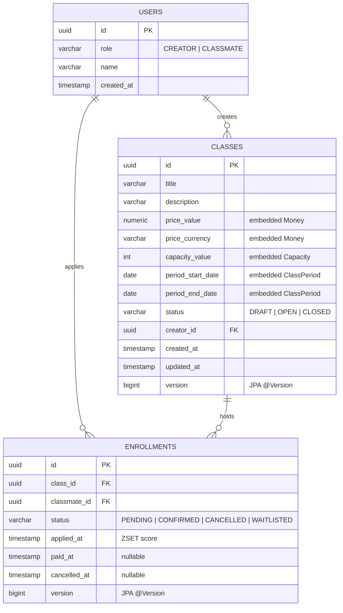

<!-- 라이브 강의 수강신청 백엔드의 프로젝트 개요·로컬 실행·ERD·도메인·동시성·테스트·엔드포인트·한계 요약 -->
# Live Class — 라이브 강의 수강신청 백엔드

라이브 강의 수강신청을 다루는 **modular monolith** 백엔드. Spring Boot 4.0.6 + Java 21 + PostgreSQL 16 + Redis 7 위에서 **FIFO 보장**과 **정합성 우선**을 핵심 가치로 한다. Redis ZSET + Lua 원자 스크립트로 마지막 자리 race·대기열 승격을 직렬화하고, PostgreSQL 을 최종 진실의 원천으로 둔다.

상세 도메인 모델은 [DOCS.md](./DOCS.md), 동시성·캐싱·스케줄링 아키텍처는 [ARCHITECTURE.md](./ARCHITECTURE.md) 참조.

---

## 1. 프로젝트 개요

세 개의 bounded context (`Class`·`Enrollment`·`User`) 가 단일 JVM 에서 Spring `ApplicationEvent` 로 협력한다. 강의는 `DRAFT → OPEN → CLOSED` 일방향 전이를 따르고, 수강은 `PENDING / CONFIRMED / CANCELLED / WAITLISTED` 네 상태를 가진다. 정원 초과 시 대기열로 빠지고, 결제 확정 후 7일 이내 취소는 다음 WAITLISTED 를 자동 승격한다.

핵심 결정: 분산락 (`Redisson RLock`) 을 쓰지 않고 Lua 원자 스크립트만으로 race 제어. 자세한 근거는 [ARCHITECTURE.md §1](./ARCHITECTURE.md#core-decision-redis-zset--lua-atomic-script).

---

## 2. 기술 스택

| 카테고리 | 선택 |
|---|---|
| 언어 / 빌드 | Java 21, Gradle Groovy DSL |
| 프레임워크 | Spring Boot 4.0.6 (Web, Data JPA, Data Redis, Validation, Quartz, Actuator) |
| 데이터 | PostgreSQL 16, Redis 7 (ZSET + Lua 스크립트) |
| 스케줄러 | Quartz (in-memory `RAMJobStore`) |
| 컨테이너 | Docker Compose (`db / redis / back / front` profile) |
| 테스트 | JUnit 5, Mockito, AssertJ, Testcontainers (Postgres + Redis) |
| API 문서 | springdoc-openapi → Swagger UI |

---

## 3. 로컬 실행

```bash
# 1. 환경 변수 복사
cp .env.example .env  # POSTGRES_USER / PASSWORD / DB / URL, REDIS_HOST / PORT / PASSWORD

# 2. 인프라(Postgres + Redis) 컨테이너 기동
docker compose --profile db --profile redis up -d

# 3. 백엔드 부팅
cd live-class
./gradlew bootRun
```

bootRun 이 뜨면 `http://localhost:8080/swagger-ui.html` 에서 API 를 직접 호출할 수 있다.

전체 스택(백엔드 + Swagger 정적 프록시까지) 컨테이너로 띄우려면 `docker compose --profile db --profile redis --profile back --profile front up -d`.

**격리 부하 테스트 환경**. 운영 사양에서 한계 동작을 검증하기 위한 별도 compose 파일 2종이 루트에 있다. 기본 `docker-compose.yml` 과 네트워크·볼륨 분리.

| 파일 | 가정 인스턴스 | 용도 |
|---|---|---|
| `docker-compose.t3-small.yml` | AWS EC2 t3.small (2 vCPU / 2 GB) | 일반 운영 사양 부하 시뮬레이션. `scripts/load-test/open-run.py` 와 함께 사용. |
| `docker-compose.t3-nano.yml` | AWS EC2 t3.nano (2 vCPU / 0.5 GB) | 메모리 압박 한계 시나리오. Redis 200ms timeout / fail-closed 자체 방어막 검증용. |

기동 예 — `docker compose -f docker-compose.t3-small.yml up -d`. 결과 보고서는 `reports/load-test/` 디렉토리. 상세 부하 테스트 절차는 `scripts/load-test/README.md` 참조.

> **주의 — 한글 경로.** Spring Boot 가 비 ASCII cwd 에서 `ClassNotFoundException` 으로 죽는 회귀가 알려져 있다. 한글 경로 저장소에서는 ASCII worktree(`/c/work/p-ascii` 등) 를 만들어 거기서 `./gradlew` 를 실행하길 권장. 자세한 가드: `.claude/hooks/pre-bash-detect-korean-cwd.sh`.

---

## 4. API 문서

Swagger UI: `http://localhost:8080/swagger-ui.html`
OpenAPI JSON: `http://localhost:8080/v3/api-docs`

모든 요청에 `X-User-Id: <UUID>` 헤더가 필요하다 (mock 인증). 헤더가 없으면 401.

---

## 5. ERD



`(class_id, classmate_id)` 에는 활성 상태(`PENDING / CONFIRMED / WAITLISTED`) 한정 partial unique index 가 걸려 있다. CANCELLED 만 재신청 가능. 자세한 인덱스 정의는 `schema.sql` 참조.

---

## 6. 도메인 설계

| Context | Aggregate Root | 책임 |
|---|---|---|
| Class | `domain/clazz/Class` | 메타데이터, 정원, 일방향 상태 전이. 정원 변경은 `DRAFT` 에서만. |
| Enrollment | `domain/enrollment/Enrollment` | 신청·확정·취소·대기열. `WAITLISTED` 는 별도 aggregate 없이 status 로 표현. |
| User | `domain/user/User` | 역할(`CREATOR / CLASSMATE`). mock 인증. |

3 context 모두 ID 참조 (`ClassId / EnrollmentId / UserId`) 만으로 협력 — 직접 객체 참조 금지. Spring `ApplicationEvent` 는 `AFTER_COMMIT` 단계로 발행되어 ZSET mirror 갱신·연쇄 도메인 이벤트(대기열 승격, OPEN→CLOSED 시 WAITLISTED 일괄 취소) 를 트리거.

상세 invariant·event·glossary 는 [DOCS.md](./DOCS.md) 참조.

---

## 7. 동시성 설계 요약

마지막 자리 race·대기열 승격 같은 race 결정은 **Redis ZSET + Lua 원자 스크립트** 로 게이트한다. PostgreSQL 은 최종 진실의 원천 + 마지막 방어선(partial unique index, `@Version`) 역할.

| Layer | 역할 |
|---|---|
| Redis ZSET + Lua | race-critical 결정. `enrollment_apply.lua` 가 capacity 검사 + ZADD 를 한 콜로. `enrollment_cancel_promote.lua` 가 ZREM + ZPOPMIN + ZADD 를 원자 swap. |
| PostgreSQL | INSERT/UPDATE 완료 후 진실 확정. `@Version` OL 로 상태 전이 race 차단. |
| 보상 (`enrollment_compensate.lua`) | DB INSERT 실패 시 ZSET 롤백. |
| Reconcile (`ReconcileRunner`) | 부팅 시 + `POST /api/admin/reconcile/{classId}` 강제 실행. ZSET 을 DB 기준으로 재구성. |

**Fail-closed 원칙.** Redis 다운 시 503 즉시. DB-only fallback 없음. 정합성 > 가용성.

자세한 결정 근거(왜 Redisson RLock 을 안 쓰는가, dual-SoT 트레이드오프 등): [ARCHITECTURE.md §1](./ARCHITECTURE.md#core-decision-redis-zset--lua-atomic-script).

---

## 8. 테스트

| 분류 | 마커 / 패턴 | Docker 필요 | 대표 실행 |
|---|---|---|---|
| 단위 (도메인) | `*DomainTest`, `*Test` (domain 패키지) | 불필요 | `./gradlew test --tests "*DomainTest"` |
| 통합 | `@IntegrationTest` 메타 (Postgres + Redis Testcontainers) | 필요 | `./gradlew test --tests "*IntegrationTest"` |
| 동시성 | `*ConcurrencyTest` (Testcontainers + multi-thread starting gun) | 필요 | `./gradlew test --tests "*ConcurrencyTest"` |
| 전체 | — | 통합·동시성 포함 시 필요 | `./gradlew test` |

`@IntegrationTest` 메타 정의: `live-class/src/test/java/.../support/IntegrationTest.java`.
한글 경로에서는 `KOREAN_CWD_GUARD_OFF=1` 우회 또는 ASCII worktree 권장.

---

## 9. 엔드포인트 정리

| Method | Path | Role | 설명 |
|---|---|---|---|
| POST | `/api/users` | (none) | 회원 등록 (CREATOR 또는 CLASSMATE 역할 명시) |
| GET | `/api/users/me` | any | 내 정보 조회 |
| POST | `/api/classes` | CREATOR | 강의 생성 (`DRAFT`) |
| PATCH | `/api/classes/{id}/status` | CREATOR | 상태 변경 (`DRAFT→OPEN`, `OPEN→CLOSED`) |
| GET | `/api/classes/{id}` | any | 단건 조회 |
| GET | `/api/classes` | any | OPEN 강의 목록 (페이지) |
| GET | `/api/classes/{id}/students` | CREATOR (본인 강의) | 수강생 목록 |
| POST | `/api/enrollments` | CLASSMATE | 신청 (`PENDING` 또는 `WAITLISTED`) |
| POST | `/api/enrollments/{id}/confirm-payment` | CLASSMATE (본인 신청) | 결제 확정 (`PENDING → CONFIRMED`) |
| DELETE | `/api/enrollments/{id}` | CLASSMATE (본인 신청) | 취소 — CONFIRMED 는 `paidAt + 7d` 내만 |
| GET | `/api/enrollments/me` | CLASSMATE | 내 수강 목록 (페이지) |
| POST | `/api/admin/reconcile/{classId}` | any (운영) | ZSET 강제 재구성 |
| GET | `/api/health` | any | 헬스 체크 (Actuator 보강) |
| GET | `/api/ping` / `/api/pong` | any | 단순 라우팅 검증 |

전체 스키마·요청·응답 예시는 Swagger UI 에서 직접 확인.

---

## 10. 한계 및 미구현

이번 단계의 백엔드는 **MVP 범위**이며, production 도입 시 다음 4가지 빈틈을 채워야 한다.

### 10.1 Class 정원 증설 불가 (OPEN 이후)

- **한계**: `Class.changeCapacity()` 는 `DRAFT` 상태에서만 호출 가능.
- **현재 동작**: `OPEN` 으로 전환된 강의는 정원을 늘릴 수 없다. WAITLISTED 가 쌓여도 자동 승격 시나리오가 없음.
- **production 해결**: `Class.changeCapacity(OPEN-allowed)` 추가 + 정원 증가분 만큼 가장 오래된 WAITLISTED 를 PENDING 으로 일괄 promote 하는 도메인 서비스(`CapacityIncreasePromoter`). Redis ZSET 측에서도 `ZPOPMIN` 을 N회 반복 + ZADD enrolled 일괄.

### 10.2 CLOSED 강의 cancel 정책 부재

- **한계**: 강의가 `CLOSED` 된 시점과 무관하게 `paidAt + 7일` 창만 적용.
- **현재 동작**: 강의가 종료된 뒤에도 7일 내라면 환불성 cancel 이 허용된다. 강의가 이미 종료된 자원에 대한 환불 정책 부재.
- **production 해결**: `CancellationPolicy` 도메인 객체 도입 — `closedAt` 와 `paidAt + 7d` 중 빠른 쪽까지만 허용 등 운영 정책으로 결정. 정책 변경 시 도메인 invariant 만 갱신.

### 10.3 WAITLISTED 승격 후 결제 timeout 없음

- **한계**: 대기열에서 `PENDING` 으로 승격된 사용자가 결제하지 않고 방치해도 강제로 풀리지 않는다.
- **현재 동작**: 무한 `PENDING` 상태로 잔류. 다음 WAITLISTED 가 무한 대기.
- **production 해결**: `EnrollmentPaymentDeadlineJob` (Quartz, 15분 주기) — 승격 시점(`promoteFromWaitlist().promotedAt`) 후 N 분 (예: 30분) 경과 PENDING 을 자동 CANCEL + 다음 WAITLISTED promote. ZSET·DB 동시 갱신은 기존 cancel 경로 재사용.

### 10.4 Class 가격 변경 불가

- **한계**: `Class.price` 는 생성 후 immutable.
- **현재 동작**: 가격 정정·할인 적용 케이스 없음. 가격이 잘못 등록된 강의는 재생성 외 방법이 없다.
- **production 해결**: `Class.changePrice(...)` 도입 + 이미 결제한 CONFIRMED 사용자에게는 적용 X (가격은 결제 시점에 `Payment` 엔티티로 snapshot). 가격 변경 이력은 `ClassPriceChangedEvent` 로 audit.

---

## 더 읽기

- 도메인 invariant·상태 라이프사이클·이벤트: [DOCS.md](./DOCS.md)
- 동시성·캐싱·Quartz 결정: [ARCHITECTURE.md](./ARCHITECTURE.md)
- 브랜치·커밋·PR 컨벤션: [CONTRIBUTING.md](./CONTRIBUTING.md)
- 다중 에이전트 파이프라인 정책: [ORCHESTRATION.md](./ORCHESTRATION.md)
