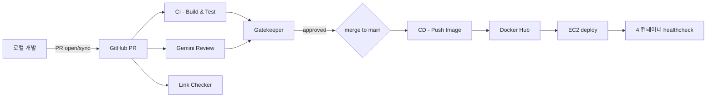

<!-- 라이브 강의 수강신청 백엔드의 CI/CD 파이프라인 - GitHub Actions 워크플로 12개 / Docker / EC2 배포 -->
# CI/CD 파이프라인

## 1. 전체 흐름



## 2. GitHub Actions 워크플로 12개

| 파일 | 트리거 | 역할 |
|---|---|---|
| `ci.yml` | PR / push main | Build & Test (JDK 21 Temurin + Gradle build-cache) |
| `cd.yml` | push main | Docker image push to Docker Hub + EC2 deploy |
| `gemini-review.yml` | PR open/sync/reopen | Gemini 2.5-pro 자동 코드 리뷰 댓글 |
| `link-checker.yml` | PR / weekly | 마크다운 링크 깨짐 검사 (lychee) |
| `context-drift-cron.yml` | daily cron | `context.yaml` ↔ 코드 정합 감사 |
| `gatekeeper.yml` | workflow_run | CI / Gemini 완료 후 머지 차단 게이트 |
| `auto-rebase.yml` | comment `/rebase` | PR 자동 rebase |
| `maintenance-cleanup.yml` | weekly cron | 오래된 worktree / 댓글 정리 |
| `status-check-audit.yml` | daily cron | required status check 일치 감사 |
| `wiki-pair-sync.yml` | push main | `wiki-src/` ↔ GitHub Wiki 동기화 (pair) |
| `wiki-sync.yml` | push main | Wiki repo 단방향 push |
| `maestro-dispatch.yml` | issue label `maestro:auto` | 자동화 maestro 트리거 (알림만, HITL) |

킬 스위치 — 저장소 Variable `AUTOMATION_ENABLED=false` 로 자동화 전체 중지 (수동 PR / 머지 영향 X).

## 3. CI — Build & Test (`ci.yml`)

핵심 단계.

```yaml
- uses: actions/checkout@v4
  with:
    fetch-depth: 0

- name: Compute path-filter decision
  # PR 의 변경 경로가 live-class/** 등 코드 경로에 해당하는지 inline 판정.
  # 필터를 on.pull_request.paths 로 옮기면 required check 가 "expected" 로 남아
  # 머지를 영구 차단하는 회귀가 있어 inline 으로 처리.
  run: |
    BASE_REF="origin/${{ github.event.pull_request.base.ref }}"
    git fetch --no-tags --depth=50 origin "${{ github.event.pull_request.base.ref }}"
    CHANGED=$(git diff --name-only "$BASE_REF...HEAD" || true)
    MATCH_REGEX='(^live-class/|^front/|^docker-compose\.yml$|^\.github/workflows/ci\.yml$)'
    SHOULD_RUN=false
    while IFS= read -r f; do
      [ -z "$f" ] && continue
      if echo "$f" | grep -qE "$MATCH_REGEX"; then SHOULD_RUN=true; break; fi
    done <<< "$CHANGED"

- uses: actions/setup-java@v4
  with: { distribution: temurin, java-version: "21" }

- uses: gradle/actions/setup-gradle@v4

- working-directory: live-class
  run: ./gradlew test --build-cache --no-watch-fs
```

주요 결정.

| 결정 | 이유 |
|---|---|
| `on.pull_request.paths` 미사용 | required status check 의 "expected" 영구 잔류 회귀 회피 |
| `gradle/actions/setup-gradle@v4` | v3 의 512-char cache key collision → HTTP 400 회귀 회피 |
| `--build-cache --no-watch-fs` | ephemeral runner 에서 watch-fs 비용 절감 |
| `concurrency: cancel-in-progress: true` | 같은 PR 의 새 push 시 진행 중 build 취소 |
| 단일 EC2 가정 | scale-out 시 trigger 중복 실행은 별도 작업 |

## 4. CD — Docker + EC2 (`cd.yml`)

### 4.1 push-image

```yaml
- uses: docker/setup-buildx-action@v3

- uses: docker/login-action@v3
  with:
    username: ${{ secrets.DOCKERHUB_USERNAME }}
    password: ${{ secrets.DOCKERHUB_TOKEN }}

- uses: docker/build-push-action@v5
  with:
    context: ./live-class
    file: ./live-class/Dockerfile
    push: true
    tags: |
      qor7777777/live-class-back:latest
      qor7777777/live-class-back:${{ github.sha }}
    cache-from: type=gha
    cache-to:   type=gha,mode=max
```

이미지 태그 2개 — `latest` (운영 배포용) + `${sha}` (롤백용).

### 4.2 deploy-ec2

```yaml
- uses: appleboy/scp-action@v0.1.7
  with:
    host:     ${{ secrets.EC2_HOST }}
    username: ${{ secrets.EC2_USER }}
    key:      ${{ secrets.EC2_SSH_KEY }}
    source:   "docker-compose.yml,front/index.html"
    target:   "/home/ubuntu/live-class/"

- uses: appleboy/ssh-action@v1
  with:
    host:     ${{ secrets.EC2_HOST }}
    username: ${{ secrets.EC2_USER }}
    key:      ${{ secrets.EC2_SSH_KEY }}
    script_stop: true
    script: |
      cd ~/live-class
      echo "${{ secrets.DOCKERHUB_TOKEN }}" | docker login -u "${{ secrets.DOCKERHUB_USERNAME }}" --password-stdin
      docker compose pull
      docker compose --profile db --profile redis --profile back --profile front up -d
      docker image prune -f
      sleep 15
      RUNNING=$(docker compose --profile db --profile redis --profile back --profile front ps --status running --format '{{.Name}}' | wc -l)
      EXPECTED=4
      if [ "$RUNNING" -lt "$EXPECTED" ]; then
        echo "::error::Expected $EXPECTED containers running, found $RUNNING"
        docker compose --profile db --profile redis --profile back --profile front logs --tail=50
        exit 1
      fi
```

배포 후 healthcheck — `docker compose ps --status running | wc -l` 로 4 컨테이너 확인. 실패 시 `logs --tail=50` 출력 후 워크플로 fail.

## 5. Dockerfile — 멀티 스테이지

`live-class/Dockerfile`.

```dockerfile
# Stage 1: builder
FROM eclipse-temurin:21-jdk-alpine AS builder
WORKDIR /workspace
COPY gradlew ./
COPY gradle/wrapper/ gradle/wrapper/
COPY build.gradle settings.gradle ./
COPY gradle.properties* ./
RUN chmod +x gradlew && ./gradlew dependencies --no-daemon --quiet || true
COPY src/ src/
RUN ./gradlew clean bootJar -x test --no-daemon

# Stage 2: runtime
FROM eclipse-temurin:21-jre-alpine AS runtime
RUN addgroup -S spring && adduser -S spring -G spring
WORKDIR /app
COPY --from=builder /workspace/build/libs/*.jar app.jar
RUN chown spring:spring app.jar
USER spring
EXPOSE 8080
ENTRYPOINT ["sh", "-c", "java $JAVA_OPTS -jar /app/app.jar"]
```

특징.

| 결정 | 이유 |
|---|---|
| 멀티 스테이지 (builder + runtime) | 최종 이미지에서 JDK / gradle 캐시 제외 → 이미지 크기 축소 |
| `temurin:21-*-alpine` | Alpine 으로 base 이미지 슬림화 |
| non-root `spring` user | 컨테이너 보안 best practice |
| `bootJar -x test` | 테스트는 CI 에서 이미 실행, image build 빠름 |
| `JAVA_OPTS` env | runtime 에서 heap 크기 등 조정 가능 (t3.nano 시 `-Xmx220m` 등) |

## 6. Docker Compose — 4 profile

`docker-compose.yml` 의 profile 구조.

| profile | service | container_name | port | 의존 |
|---|---|---|---|---|
| `db` | postgres:16-alpine | live-class-postgres | (internal) | — |
| `redis` | redis:7-alpine | live-class-redis | (internal) | — |
| `back` | qor7777777/live-class-back | live-class-app | 8080 | postgres + redis healthy |
| `front` | qor7777777/live-class-front | live-class-nginx | 80 | — |

전 services 가 `live-class-net` bridge 네트워크에 join. healthcheck 4종 모두 정의 — `start_period` 까지 포함하여 cold start 보호.

비밀번호 등 시크릿은 모두 `.env` (root) 에서 주입 — compose 파일에 평문 X.

### 6.1 격리 부하 테스트용 compose

| 파일 | 사양 가정 | 용도 |
|---|---|---|
| `docker-compose.t3-small.yml` | AWS EC2 t3.small (2 vCPU / 2 GB) | 일반 운영 사양 부하 시뮬레이션 |
| `docker-compose.t3-nano.yml` | AWS EC2 t3.nano (2 vCPU / 0.5 GB) | 메모리 압박 한계 시나리오 + Redis 200ms timeout / fail-closed 검증 |

기본 compose 와 네트워크 / 볼륨 / 포트가 분리되어 동시 기동 가능. 자세한 사양·결과는 `reports/load-test/t3-small-limit-2026-05-16.md`.

## 7. Gemini AI Review (`gemini-review.yml`)

PR 마다 `gemini-2.5-pro` 가 4 관점 (정확성 / 동시성 / 보안 / 테스트 커버리지) 으로 자동 리뷰 댓글 게시. 머지 결정은 사람이.

주요 결정.

| 결정 | 이유 |
|---|---|
| diff cutoff 800,000자 | gemini-2.5-pro 의 ~1M token 입력 컨텍스트 안전 한도 |
| `git diff` 결과를 파일로 떨어뜨림 | env-var ARG_MAX (~128KB) 우회 — 자세한 사건은 [트러블슈팅 3](troubleshooting/03-ai-harness-gemini.md) |
| `curl --data-binary @file` | 명령행 인자 길이 우회 |
| paths-ignore inline 재현 | required status check "expected" 잔류 회귀 회피 |
| `${#var}` bash 내장 substring | `printf | wc -c` 의 SIGPIPE 회귀 회피 |

시스템 프롬프트는 워크플로 안에 inline. 도메인 (live-class 라이브 강의 수강신청) 컨텍스트 + 4 관점 + 출력 포맷 (`## 요약 / ## 발견사항 / ## 추천 후속작업`) 강제.

## 8. 필요한 시크릿 / 변수

GitHub Repository → Settings → Secrets and variables.

| 종류 | 키 | 용도 |
|---|---|---|
| Secret | `DOCKERHUB_USERNAME` / `DOCKERHUB_TOKEN` | Docker Hub login |
| Secret | `EC2_HOST` / `EC2_USER` / `EC2_SSH_KEY` | EC2 SSH 배포 |
| Secret | `GEMINI_API_KEY` | Gemini AI Review |
| Variable | `AUTOMATION_ENABLED` | 자동화 maestro 킬 스위치 (`true / false`) |

## 9. branch protection 정책

`main` 보호.

| 항목 | 설정 |
|---|---|
| Require pull request reviews | 1 review |
| Require status checks to pass | `Build & Test`, `gemini-review` |
| Require conversation resolution | enabled (PR #88) |
| Allow force pushes | X |
| Allow deletions | X |

required status check 누락 / `expected` 영구 잔류 등의 회귀를 매일 `status-check-audit.yml` 가 cron 감사.

## 10. 운영 검증 명령

배포 후 운영자가 EC2 에서 직접 확인하는 명령.

```bash
# 컨테이너 상태
docker compose --profile db --profile redis --profile back --profile front ps

# 백엔드 헬스
curl -sS http://localhost:8080/actuator/health

# 최근 로그 (50줄)
docker compose --profile back logs --tail=50 app

# Redis 미러 상태 (특정 강의)
docker compose --profile redis exec redis redis-cli -a "$REDIS_PASSWORD" ZCARD "enrolled:$CLASS_ID"

# 강제 reconcile
curl -sS -X POST "http://localhost:8080/api/admin/reconcile/$CLASS_ID" \
  -H "X-User-Id: 00000000-0000-0000-0000-000000000001"
```
