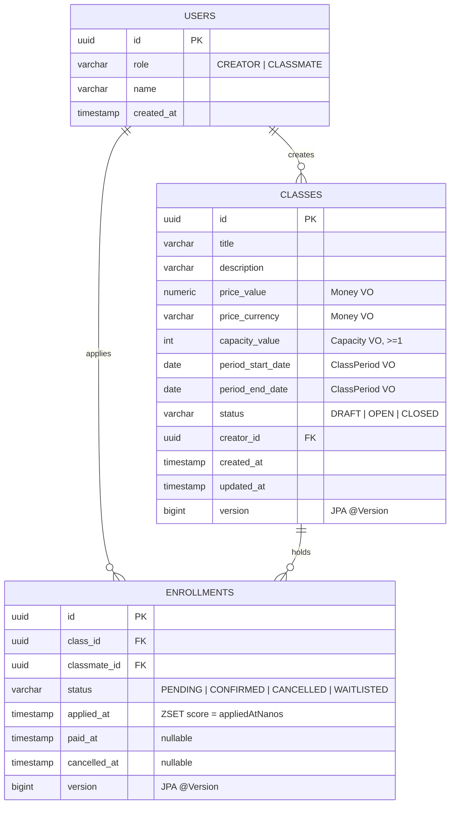

<!-- 라이브 강의 수강신청 백엔드의 ERD / 컬럼 정의 / 인덱스 / 제약 / Redis ZSET 매핑 상세 -->
# 데이터 모델 — ERD · 컬럼 · 인덱스 · 제약

## 1. ERD



## 2. 테이블 정의

### 2.1 `users`

| 컬럼 | 타입 | 제약 | 비고 |
|---|---|---|---|
| `id` | `uuid` | PK, not null, not updatable | application-generated UUID |
| `role` | `varchar(20)` | not null, not updatable | `CREATOR / CLASSMATE` enum 문자열 |
| `name` | `varchar(50)` | not null | 1~50자, blank 금지 |
| `created_at` | `timestamp` | not null, not updatable | UTC `Instant` |

도메인 — `User` aggregate root. `register()` 정적 팩토리만 생성 진입점, 가변 setter X. role 은 생성 후 immutable.

### 2.2 `classes`

| 컬럼 | 타입 | 제약 | 비고 |
|---|---|---|---|
| `id` | `uuid` | PK, not null, not updatable | |
| `title` | `varchar(200)` | not null | 1~200자 |
| `description` | `varchar(2000)` | nullable | 0~2000자 |
| `price_value` | `numeric` | not null | `Money` VO 의 amount |
| `price_currency` | `varchar` | not null | `Money` VO 의 currency 문자열 (기본 KRW) |
| `capacity_value` | `int` | not null | `Capacity` VO, ≥ 1 |
| `period_start_date` | `date` | not null | `ClassPeriod` VO start |
| `period_end_date` | `date` | not null | `ClassPeriod` VO end, ≥ start |
| `status` | `varchar(20)` | not null | `DRAFT / OPEN / CLOSED` |
| `creator_id` | `uuid` | not null, not updatable | FK → `users.id` (DB FK 미강제, 도메인 ID 참조) |
| `created_at` | `timestamp` | not null, not updatable | |
| `updated_at` | `timestamp` | not null | 상태 / 정원 변경 시 갱신 |
| `version` | `bigint` | not null, `@Version` | 낙관락 |

도메인 — `Class` aggregate root. `draft()` 정적 팩토리 + `open() / close() / autoClose() / changeCapacity()` intent 메서드. setter X.

VO (Embedded).

| VO | 컬럼 매핑 | invariant |
|---|---|---|
| `Money` | `price_value` + `price_currency` | amount ≥ 0 |
| `Capacity` | `capacity_value` | ≥ 1 |
| `ClassPeriod` | `period_start_date` + `period_end_date` | end ≥ start |

### 2.3 `enrollments`

| 컬럼 | 타입 | 제약 | 비고 |
|---|---|---|---|
| `id` | `uuid` | PK | |
| `class_id` | `uuid` | not null, not updatable | FK → `classes.id` (도메인 ID 참조) |
| `classmate_id` | `uuid` | not null, not updatable | FK → `users.id` |
| `status` | `varchar(20)` | not null | `PENDING / CONFIRMED / CANCELLED / WAITLISTED` |
| `applied_at` | `timestamp` | not null, not updatable | ZSET score 원본 (`appliedAtNanos`) |
| `paid_at` | `timestamp` | nullable | CONFIRMED 시점 |
| `cancelled_at` | `timestamp` | nullable | CANCELLED 시점 |
| `version` | `bigint` | not null, `@Version` | 7일창 race · double-cancel 차단 |

도메인 — `Enrollment` aggregate root. `apply() / waitlist()` 정적 팩토리 + `confirm() / cancel() / promoteFromWaitlist()` intent. WAITLISTED 는 별도 aggregate 없이 status 로만 표현.

## 3. 인덱스

`@Index` JPA 선언 + 운영 시 partial unique index 추가.

```sql
-- JPA @Index (live-class/src/main/java/.../Enrollment.java)
CREATE INDEX idx_enroll_classid_appliedat   ON enrollments (class_id, applied_at);
CREATE INDEX idx_enroll_classmate           ON enrollments (classmate_id);
CREATE INDEX idx_enroll_classid_status      ON enrollments (class_id, status);

-- 운영 추가 - 활성 상태 한정 partial unique (DDL 직접 추가 권장)
CREATE UNIQUE INDEX uq_enroll_active
  ON enrollments (class_id, classmate_id)
  WHERE status IN ('PENDING', 'CONFIRMED', 'WAITLISTED');
```

용도.

| 인덱스 | 쿼리 패턴 |
|---|---|
| `idx_enroll_classid_appliedat` | reconcile 시 `class_id` 별 활성 enrollment 를 `applied_at` 오름차순 로드 |
| `idx_enroll_classmate` | `GET /api/enrollments/me` — 본인 enrollment 목록 |
| `idx_enroll_classid_status` | `GET /api/classes/{id}/students` — CONFIRMED 필터 |
| `uq_enroll_active` | DB 차원 마지막 방어선 — Redis 가 race 막아도 동시 두 INSERT 가 도달하면 한 쪽만 통과 |

## 4. 제약과 invariant

DB 제약 + 도메인 invariant 의 이중 방어.

| invariant | DB 강제 | 도메인 강제 |
|---|---|---|
| capacity ≥ 1 | `capacity_value` not null | `Capacity` VO 생성자 |
| 7일 취소 창 | X | `Enrollment.cancel(now)` + `CancellationWindow.SEVEN_DAYS.isWithin(paidAt, now)` |
| 활성 (classId, classmateId) 중복 금지 | `uq_enroll_active` partial unique | `enrollment_apply.lua` ZSCORE 중복 검사 |
| CONFIRMED + PENDING ≤ capacity | X (DB 단에서는 불가 — count over rows) | `enrollment_apply.lua` ZCARD vs capacity |
| 일방향 상태 전이 | X | `Class.open() / close()` intent 메서드 |
| Creator 본인 강의 신청 금지 | X | application service 진입 시 role + ownership 체크 |

## 5. Redis ZSET 매핑

| Redis key | 타입 | TTL | 매핑 |
|---|---|---|---|
| `enrolled:{classId}` | ZSET | 영구 | `enrollments WHERE class_id = ? AND status IN ('PENDING','CONFIRMED')` |
| `waitlist:{classId}` | ZSET | 영구 | `enrollments WHERE class_id = ? AND status = 'WAITLISTED'` |
| `class:status:{classId}` | String | 300s | `classes.status` 핫 경로 캐시 |
| `lock:reconcile:{classId}` | String | 30s | `ClassLockService` outer-wrap token |

ZSET score = `appliedAtNanos` (epoch nanoseconds). FIFO 순서가 데이터 구조 레벨에서 보장.

reconcile 정책 — `ReconcileRunner` 가 부팅 시 모든 OPEN 강의를 순회하며 ZSET 을 DB 기준 재구성. 런타임 강제 재구성은 `POST /api/admin/reconcile/{classId}` 로 트리거.

## 6. DDL 부팅 정책

- 로컬 dev — `spring.jpa.hibernate.ddl-auto: update` (기본). 컬럼 변경 자동 반영.
- 운영 — `JPA_DDL_AUTO` 환경 변수로 `none` 또는 `validate` 권장. 마이그레이션은 별도 도구 (Flyway / Liquibase) 도입 시점에 분리.

본 사이클에서 Flyway 미도입 — 단일 EC2 + MVP 범위 가정. production 도입 시 `db/migration/V1__init.sql` 생성 + `uq_enroll_active` partial unique 강제 권장.

## 7. 관련 코드 위치

| 파일 | 역할 |
|---|---|
| `live-class/src/main/java/.../domain/clazz/Class.java` | Class aggregate root |
| `live-class/src/main/java/.../domain/clazz/Money.java` | Money VO |
| `live-class/src/main/java/.../domain/clazz/Capacity.java` | Capacity VO |
| `live-class/src/main/java/.../domain/clazz/ClassPeriod.java` | ClassPeriod VO |
| `live-class/src/main/java/.../domain/enrollment/Enrollment.java` | Enrollment aggregate root |
| `live-class/src/main/java/.../domain/enrollment/CancellationWindow.java` | 7일 창 VO |
| `live-class/src/main/java/.../domain/user/User.java` | User aggregate root |
| `live-class/src/main/java/.../infrastructure/RedisKeyFactory.java` | Redis key 규약 |
