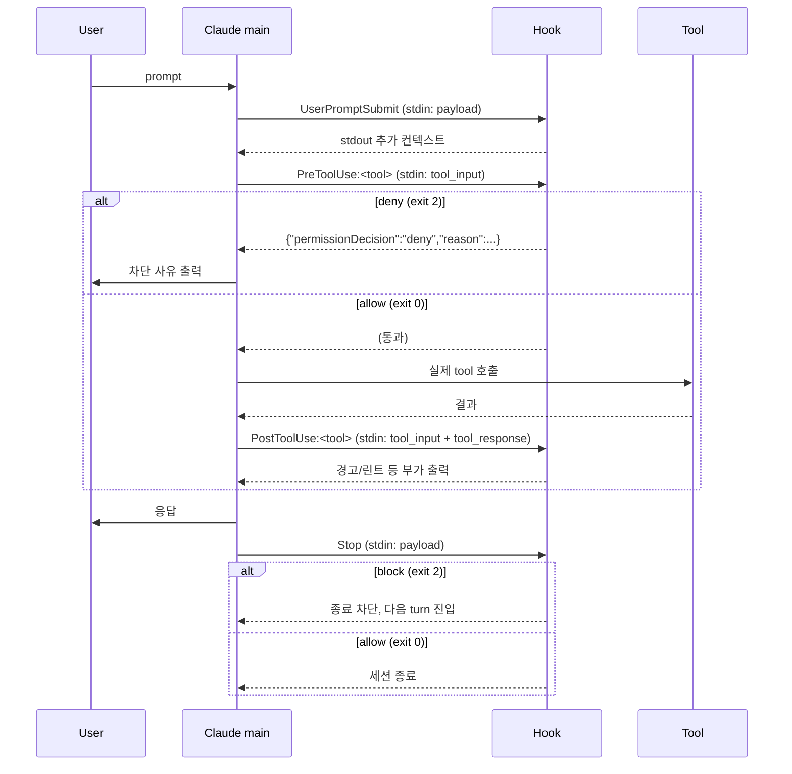

<!-- 하네스 구조·라이프사이클·hook 입출력 계약·구현 패턴·설계 동기 -->
# Harness Architecture

본 문서는 하네스가 **왜 이 모양인지** + 새 hook을 만들 때 따라야 할 패턴을 정리한다. 각 hook의 차단/통과 영역은 `docs/harness/01-reference.md`.

## 시스템 구조

```
.claude/
├── settings.json            # permissions + hooks 등록 단일 진입점
├── settings.local.json      # 개인용 override (gitignored)
├── agents/                  # 6개 서브에이전트 정의
├── skills/                  # 6개 파이프라인 스킬 + 유틸 스킬
├── hooks/                   # 12 hook + _lib-pipeline-state.sh 공유 헬퍼
└── templates/               # 보고서·작업 명세 템플릿
.claudeignore                # 시크릿 경로 차단 (.env, *.key 등)
~/.claude/projects/<id>/memory/   # 프로젝트별 영구 메모리
```

- 모든 hook는 Git Bash로 실행되는 `.sh` 스크립트.
- `settings.json`이 단일 진입점이라 hook 추가·삭제는 이 파일 한 곳만 수정.
- `~/.claude/` 메모리는 git에 들어가지 않는 영역 — 프로젝트 종속 사실은 `memory/feedback_*.md`로 저장.

## 라이프사이클



- `PreToolUse`에서 deny된 호출은 `T`에 도달하지 않는다.
- `Stop` block은 Codex stop-review-gate가 사용하는 메커니즘.

## Hook 입출력 계약

### 표준 헤더

```sh
#!/usr/bin/env bash
# 한 줄 한국어 헤더 코멘트
set -euo pipefail
```

- `set -e`로 어떤 명령 실패도 즉시 stop.
- `set -u`로 미정의 변수 사용 차단.
- `set -o pipefail`로 파이프 중간 실패도 잡음.

### payload 파싱

```sh
payload=$(cat)

if command -v jq >/dev/null 2>&1; then
  command_str=$(printf '%s' "$payload" | jq -r '.tool_input.command // ""')
elif command -v node >/dev/null 2>&1; then
  command_str=$(PAYLOAD="$payload" node -e '
    const p = JSON.parse(process.env.PAYLOAD || "{}");
    const c = p && p.tool_input && p.tool_input.command;
    if (typeof c === "string") process.stdout.write(c);
  ')
else
  deny "parser-missing" "install jq or node"
fi
```

- jq → node → fail-closed deny 3단 fallback.
- 본 워크스페이스는 Git Bash 기본 설치에 jq가 없고 node만 있는 경우가 흔해 양쪽 다 지원.
- 두 파서 모두 부재 시 통과시키면 우회 가능성 → fail-closed.

### Deny 출력

```sh
deny() {
  local category="$1"
  local message="$2"
  printf '{"permissionDecision":"deny","reason":"%s: %s"}' "$category" "$message"
  exit 2
}
```

- `permissionDecision: deny`는 Claude Code의 약속된 stdout 형식.
- 추가 안내는 `cat >&2 <<EOF ... EOF`로 stderr에 출력 가능.

## 구현 패턴

### 정규식 union + 경계 앵커

```sh
if printf '%s' "$text" | grep -qE '(^|[[:space:];&|])rm[[:space:]]+-[a-zA-Z]*[rR][a-zA-Z]*[fF]'; then
  deny "rm-rf" "recursive forced rm"
fi
```

- `(^|[[:space:];&|])` — 명령의 시작 또는 쉘 separator 뒤에서만 매칭. quoted string 내부(`cat "rm -rf"`)는 통과.
- 한 패턴 안에 short flag(`-rf` · `-fr` · 대소문자 혼합)와 long flag(`--recursive --force`)를 모두 포함.

### Shell 재진입 처리

```sh
extract_shell_reentry_inner() {
  local text="$1"
  if [[ "$text" =~ ^bash[[:space:]]+-c[[:space:]]+\"([^\"]*)\"$ ]]; then
    printf '%s' "${BASH_REMATCH[1]}"
  elif [[ "$text" =~ ^cmd[[:space:]]+/c[[:space:]]+\"([^\"]*)\"$ ]]; then
    printf '%s' "${BASH_REMATCH[1]}"
  # bash · sh · cmd · cmd.exe · powershell · pwsh 모두 처리
  else
    return 1
  fi
}

is_destructive "$command_str"
if inner=$(extract_shell_reentry_inner "$command_str"); then
  is_destructive "$inner"
fi
```

- `bash -c "..."` · `sh -c "..."` · `cmd /c "..."` · `powershell -Command "..."` 인용부호 내부도 같은 패턴으로 재검사.
- 파싱 못 한 shell 재진입 형태는 fail-closed deny.

### 파일 크기 측정

```sh
file_size=$(wc -c < "$file_path" 2>/dev/null || echo 0)
file_size=${file_size//[[:space:]]/}
if [ "$file_size" -gt 204800 ]; then
  deny "read-size" "file is ${file_size} bytes (> 204800)"
fi
```

- `wc -c < file`이 가장 POSIX 호환적이고 Git Bash·macOS·Linux 어디서나 동일 동작.
- 임계값 200 KiB는 surrogate-split 사고(670 KB 누적 페이로드)에서 단일 Read 1/3 이하 마진.

## 설계 동기

각 hook이 왜 추가됐는지 — 운영 사건과 결정의 1:1 매핑.

| 사건 | 결정 | 산출 hook |
|---|---|---|
| 670KB 누적 페이로드에서 UTF-16 surrogate pair가 잘려 Anthropic API 400 | 큰 Read와 무한 Bash 출력을 하네스에서 강제 deny, 모델 의지에 의존 X | `pre-tool-read-size-guard.sh`, `pre-bash-block-large-output.sh` |
| 한글 parent path에서 Spring Boot `ClassNotFoundException` 회귀 | 한글 cwd + JVM 호출은 차단하고 ASCII worktree 사용 안내 | `pre-bash-detect-korean-cwd.sh` |
| `Read(.env)` deny만 있고 `Bash(cat .env)` 통과되어 시크릿 누설 가능 | settings.json deny에 Bash 시크릿 출력 패턴 추가, hook 단에서도 차단 | settings.json deny + (간접) `pre-bash-block-destructive.sh` 구조 답습 |
| `git mv plan/before/`만 차단했으나 `mv`·`Move-Item`·`bash -c "git mv ..."` 우회 발견 | 매처 union을 모든 변종으로 확장 + shell 재진입 내부 재검사 | `pre-bash-block-plan-move-{without-report,with-unchecked}.sh` |
| `rm -rf` 변종(`rm -fR` · `rm --recursive --force` · PowerShell `Remove-Item -Recurse`)이 단순 패턴으로 통과 | 정규식 union 전면 확장 + shell 재진입 + 파서 부재 시 fail-closed | `pre-bash-block-destructive.sh` |
| 보고서·체크리스트 없이 `plan/before → plan/after` 이동 시도 → 작업 추적성 손실 | 이동 명령을 hook에서 검증, 두 조건 미충족 시 deny | `pre-bash-block-plan-move-*.sh` |
| `context.yaml`의 `last_indexed`·라인 수·`related_docs`가 실제와 어긋난 채로 머지되는 사례 | audit 스크립트로 drift 진단 + Stop/PostToolUse hook이 warn 통보 + 6 에이전트 보일러플레이트를 `_prelude.md`로 단일화 | `stop-warn-context-stale.sh`, `post-write-context-stale.sh`, `_prelude.md` + `resolve-preludes.sh` |

## 회귀 테스트 패턴

수동 payload 주입 스크립트 기본 골격.

```sh
#!/usr/bin/env bash
HOOK="C:/path/.claude/hooks/<hook>.sh"

encode() {
  CMD="$1" node -e '
    process.stdout.write(JSON.stringify({tool_input:{command: process.env.CMD || ""}}));
  '
}

run_case() {
  local name="$1" expected="$2" command="$3"
  local payload=$(encode "$command")
  set +e
  printf '%s' "$payload" | bash "$HOOK" >/dev/null 2>&1
  local exit_code=$?
  set -e
  local actual=ALLOW
  [ "$exit_code" -eq 2 ] && actual=DENY
  [ "$actual" = "$expected" ] && echo "PASS $name" || echo "FAIL $name expected=$expected actual=$actual"
}

run_case "rm-rf"        DENY  'rm -rf /tmp'
run_case "rm specific"  ALLOW 'rm one.txt'
run_case "shell re-entry" DENY 'bash -c "rm -rf /"'
```

- payload 인코딩은 node로 처리(jq 부재 환경 대응).
- `PATH=/usr/bin:/bin bash "$HOOK"`로 parser-absent 시뮬레이션 가능 — jq·node가 사라지면 fail-closed deny 확인.
- 본 워크스페이스 회귀 케이스는 `/c/tmp/hook-test-*.sh`에 분산 저장, 현재 70/70 통과.

## 백로그 (해당 카테고리)

본 문서가 다루는 구조·구현 영역의 미해결 backlog. 풀 목록은 `plan/api-error-400-the-hazy-newell.md`.

| 우선순위 | 항목 |
|---|---|
| P1 | Gradle allow-list 좁힘 — `./gradlew bootRun:*` 등 args 인젝션 가능 폭 축소 |
| P1 | `post-write-md-lint.sh`의 `npx --yes` 제거 + lockfile 사용 (supply-chain 회피) |
| P1 | `_lib-pipeline-state.sh` 및 stop hook의 `find -print0`/`xargs -0` 일관화 |
| P1 | `settings.json`에 `Read(.claude/agent-memory/**)` deny 추가 |
| P1 | `pre-write-worktree-guard.sh` realpath canonicalize + `exit 2` enforce |
| P2 | Stop hook에 `git -C "$target"` 통일 (워크트리 인지) |
| P2 | `post-write-warn-bean-collision.sh`에 `command -v gawk` 가드 |
| P3 | `session-start.sh`·`user-prompt-submit.sh`의 jq dead branch 단순화 |
| P3 | hook 진단 출력에 `printf '%q'` 적용 (한글·공백·제어문자 안전) |

## 관련 문서

- `docs/harness/01-reference.md` — 12 hook 표 · payload 예시 · permissions.
- `docs/harness/03-migration.md` — 이식 체크리스트 · 환경 가정 · 함정.
- `.claude/hooks/<name>.sh` — 본 문서가 인용한 실제 hook 코드.
