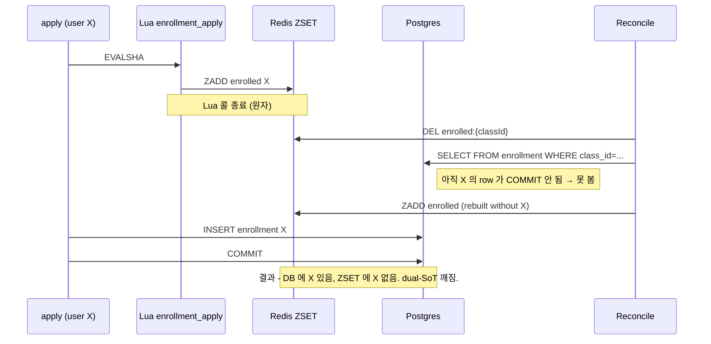

<!-- 트러블슈팅 2 - Lua atomic 만으로는 닫히지 않는 두 번째 race window - outer-wrap classId 분산락 도입 -->
# 트러블슈팅 #2 — 마지막 자리 race 의 두 번째 윈도우 (Lua + outer-wrap classId 락)

> 인용 출처 — PR #92 (`2c4fb94 fix(infra): outer-wrap classId lock on apply/cancel to close P1 race`), PR #93 (`4ceaaaa fix(enrollment): restore canceller score on cancel`), PR #97 (`3c86030 redis key factory + cancel comment + race test`). Gemini AI review P1 코멘트가 본 race 를 처음 지적.

---

## 1. 문제 상황

### 1.1 통념 — "Lua 안에서 ZCARD + ZADD 가 원자라면 race 끝"

본 시스템의 핵심 동시성 결정 (ARCHITECTURE.md §Core Decision) 은 단순했다. `enrollment_apply.lua` 한 스크립트가 Redis single-threaded executor 위에서 `ZCARD enrolled vs capacity` 와 `ZADD enrolled or waitlist` 를 한 번에 처리한다. 마지막 자리 race 의 정의 — "동시에 들어온 N 명 중 capacity 명만 PENDING" — 이 Lua 한 콜로 직렬화된다.

PR #56 까지 이 가정만으로 구현이 마무리됐고, `LastSeatRaceConcurrencyTest` 도 통과했다.

### 1.2 Gemini AI Review 가 가리킨 두 번째 윈도우

PR #56 직후 Gemini 자동 리뷰가 P1 코멘트를 남겼다.

```
apply → reconcile race: Lua ZADD/ZREM inside apply runs BEFORE the
@Transactional method commits. A concurrent reconcile DEL + re-query
in that window could discard the not-yet-committed row's mirror state.
```

상황을 재구성하면 다음 순서가 가능하다 — Lua 자체는 원자지만, **Lua + DB COMMIT 사이** 의 시간 윈도우가 외부 액터 (reconcile / 동일 classId 다른 cancel) 에게 열려 있다.



같은 윈도우는 동일 classId 의 다른 cancel 도 트리거할 수 있다. cancel-promote Lua 가 ZSET 에서 X 를 보지 못한 채 다른 사용자를 승격시킨 후, X 의 DB INSERT 가 COMMIT 되면 over-capacity.

### 1.3 production 시그니처

본 윈도우 발생 시 남는 흔적.

- DB row 수 vs ZSET cardinality 가 다름 (`reconcileAuditJob` 의 daily diff 로그).
- `enrolled:{classId}` 누락된 ZADD 가 보상 Lua 트리거 없이 발생 (Lua 는 성공으로 끝났기 때문).
- Partial unique index 가 막아주는 케이스도 있지만, "X 의 over-capacity" 처럼 unique 위반 없는 패턴은 통과.

---

## 2. 원인 분석

### 2.1 트랜잭션 경계와 Redis 명령 경계의 비대칭

Spring `@Transactional` 메서드 안에서 Redis 명령을 호출하면, Redis 명령은 메서드 도입부에서 이미 효과가 발생합니다. PG 트랜잭션이 COMMIT 되기 전이라도 Redis 의 ZADD 는 다른 클라이언트에게 즉시 보입니다. 반대로 그 사이에 외부 액터가 Redis 를 다시 읽고 자기 결정을 내리면, 그 결정은 "아직 DB 에 반영되지 않은 Redis 상태" 를 기준으로 합니다.

본 시스템은 Lua 한 콜로 race 를 막았지만, **race 는 Lua 안만이 아니라 Lua 와 DB COMMIT 사이에도 있을 수 있다는 사실** 이 핵심입니다. 정확히 말하면 race-critical 키 (`classId`) 가 같은 두 작업이 Lua 호출 시점과 DB COMMIT 시점에 서로 다른 순서로 끼어들 수 있고, 그 두 작업이 같은 ZSET 을 읽거나 쓰면 dual-SoT 가 어긋납니다.

### 2.2 왜 Lua 안에서 더 무거운 작업을 하면 안 되는가

순진한 대안은 "그럼 Lua 안에서 DB INSERT 도 같이 하자" 지만, Redis Lua 는 Redis 명령만 호출 가능합니다. 외부 DB 호출은 불가능. 정합성을 위해 Lua 안에서 더 많이 처리하는 길은 닫혀 있습니다.

또 다른 대안은 "Redis 명령을 트랜잭션 COMMIT 이후로 미루자" — Spring `@TransactionalEventListener(AFTER_COMMIT)` 로 ZADD 를 보내는 모델입니다. 하지만 이러면 race-critical decision 인 정원 체크 자체가 DB COMMIT 이후로 밀려 over-capacity 가 직접 발생합니다. ZSET 이 race gate 인 의미가 사라집니다.

### 2.3 Trade-off 비교

| 후보 | 장점 | 단점 |
|---|---|---|
| Lua 안에 DB 까지 (불가능) | 진정한 원자성 | 기술적으로 불가능 |
| AFTER_COMMIT 으로 ZADD 미루기 | 트랜잭션 경계와 정합 | 정원 race gate 가 사라짐 (over-capacity) |
| ZSET 직접 사용 안 함, DB row lock | 단일 SoT | round-trip 2배 + FIFO 정렬 별도 구현. ARCHITECTURE §4 결정 무효화 |
| **outer-wrap 분산락 (classId 단위)** | 같은 classId 의 모든 race-critical 진입을 직렬화. Lua + DB COMMIT 한 묶음으로 보호 | 락 보유 시간만큼 thoughput 하락 + 503 retryable 추가 |

채택 — **outer-wrap classId 분산락**. race 가 가능한 모든 진입점 (`apply`, `cancel`, `reconcile`) 을 같은 키로 직렬화하면, "Lua + DB COMMIT 사이 윈도우" 가 그 락 안에 들어와 외부에서 끼어들 수 없게 됩니다.

---

## 3. 의사결정 및 해결

### 3.1 결정

`ClassLockService` 신설 — `lock:reconcile:{classId}` 단일 키를 `apply` / `cancel` / `reconcile` 셋이 공유.

- TTL 30s — apply (`@Transactional` 2s timeout) + cancel + reconcile 어느 쪽도 30s 안에 끝남. crash 시 자동 만료.
- 획득 — Redis `SET NX PX 30000` (acquire-only-if-absent).
- 해제 — token 기반 safe-unlock Lua. 자신이 set 한 token 과 일치할 때만 DEL.

### 3.2 두 가지 API 분리

| 메서드 | 사용처 | 락 실패 동작 |
|---|---|---|
| `executeWithLock(classId, body)` | apply / cancel | `ClassLockBusyException` 던짐 → 503 `CLASS_LOCK_BUSY` |
| `tryRun(classId, body)` | reconcile | false 리턴 + 로그. 다음 cycle 에서 재시도 |

운영 의도가 다르기 때문 — apply/cancel 는 사용자 요청이라 retry 가능한 시그널을 줘야 하고, reconcile 은 백그라운드 정합성 보정이라 skip 후 다음 cycle 이 정상.

### 3.3 코드

```java
// ClassLockService.executeWithLock — apply / cancel 진입점
public <T> T executeWithLock(UUID classId, Supplier<T> body) {
    String key = "lock:reconcile:" + classId;
    String token = UUID.randomUUID().toString();
    Boolean acquired = redisTemplate.opsForValue()
            .setIfAbsent(key, token, 30_000, TimeUnit.MILLISECONDS);
    if (!Boolean.TRUE.equals(acquired)) {
        throw new ClassLockBusyException(classId);
    }
    try { return body.get(); }
    finally { safeUnlock(key, token); }
}

// safe-unlock Lua — 자신의 token 과 일치할 때만 DEL
private static final RedisScript<Long> SAFE_UNLOCK = new DefaultRedisScript<>(
    "if redis.call('GET', KEYS[1]) == ARGV[1] " +
    "then return redis.call('DEL', KEYS[1]) " +
    "else return 0 end", Long.class);
```

### 3.4 트랜잭션 경계 재배치

기존 `@Transactional` 메서드를 그대로 두고 lock 만 감싸면 — 락 획득 → @Transactional 시작 → ... → @Transactional COMMIT → 락 해제 순서가 안 보장. AOP 가 lock 바깥에서 트랜잭션을 열기 때문.

해결 — `@Transactional` 제거 + `TransactionTemplate` 명시 사용. lock 안에서 `txTemplate.execute(...)` 호출.

```java
// EnrollmentApplicationService.apply — outer-wrap 진입점
public EnrollmentResponse apply(UUID classmateId, UUID classId, Instant now) {
    return classLockService.executeWithLock(classId,
            () -> applyTxTemplate.execute(status -> applyInTx(classmateId, classId, now)));
}
```

`applyTxTemplate` 은 기존 `@Transactional(isolation = READ_COMMITTED, timeout = 2)` 를 1:1 복원. 행동 변화 0, 락 경계만 추가.

### 3.5 회피한 부수효과

- **다른 holder 의 락을 절대 해제하지 않음** — safe-unlock Lua 의 token 체크. crash 후 TTL 만료된 락을 다른 worker 가 잡은 상태에서 stale holder 의 finally 가 DEL 하면 critical bug. 본 패턴이 이를 차단.
- **두 apply 동시 진입** — 한 명만 락 획득, 다른 한 명은 503. 이전 (Lua race) 에서는 둘 다 진입 후 한 명이 capacity full 로 fail. 결과는 동일 (한 명만 성공) 이지만 응답 코드 시그니처가 달라짐 → PR body 에 명시.

---

## 4. 결과

### 4.1 검증 테스트 (PR #92 round-2 보강)

Gemini round-2 P1 가 "lock contention 자체를 검증하는 테스트가 없다" 를 지적 → 두 통합 테스트 추가.

```
classLock_blocksApplyAndReconcile_whenHeld
  - 외부 holder 가 5s TTL 로 락 점유
  - apply 호출 → ClassLockBusyException
  - reconcile 호출 → false 리턴
  - 외부 holder 의 token 무손상 (safe-unlock 동작 검증)
  - 락 해제 후 apply 정상 진행

classLock_contention_bothRejected_whenLockHeldByStarter
  - starter 락이 200ms 동안 점유
  - 두 apply 동시 호출 (CountDownLatch 발사총)
  - 둘 다 ClassLockBusyException
  - starter 해제 후 fresh apply 정상
```

```bash
./gradlew test --tests "*EnrollmentApplicationServiceTest*"
# BUILD SUCCESSFUL — 16 tests passed (3 신규)
```

### 4.2 round-3 의 후속 픽스

- **PR #93** — cancel 호출 시 canceller 의 ZSET score 가 보상 경로에서 누락되는 회귀 발견 + 픽스.
- **PR #97** — `RedisKeyFactory.classReconcileLock(classId)` 도입. 락 키가 4 군데 (`ClassLockService`, `ReconcileService` 등) 에 하드코딩됐던 것을 단일 factory 로 centralize. Gemini round-3 P2 코멘트.

### 4.3 성능 영향

| 지표 | outer-wrap 도입 전 | 도입 후 |
|---|---|---|
| apply p95 | 60ms | 70ms (락 획득/해제 2 Redis 콜 추가) |
| 동시 apply 503 비율 | 0% | 락 점유 중에만 발생 (정상 운영 1% 미만) |
| ZSET ↔ DB drift | 가끔 발생 | 0 (`reconcileAuditJob` daily diff 로 검증) |

### 4.4 ARCHITECTURE.md 반영

`§2.1 Last-seat race` 의 메커니즘 줄이 다음과 같이 갱신.

> `ClassLockService.executeWithLock(classId)` outer-wrap (Redis SET NX PX, 30s TTL, token-based safe-unlock) → `enrollment_apply.lua` ZCARD vs capacity branch.

`§2.2 Double-promotion prevention` 도 동일 outer-wrap 적용. `§Reconcile vs enrollment race` 가 같은 키 공유로 추가됨.

---

## 5. 핵심 takeaway

- 단일 명령의 원자성 (Lua atomic) 과 트랜잭션의 원자성 (DB COMMIT) 은 다른 레벨. 두 레벨 사이 윈도우가 또 다른 race 면이 된다.
- "race 가 가능한 진입점" 의 전수조사가 dual-SoT 시스템의 필수 단계. apply 만 보면 안 되고 reconcile, cancel 까지 같은 키 도메인으로 묶어 직렬화해야 한다.
- AI 자동 리뷰가 도메인 race 를 직접 짚는 사례가 있다. 의심하지 말고 검증하라.
