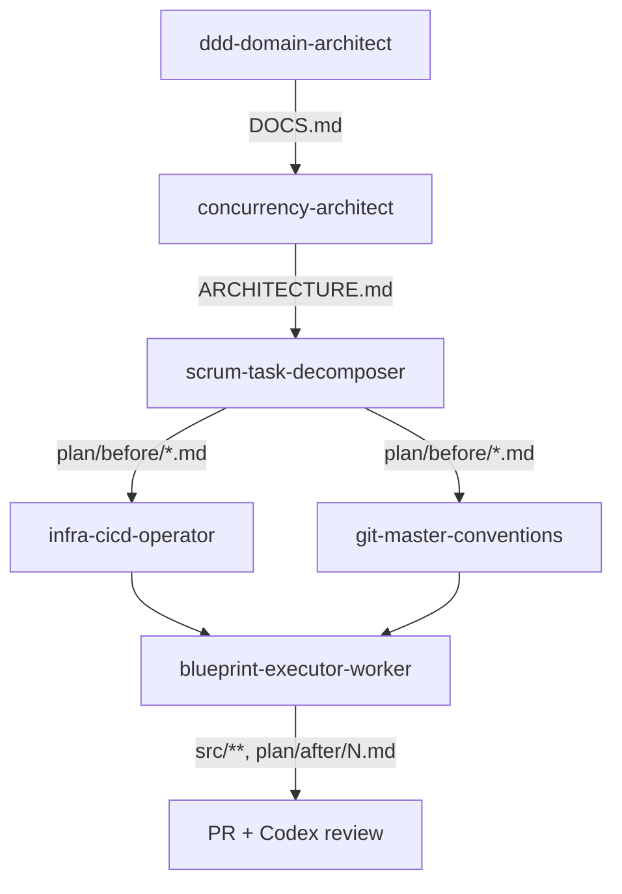

<!-- 6개 내부 서브에이전트 + 외부 위임(Codex) 카탈로그. 사람이 읽는 가이드 -->
# Agents

본 워크스페이스의 메인 세션은 `src/`를 직접 만지지 않는다. 단계별로 서브에이전트를 부르고, PR 머지 시점에 외부 Codex가 자동 리뷰를 건다. 본 문서는 그 일곱 주체를 처음 보는 사람이 빠르게 따라가도록 정리한 인덱스다.

## 흐름 한 장

- 같은 레벨끼리는 병렬 가능.
- 다음 레벨로 넘어가려면 앞 산출물 파일이 디스크에 있어야 한다.
- 없으면 해당 단계 스킬이 사전 검증에서 STOP하고 빠진 파일을 알려준다.

## 내부 서브에이전트

### `ddd-domain-architect` — 도메인 설계

- **언제 부르나**: 파이프라인의 첫 단계. 새 도메인 설계가 필요할 때.
- **출력**: `DOCS.md` 한 파일. 바운디드 컨텍스트·애그리거트·상태 전이·도메인 이벤트·불변식이 박혀 있어 후속 에이전트의 절대 출처가 된다.
- **페르소나**: Eric Evans · Vaughn Vernon DDD를 따르는 시니어 백엔드 아키텍트. 코드는 절대 쓰지 않음.
- **막히면**: 비즈니스 요구가 모호하면 추측 대신 사용자에게 되묻는다.

### `concurrency-architect` — 동시성 설계

- **언제 부르나**: `DOCS.md`가 준비된 직후. race condition·deadlock·lost update가 일어날 지점을 찾아 락 전략을 정해야 할 때.
- **출력**: `ARCHITECTURE.md`. DB 락 / Redisson / Redis ZSET + Lua 비교 결과 + 선택 사유.
- **페르소나**: 대규모 트래픽 환경의 시니어 성능 엔지니어. MVCC·2PL·CAS·CAP 이론으로 모든 결론을 뒷받침. 어조는 단호.
- **막히면**: `DOCS.md` 부재 시 즉시 STOP, `/design-domain` 먼저 돌리라고 안내.

### `scrum-task-decomposer` — 태스크 분해

- **언제 부르나**: 두 설계 문서가 준비된 후. 워커가 손댈 수 있는 마이크로 태스크가 필요할 때.
- **출력**: `plan/before/NN_<role>_<slug>.md` 패턴의 파일 여러 개. 각 파일에 단일 책임 · DoD · 체크리스트 · 역할 할당 · 의존 task 명시.
- **역할 분류**: The Infra Operator(인프라/스키마) · The Quality Guardian(테스트/통합) · 코드 워커.
- **막히면**: `DOCS.md` 또는 `ARCHITECTURE.md` 부재 시 STOP.

### `infra-cicd-operator` — 컨테이너·CI/CD

- **언제 부르나**: `ARCHITECTURE.md`의 인프라 결정(Redis 인증 모드·영속성 등)을 실제 운영 환경으로 옮길 때.
- **출력**: `docker-compose.yml` · `Dockerfile` · `.github/workflows/ci-cd.yml` · `.env` 샘플.
- **지향**: "레거시 프리" — 호스트 의존 최소화, 모든 것을 컨테이너로 묶음.
- **막히면**: `ARCHITECTURE.md` 부재 시 STOP. 빌드 도구·JDK·RDBMS가 모호하면 사용자에게 질문.

### `git-master-conventions` — Git 형상 관리

- **언제 부르나**: 여러 워커가 병렬 PR을 쏟아내기 전에 충돌·추적성 규약이 필요할 때.
- **출력**: `CONTRIBUTING.md`(브랜치 전략·네이밍·Conventional Commits·머지 정책) + `.github/pull_request_template.md`(모든 PR 강제 체크리스트).
- **원칙**: 한 브랜치 = 한 태스크 = 한 PR. PR 푸터에 `Refs: plan/before/NN_*.md` 강제.
- **막히면**: `plan/before/*.md`가 최소 한 건 없으면 STOP.

### `blueprint-executor-worker` — 코드 구현 워커

- **언제 부르나**: 분해된 단일 작업 명세를 Java/Spring 코드로 옮길 때.
- **격리**: 메인이 지정한 `../worktrees/feature-<slug>` 안에서만 작업. 메인 저장소·다른 워크트리는 절대 안 만짐.
- **출력**: 워크트리 안의 `src/main/java/**` · `src/test/java/**` + 작업 명세 체크리스트 모두 `[x]` + `reports/<NN>_<agent-name>_<YYYY-MM-DD>.md` 종료 보고서.
- **plan 이동**: 워커가 **같은 PR 안에서** `plan/before/NN_*.md` → `plan/after/NN_*.md`를 직접 `git mv`한다. PreToolUse hook이 보고서 존재와 체크리스트 완료를 검증해 두 전제가 충족됐을 때만 통과한다. 결과적으로 PR 한 개에 code + report + plan 전이가 모두 들어가 squash merge로 atomic 반영된다. (`worker.md` Step 6, `blueprint-executor-worker.md` Output Format 2와 동일 룰.)
- **원칙**: 창의적 일탈 0. 설계는 `DOCS.md`·`ARCHITECTURE.md`가 절대 출처.
- **막히면**: 네 입력(`DOCS.md`·`ARCHITECTURE.md`·작업 명세·worktree 경로) 중 하나라도 부재 시 STOP.

## 보조 에이전트 — 리팩토링·문서 (2026-05-16 추가)

### `refactoring-maestro` — 리팩토링 오케스트레이션

- **언제 부르나**: 전체 코드베이스의 리팩토링 사이클을 돌릴 때. `/evolution` 스킬이 직접 호출.
- **출력**: `reports/refactoring/maestro-summary-<YYYY-MM-DD>.md` + 호출자 보고. 도메인 모듈 인벤토리 / 워커 결과 취합 / P0·P1·P2·반려 분류.
- **내부 동작**: 도메인 경계 식별 → 모듈마다 `refactoring-worker` 병렬 디스패치 → 결과 취합·중복 제거·오버엔지 컷.
- **모델**: opus.
- **막히면**: 도메인 경계가 코드 구조로 식별 불가 → `context.yaml.business_context.domains` 갱신 요청.

### `refactoring-worker` — 단일 모듈 5 기준 스캔

- **언제 부르나**: maestro 가 단일 도메인 모듈을 할당했을 때.
- **출력**: `대상 위치 / 문제점 / 개선안` 포맷의 리포트.
- **5 기준**: Rich Enum 전환 / 도메인 모델(Entity·VO) 로직 이동 / Common 모듈 의존성 제거 / 코드 최적화(Stream 등) / 주석 직관성 개선.
- **자체 컷 룰**: 단일 사용 인터페이스·추상화·"더 유연한 구조" 추측성 일반화 등 출력 단계에서 제외.
- **모델**: sonnet.

### `doc-maestro` — README + 상세 문서 오케스트레이션

- **언제 부르나**: 면접관 평가용 README + 상세 문서 세트를 일괄 생성·갱신할 때. `/business-card-production` 스킬이 직접 호출.
- **출력**: `README.md` 12 섹션 직접 작성 + 상세 문서 8건 위임 결과 검수.
- **내부 동작**: `doc-worker` × 4 (api/erd/architecture/cicd) + `doc-troubleshooting-worker` × 4 단일 메시지 다중 `Agent` 호출로 병렬 디스패치.
- **모델**: opus.
- **공통 규칙**: 자의적 추론·이모지·AI 상투어 금지. 개조식 우선. 시각화 극대화.

### `doc-worker` — 단일 일반 기술 문서 작성

- **언제 부르나**: maestro 가 단일 기술 문서(api / erd / architecture / cicd) 1건을 할당했을 때.
- **출력**: 표·Mermaid·동작 가능한 Java/Spring 코드 중심 마크다운 1건.
- **모델**: haiku.

### `doc-troubleshooting-worker` — 단일 트러블슈팅 문서 작성

- **언제 부르나**: maestro 가 단일 트러블슈팅 이슈 1건을 할당했을 때.
- **출력**: 4단계 흐름 (문제 상황 / 원인 분석 / 의사결정·해결 / 결과). 원인 분석·Trade-off 만 서술형 허용.
- **현실 팩트 기반**: Java/Spring/Redis 환경에서 실제 발생 가능. 가상의 시나리오 금지.
- **모델**: haiku.

## 호출 매칭

| 작업 | 에이전트 | 스킬 |
|---|---|---|
| 새 도메인 설계 | `ddd-domain-architect` | `/design-domain` |
| 동시성·캐싱·락 전략 | `concurrency-architect` | `/design-concurrency` |
| 설계를 태스크로 쪼개기 | `scrum-task-decomposer` | `/decompose-tasks` |
| 컨테이너·CI/CD 셋업 | `infra-cicd-operator` | `/setup-infra` |
| 브랜치·커밋·PR 규약 | `git-master-conventions` | `/setup-git-rules` |
| 단일 태스크 코드화 | `blueprint-executor-worker` | `/exec-blueprint` |

스킬 호출 시 사전 검증과 다음 단계 안내가 자동으로 따라붙는다. 스킬 본체는 `docs/agents/skills.md`.

## 외부 위임 — Codex

여섯 내부 에이전트와 별개로 본 워크스페이스는 `codex@openai-codex` 플러그인을 외부 에이전트로 등록해 두고 있다. 위치는 `~/.claude/plugins/`이고, Claude의 `Task` 도구가 아니라 별도 프로세스로 동작한다.

**본 세션에서 실제 관측된 동작.**

- **Stop hook 게이트** — 세션 종료 직전 변경분을 자동 리뷰. PR #22 작성 중 "PR 제목 규약과 커밋 컨벤션 충돌"을 잡아 세션 종료를 한 차례 막아 세운 사례가 있고, 본 문서 재작성 직전에도 "dead references / unsupported stop-gate claim" 두 건을 잡았다. 상태는 `state.json`의 `stopReviewGate: true`로 활성화.
- **명시적 위임** — 이전 세션에서 `pre-bash-block-destructive.sh` 정규식 union 재작성을 Codex에 위임한 기록이 메모리에 남아 있다(`feedback_surrogate_split.md`에서 참조).

**확인되지 않은 부분.**

- 게이트의 P0/P1 등 내부 등급 분류 규칙, 사용하는 모델 이름, 위임 시 비용 산정 등은 본 세션에서 직접 확인된 적 없음. 이 영역은 단정하지 않는다.

**운영 룰.**

- 메인이 직렬로 처리 가능한 작업이면 위임하지 않는다(컨텍스트 전환 비용).
- Codex가 막아 세운 사례는 PR 본문·chore 커밋에 명시하면 게이트가 실제 동작한다는 회귀 증거가 된다.
- 토글·설치 확인은 `codex:setup` 스킬.

## 관련 문서

- `docs/agents/skills.md` — 여섯 슬래시 스킬 카탈로그.
- `AGENTS-SKILLS-HARNESS.md` — 이 문서들을 묶는 1페이지 허브.
- `.claude/agents/<name>.md` — 각 에이전트의 풀 정의(페르소나·산출 형식·구체 절차).

> `docs/harness/01-reference.md` · `02-architecture.md` · `03-migration.md`는 본 시리즈의 후속 문서로 같은 PR에 추가될 예정.
